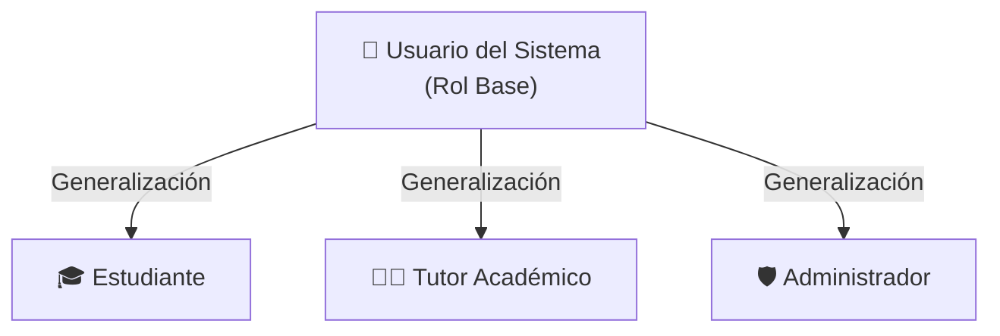
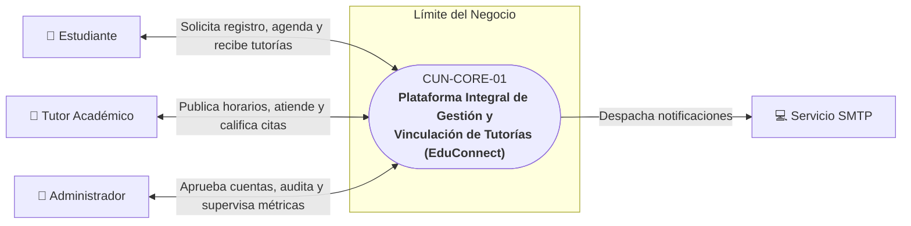
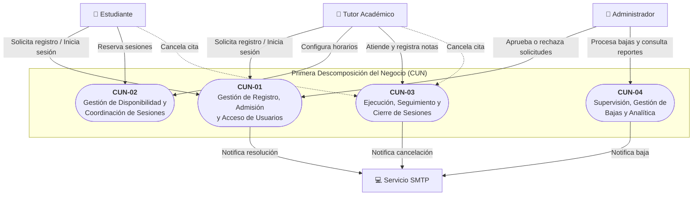
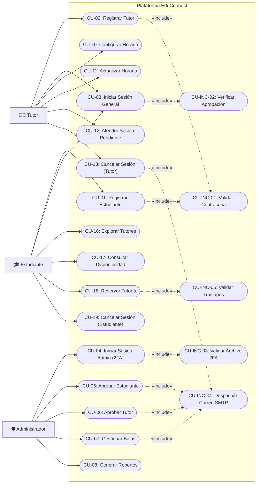
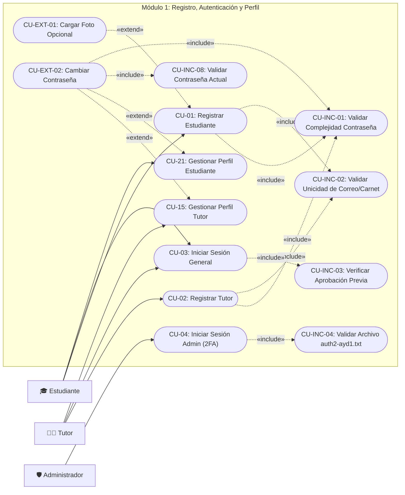
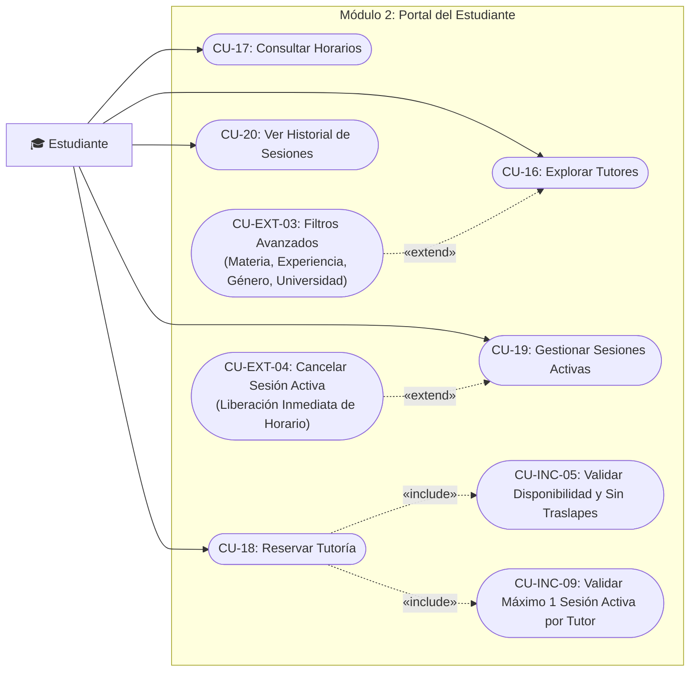
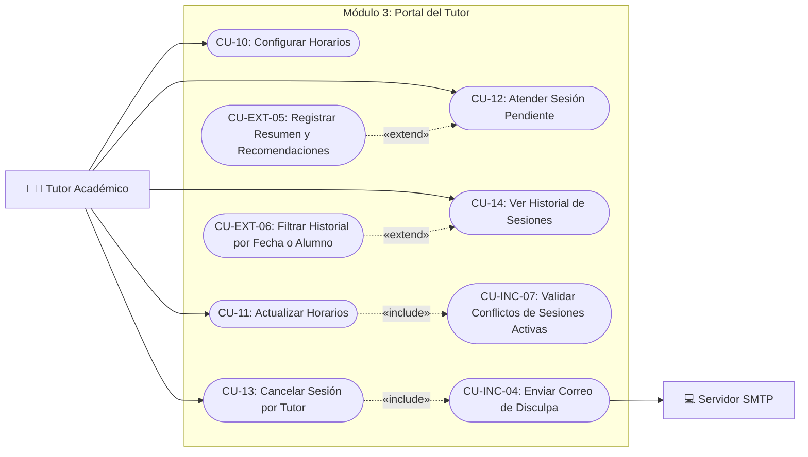
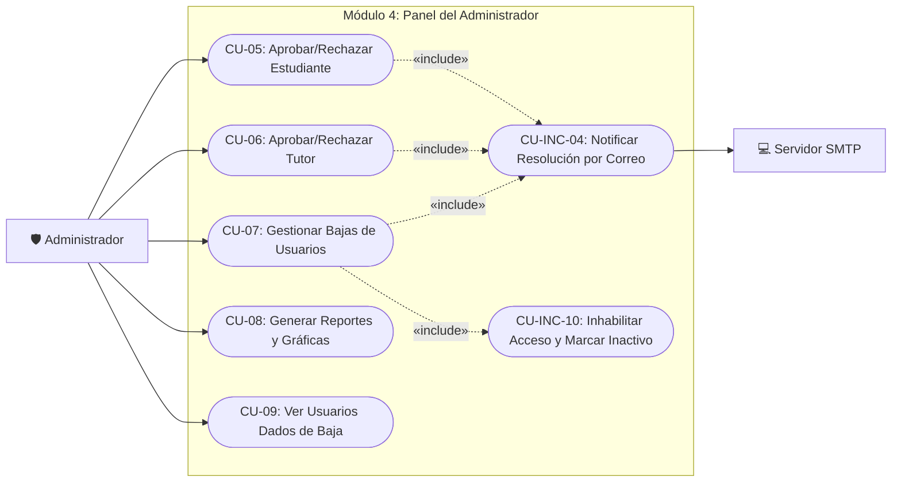

# Casos de Uso del Negocio y del Sistema - EduConnect

---

## 1. Actores del Sistema

| Actor | Tipo | Descripción |
| :--- | :--- | :--- |
| **Usuario del Sistema** | Base / Abstracto | Rol base autenticado que comparte funciones comunes (perfil, credenciales). |
| **Estudiante** | Especializado | Alumno que busca tutores, consulta disponibilidad, reserva y gestiona tutorías. |
| **Tutor Académico** | Especializado | Docente que gestiona sus horarios de atención, atiende y califica sesiones. |
| **Administrador** | Especializado | Rol de gestión que aprueba/rechaza registros (2FA), da de baja usuarios y analiza reportes. |
| **Servicio SMTP** | Secundario / Externo | Sistema externo encargado de la emisión de correos y notificaciones automáticas. |

---

## 2. Paso 1: Core del Negocio (CUN Core)

El Core del Negocio representa la totalidad del alcance a modelar en un único proceso central que conecta a los actores principales con la plataforma.

| Campo | Detalle |
| :--- | :--- |
| **Código y Nombre** | **CUN-CORE-01:** Plataforma Integral de Gestión y Vinculación de Tutorías (EduConnect) |
| **Actores** | Estudiante, Tutor Académico, Administrador (Primarios) / Servicio SMTP (Externo) |
| **Propósito** | Centralizar y optimizar la vinculación académica, agendamiento de asesorías y seguimiento pedagógico en un entorno institucional administrado y seguro. |
| **Alcance** | Comprende el registro de usuarios, validación administrativa con 2FA, publicación de disponibilidad, reserva de citas sin traslapes, atención de sesiones y reportes estadísticos. |

---

## 3. Paso 2: Primera Descomposición (Procesos del Negocio - CUN)

Descomposición del Core en los 4 macro-procesos de negocio de principio a fin:

| Código | Proceso del Negocio | Actores | Descripción |
| :--- | :--- | :--- | :--- |
| **CUN-01** | **Gestión de Registro, Admisión y Acceso** | Estudiante, Tutor, Admin, SMTP | Solicitud de cuentas, auditoría y aprobación/rechazo administrativo, autenticación (2FA para admin). |
| **CUN-02** | **Gestión de Disponibilidad y Coordinación** | Tutor, Estudiante | Configuración de horarios por el tutor, exploración del catálogo y reserva de citas sin traslapes. |
| **CUN-03** | **Ejecución, Seguimiento y Cierre de Sesiones** | Tutor, Estudiante, SMTP | Atención pedagógica con registro de recomendaciones, o cancelaciones con liberación horaria y notificación. |
| **CUN-04** | **Supervisión, Gestión de Bajas y Analítica** | Administrador, SMTP | Revocación de accesos a usuarios activos, auditoría de bajas y reportes estadísticos de uso. |

---

## 4. Paso 3: Casos de Uso Expandidos (CUS - Nivel Sistema)

### 4.1 Diagrama General Consolidado

---

### 4.2 Diagramas Modulares

#### Módulo 1: Registro, Autenticación y Perfil

#### Módulo 2: Portal del Estudiante

#### Módulo 3: Portal del Tutor

#### Módulo 4: Panel del Administrador

---

## 5. Paso 4: Descripciones Textuales Estructuradas

### Módulo de Autenticación y Registro

#### CU-01: Registro de Estudiante
- **Identificador:** CU-01 | **Mapeo:** HU-01 / RF-01 | **Prioridad:** Alta
- **Actores:** Estudiante (Iniciador), Sistema
- **Propósito:** Registrar un nuevo estudiante para acceder a la plataforma.
- **Resumen:** El estudiante completa el formulario con datos personales y credenciales. El sistema valida políticas de contraseña y unicidad del correo, registrando la cuenta en estado "PENDIENTE".
- **Condiciones previas:** Correo y carnet no registrados previamente.
- **Secuencia normal:**
  1. El estudiante pulsa "Registrarse como Estudiante".
  2. El sistema muestra el formulario (nombre, apellido, carnet, género, dirección, teléfono, fecha de nacimiento, correo, contraseña).
  3. El estudiante ingresa datos y (opcionalmente) carga su foto de perfil (`CU-EXT-01`).
  4. El estudiante envía el formulario.
  5. El sistema invoca `CU-INC-01` (valida complejidad de contraseña) y `CU-INC-02` (valida unicidad).
  6. El sistema encripta la contraseña y almacena el registro en estado "PENDIENTE".
  7. El sistema confirma en pantalla el registro exitoso.
- **Excepciones:**
  - *Paso 5a:* Contraseña no cumple políticas $\rightarrow$ El sistema señala el error y solicita corrección.
  - *Paso 5b:* Correo o carnet duplicados $\rightarrow$ El sistema cancela el guardado y notifica duplicidad.
- **Condiciones posteriores:** Cuenta registrada en estado "PENDIENTE", a la espera de aprobación (`CU-05`).

#### CU-02: Registro de Tutor
- **Identificador:** CU-02 | **Mapeo:** HU-02 / RF-02 | **Prioridad:** Alta
- **Actores:** Tutor (Iniciador), Sistema
- **Propósito:** Registrar un tutor profesional con su especialidad docente y fotografía obligatoria.
- **Resumen:** El aspirante ingresa sus datos personales, carnet/ID, número de identificación de tutor, especialidad, dirección (física u online), año de inicio, universidad y foto obligatoria. Tras validar unicidad y contraseña, el perfil queda en estado "PENDIENTE".
- **Condiciones previas:** Correo e ID de tutor únicos en el sistema; fotografía digital disponible.
- **Secuencia normal:**
  1. El tutor selecciona "Registrarse como Tutor".
  2. El sistema despliega el formulario con todos los campos requeridos y selector de fotografía obligatoria.
  3. El tutor llena los datos y adjunta la imagen.
  4. El tutor envía la solicitud.
  5. El sistema ejecuta `CU-INC-01` (contraseña) y `CU-INC-02` (unicidad de correo, carnet e ID de tutor).
  6. El sistema encripta la contraseña y guarda el registro con estado "PENDIENTE".
  7. El sistema muestra mensaje de confirmación.
- **Excepciones:**
  - *Paso 3:* Omisión de fotografía $\rightarrow$ El sistema bloquea el envío indicando campo obligatorio.
  - *Paso 5:* Falla de validación $\rightarrow$ Se detiene el proceso y se informa el motivo.
- **Condiciones posteriores:** Tutor registrado en estado "PENDIENTE", a la espera de aprobación (`CU-06`).

#### CU-03: Iniciar Sesión General
- **Identificador:** CU-03 | **Mapeo:** HU-03 / RF-03 | **Prioridad:** Alta
- **Actores:** Estudiante o Tutor (Iniciador), Sistema
- **Propósito:** Autenticar usuarios y autorizar el acceso a su portal correspondiente.
- **Resumen:** El usuario ingresa su correo y contraseña. El sistema verifica credenciales y valida que la cuenta haya sido aprobada por el administrador antes de otorgar acceso.
- **Condiciones previas:** Usuario registrado previamente.
- **Secuencia normal:**
  1. El usuario accede a la vista de login e ingresa correo y contraseña.
  2. El sistema valida la coincidencia de las credenciales contra la base de datos.
  3. El sistema ejecuta `CU-INC-03` (comprueba que el estado sea "APROBADO").
  4. El sistema emite token de sesión y redirige al panel según su rol.
- **Excepciones:**
  - *Paso 2:* Credenciales incorrectas $\rightarrow$ Mensaje: "Credenciales de acceso incorrectas".
  - *Paso 3a:* Estado "PENDIENTE" $\rightarrow$ Mensaje: "Su cuenta aún está pendiente de aprobación".
  - *Paso 3b:* Estado "INACTIVO" $\rightarrow$ Mensaje: "Su cuenta ha sido deshabilitada. Contacte al Administrador".
- **Condiciones posteriores:** Sesión activa autenticada.

#### CU-04: Iniciar Sesión Administrador (2FA)
- **Identificador:** CU-04 | **Mapeo:** HU-04 / RF-04 | **Prioridad:** Alta
- **Actores:** Administrador (Iniciador), Sistema
- **Propósito:** Conceder acceso seguro al panel administrativo mediante doble factor de autenticación.
- **Resumen:** El administrador valida usuario y contraseña predeterminada, y luego sube el archivo criptográfico obligatorio `auth2-ayd1.txt` para superar el segundo factor.
- **Condiciones previas:** Credenciales primarias y archivo `auth2-ayd1.txt` válido en posesión del administrador.
- **Secuencia normal:**
  1. El administrador ingresa usuario y contraseña de primer paso.
  2. El sistema valida las credenciales primarias y redirige a la vista 2FA.
  3. El administrador carga el archivo `auth2-ayd1.txt`.
  4. El sistema ejecuta `CU-INC-04` (lee la clave del archivo, valida que difiera de la del primer paso y coincida con el hash administrativo).
  5. El sistema autoriza el ingreso al panel administrativo.
- **Excepciones:**
  - *Paso 2:* Credenciales primarias erróneas $\rightarrow$ Acceso denegado.
  - *Paso 4a:* Nombre de archivo distinto a `auth2-ayd1.txt` $\rightarrow$ Error de archivo inválido.
  - *Paso 4b:* Contraseña del archivo incorrecta o idéntica al primer paso $\rightarrow$ Fallo de segundo factor.
- **Condiciones posteriores:** Sesión de administrador iniciada.

---

### Módulo del Administrador

#### CU-05: Aprobación de Registro de Estudiantes
- **Identificador:** CU-05 | **Mapeo:** HU-05 / RF-05 | **Prioridad:** Alta
- **Actores:** Administrador (Iniciador), Servidor SMTP, Estudiante
- **Propósito:** Admitir o rechazar solicitudes de registro de estudiantes.
- **Resumen:** El administrador visualiza a los aspirantes pendientes, revisa foto, carnet y datos, y presiona "Aceptar" o "Rechazar". El sistema actualiza el estado y notifica por correo electrónico.
- **Condiciones previas:** Administrador autenticado (2FA); solicitudes con estado "PENDIENTE".
- **Secuencia normal:**
  1. El administrador entra a la lista de estudiantes pendientes.
  2. Revisa la información y presiona "Aceptar" o "Rechazar".
  3. Confirma la acción en el cuadro de diálogo.
  4. El sistema actualiza el estado a "APROBADO" o "RECHAZADO".
  5. El sistema invoca `CU-INC-04` despachando un correo con la resolución al estudiante.
  6. El registro se remueve de pendientes y se emite notificación de éxito.
- **Excepciones:**
  - *Paso 5:* Falla de conexión SMTP $\rightarrow$ El estado se guarda en base de datos y se reporta alerta de reintento de correo.
- **Condiciones posteriores:** Cuenta habilitada para iniciar sesión o rechazada formalmente.

#### CU-06: Aprobación de Registro de Tutores
- **Identificador:** CU-06 | **Mapeo:** HU-06 / RF-06 | **Prioridad:** Alta
- **Actores:** Administrador (Iniciador), Servidor SMTP, Tutor
- **Propósito:** Validar perfiles profesionales de tutores aspirantes.
- **Resumen:** El administrador revisa el perfil docente y foto obligatoria del tutor y decide aceptarlo o rechazarlo, enviándole un correo formal con la notificación.
- **Condiciones previas:** Administrador autenticado (2FA); tutores con estado "PENDIENTE".
- **Secuencia normal:**
  1. El administrador accede a la lista de tutores pendientes.
  2. Examina fotografía, carnet, especialidad y número de identificación.
  3. Pulsa "Aceptar" o "Rechazar" y confirma la decisión.
  4. El sistema actualiza el estado a "APROBADO" o "RECHAZADO".
  5. El sistema ejecuta `CU-INC-04` notificando al tutor por correo electrónico.
  6. El registro se retira de la bandeja de pendientes.
- **Excepciones:**
  - *Paso 5:* Falla de SMTP $\rightarrow$ Se mantiene la persistencia en base de datos con log de advertencia.
- **Condiciones posteriores:** Tutor habilitado para iniciar sesión, publicar horarios y ofrecer tutorías.

#### CU-07: Gestión de Usuarios Activos y Bajas
- **Identificador:** CU-07 | **Mapeo:** HU-07 / RF-07 | **Prioridad:** Media
- **Actores:** Administrador (Iniciador), Servidor SMTP, Usuario
- **Propósito:** Supervisar a los usuarios aceptados y dar de baja cuentas por faltas normativas.
- **Resumen:** El administrador visualiza a estudiantes y tutores activos en vistas separadas, selecciona a un usuario, ingresa el motivo y confirma la baja. El sistema deshabilita la cuenta y envía un correo de notificación.
- **Condiciones previas:** Administrador autenticado; usuario en estado "APROBADO".
- **Secuencia normal:**
  1. El administrador selecciona a un estudiante o tutor activo y pulsa "Dar de Baja".
  2. El sistema solicita confirmación y captura del motivo de baja.
  3. El administrador introduce la justificación y confirma.
  4. El sistema ejecuta `CU-INC-10` cambiando el estado a "INACTIVO" y revoca tokens de sesión.
  5. El sistema ejecuta `CU-INC-04` enviando un correo al usuario con el motivo de la baja.
  6. El usuario se traslada a la vista de auditoría de bajas.
- **Excepciones:**
  - *Paso 3:* Cancelación del modal $\rightarrow$ La cuenta permanece activa sin cambios.
- **Condiciones posteriores:** Usuario inactivo e inhabilitado para iniciar sesión.

#### CU-08: Generación de Reportes del Sistema
- **Identificador:** CU-08 | **Mapeo:** HU-08 / RF-08 | **Prioridad:** Media
- **Actores:** Administrador (Iniciador)
- **Propósito:** Mostrar reportes gráficos y analíticos del uso de la plataforma.
- **Resumen:** El administrador consulta la sección de reportes. El sistema procesa las métricas y genera tablas y gráficas (ej. tutores con más alumnos atendidos, materias con mayor demanda).
- **Condiciones previas:** Administrador autenticado; datos de sesiones registradas.
- **Secuencia normal:**
  1. El administrador ingresa a "Reportes y Estadísticas".
  2. El sistema calcula las métricas y genera:
     - Reporte 1: Tutores con más estudiantes atendidos (tabla + gráfico de barras).
     - Reporte 2: Materias con mayor demanda (tabla + gráfico circular).
  3. El administrador interactúa con los datos actualizados al momento.
- **Excepciones:**
  - *Paso 2:* Sin sesiones atendidas $\rightarrow$ Muestra gráficas vacías con leyenda: "Sin datos registrados".
- **Condiciones posteriores:** Consulta analítica generada sin alterar datos transaccionales.

#### CU-09: Visualización de Usuarios Dados de Baja
- **Identificador:** CU-09 | **Mapeo:** HU-09 / RF-09 | **Prioridad:** Media
- **Actores:** Administrador (Iniciador)
- **Propósito:** Auditar el historial de cuentas suspendidas o dadas de baja.
- **Resumen:** El administrador consulta la tabla de auditoría que lista a estudiantes y tutores inactivos con fecha, hora y motivo registrado de la baja.
- **Condiciones previas:** Administrador autenticado.
- **Secuencia normal:**
  1. El administrador hace clic en "Usuarios Dados de Baja".
  2. El sistema despliega la lista con: nombre, rol, correo, fecha de baja y motivo.
  3. El administrador filtra por rol o fecha según sus necesidades de auditoría.
- **Excepciones:**
  - *Paso 2:* Sin bajas $\rightarrow$ Mensaje: "No existen registros de bajas".
- **Condiciones posteriores:** Trazabilidad de auditoría visualizada.

---

### Módulo del Tutor

#### CU-10: Configurar Horarios de Atención
- **Identificador:** CU-10 | **Mapeo:** HU-10 / RF-10 | **Prioridad:** Alta
- **Actores:** Tutor (Iniciador), Sistema
- **Propósito:** Definir los días hábiles y el rango horario uniforme de atención.
- **Resumen:** El tutor selecciona los días de la semana y el rango horario (ej. 8:00 AM a 5:00 PM) que aplicará a todas sus jornadas. El sistema valida el rango y publica su disponibilidad.
- **Condiciones previas:** Tutor autenticado y aprobado.
- **Secuencia normal:**
  1. El tutor ingresa a "Configurar Disponibilidad".
  2. Selecciona los días de la semana y el intervalo de horas de atención.
  3. Pulsa "Guardar Horario".
  4. El sistema valida que la hora de inicio sea menor a la hora final y guarda la configuración.
  5. El sistema notifica la publicación del horario.
- **Excepciones:**
  - *Paso 2:* Sin días seleccionados $\rightarrow$ Error: "Debe marcar al menos un día".
  - *Paso 4:* Hora final $\le$ hora inicial $\rightarrow$ Error: "Rango de horario inválido".
- **Condiciones posteriores:** Horario publicado y disponible para agendamiento.

#### CU-11: Actualizar Horarios de Atención
- **Identificador:** CU-11 | **Mapeo:** HU-11 / RF-11 | **Prioridad:** Media
- **Actores:** Tutor (Iniciador), Sistema
- **Propósito:** Modificar la jornada de disponibilidad validando ausencia de conflictos con citas activas.
- **Resumen:** El tutor cambia sus días u horas. El sistema ejecuta `CU-INC-07` para asegurar que ninguna sesión activa quede fuera del nuevo rango; si hay conflictos, rechaza el cambio hasta reprogramarlas.
- **Condiciones previas:** Horarios configurados previamente.
- **Secuencia normal:**
  1. El tutor modifica días u horas y pulsa "Actualizar".
  2. El sistema ejecuta `CU-INC-07` buscando sesiones activas en conflicto.
  3. Al comprobar cero conflictos, actualiza la disponibilidad en base de datos.
  4. El sistema emite mensaje de confirmación.
- **Excepciones:**
  - *Paso 2:* Conflicto con sesiones activas $\rightarrow$ Rechaza actualización con alerta: "Existen citas programadas en los periodos modificados. Debe gestionarlas primero".
- **Condiciones posteriores:** Agenda actualizada sin inconsistencias.

#### CU-12: Atender Sesión Pendiente
- **Identificador:** CU-12 | **Mapeo:** HU-12 / RF-12 | **Prioridad:** Alta
- **Actores:** Tutor (Iniciador), Sistema
- **Propósito:** Concluir una tutoría e ingresar el resumen y recomendaciones pedagógicas.
- **Resumen:** El tutor visualiza sus citas pendientes en orden cronológico. Tras la sesión, pulsa "Marcar como Atendido", redacta el resumen pedagógico (`CU-EXT-05`) y guarda el cierre.
- **Condiciones previas:** Sesión activa programada.
- **Secuencia normal:**
  1. El tutor accede a "Sesiones Pendientes" y localiza la cita.
  2. Hace clic en "Marcar como Atendido".
  3. En el modal emergente, ingresa el resumen de la tutoría y recomendaciones para el alumno.
  4. Confirma el guardado.
  5. La sesión cambia a estado "ATENDIDA" y se archiva en el historial.
- **Excepciones:**
  - *Paso 3:* Campo de resumen vacío $\rightarrow$ Solicita completar las observaciones antes de confirmar.
- **Condiciones posteriores:** Sesión archivada como atendida y computada para métricas.

#### CU-13: Cancelar Sesión por el Tutor
- **Identificador:** CU-13 | **Mapeo:** HU-13 / RF-13 | **Prioridad:** Alta
- **Actores:** Tutor (Iniciador), Servidor SMTP, Estudiante
- **Propósito:** Anular una cita por imprevisto, liberando el horario de inmediato y notificando formalmente al alumno.
- **Resumen:** El tutor cancela una sesión pendiente ingresando el motivo. El sistema cambia el estado a "Cancelada por Tutor", libera el cupo en la agenda y despacha un correo de disculpa al alumno.
- **Condiciones previas:** Sesión activa asignada al tutor.
- **Secuencia normal:**
  1. El tutor selecciona la sesión y pulsa "Cancelar Sesión".
  2. Ingresa la justificación de la cancelación y confirma.
  3. El sistema actualiza el estado a "CANCELADA_POR_TUTOR".
  4. El sistema libera inmediatamente el horario en la agenda del tutor.
  5. El sistema ejecuta `CU-INC-04` enviando un correo al alumno con: fecha, hora, materia, motivo y mensaje de disculpa.
- **Excepciones:**
  - *Paso 2:* Sin motivo $\rightarrow$ Exige justificar la cancelación.
- **Condiciones posteriores:** Espacio horario libre en el calendario y alumno notificado.

#### CU-14: Consultar Historial del Tutor
- **Identificador:** CU-14 | **Mapeo:** HU-14 / RF-14 | **Prioridad:** Alta
- **Actores:** Tutor (Iniciador), Sistema
- **Propósito:** Revisar el histórico de todas las sesiones impartidas o canceladas.
- **Resumen:** El tutor accede a su historial con opciones de filtrado por alumno o fechas (`CU-EXT-06`), visualizando fecha, hora, alumno, materia, resumen y estado.
- **Condiciones previas:** Tutor autenticado.
- **Secuencia normal:**
  1. El tutor ingresa a "Historial de Tutorías".
  2. El sistema recupera y muestra las sesiones históricas.
  3. (Opcional) Aplica filtros por fecha o estudiante.
- **Excepciones:**
  - *Paso 2:* Sin sesiones históricas $\rightarrow$ Muestra mensaje indicativo de historial vacío.
- **Condiciones posteriores:** Visualización de la actividad docente.

#### CU-15: Gestionar Perfil del Tutor
- **Identificador:** CU-15 | **Mapeo:** HU-15 / RF-15 | **Prioridad:** Alta
- **Actores:** Tutor (Iniciador), Sistema
- **Propósito:** Actualizar información profesional, foto y contraseña.
- **Resumen:** El tutor edita sus datos (excepto correo). Puede subir una nueva foto o cambiar su contraseña validando la clave actual y aplicando políticas de seguridad.
- **Condiciones previas:** Tutor autenticado.
- **Secuencia normal:**
  1. El tutor ingresa a "Mi Perfil" y edita los campos deseados.
  2. (Opcional) Carga una nueva foto.
  3. (Opcional) Solicita cambio de contraseña (`CU-EXT-02`):
     - Ingresa contraseña actual y nueva contraseña.
     - El sistema ejecuta `CU-INC-08` (valida clave actual) y `CU-INC-01` (complejidad).
  4. Pulsa "Guardar Cambios" y el sistema confirma la actualización.
- **Excepciones:**
  - *Paso 3:* Clave actual no coincide $\rightarrow$ Error: "Contraseña actual incorrecta".
- **Condiciones posteriores:** Perfil y credenciales actualizados en base de datos.

---

### Módulo del Estudiante

#### CU-16: Explorar y Buscar Tutores
- **Identificador:** CU-16 | **Mapeo:** HU-16 / RF-16 | **Prioridad:** Alta
- **Actores:** Estudiante (Iniciador), Sistema
- **Propósito:** Consultar el catálogo de tutores activos y aplicar filtros avanzados.
- **Resumen:** El estudiante visualiza a los tutores activos (excluyendo aquellos con los que ya tiene sesión activa). Puede aplicar filtros avanzados por materia, experiencia, género, edad y universidad (`CU-EXT-03`).
- **Condiciones previas:** Estudiante autenticado y aprobado.
- **Secuencia normal:**
  1. El estudiante ingresa a "Explorar Tutores".
  2. El sistema consulta y muestra las tarjetas de tutores disponibles.
  3. (Opcional) Aplica filtros de materia, experiencia, género o universidad.
  4. El estudiante selecciona al tutor de su interés.
- **Excepciones:**
  - *Paso 3:* Cero coincidencias $\rightarrow$ Mensaje: "No se encontraron tutores con los criterios indicados".
- **Condiciones posteriores:** Tutor seleccionado para consulta de horarios (`CU-17`).

#### CU-17: Consultar Horarios y Disponibilidad
- **Identificador:** CU-17 | **Mapeo:** HU-17 / RF-17 | **Prioridad:** Alta
- **Actores:** Estudiante (Iniciador), Sistema
- **Propósito:** Consultar la disponibilidad de un tutor en una fecha seleccionada.
- **Resumen:** El estudiante selecciona una fecha y el sistema muestra los bloques horarios clasificados visualmente en "Disponible" u "Ocupado", o avisa si el tutor no labora en esa fecha.
- **Condiciones previas:** Estudiante autenticado; tutor con horarios fijados.
- **Secuencia normal:**
  1. El estudiante hace clic en "Ver Horarios" sobre el perfil del tutor.
  2. Selecciona una fecha en el calendario.
  3. El sistema valida si es día laboral del tutor y muestra los bloques horarios (disponibles / ocupados).
  4. El estudiante elige un bloque libre para agendar.
- **Excepciones:**
  - *Paso 3:* Día no laborable $\rightarrow$ Aviso: "El tutor no atiende en la fecha seleccionada".
- **Condiciones posteriores:** Horario libre seleccionado para formalizar reserva en `CU-18`.

#### CU-18: Programar Sesión de Tutoría
- **Identificador:** CU-18 | **Mapeo:** HU-18 / RF-18 | **Prioridad:** Alta
- **Actores:** Estudiante (Iniciador), Sistema
- **Propósito:** Reservar una tutoría validando ausencia de traslapes y reglas de negocio.
- **Resumen:** El estudiante completa el formulario con fecha, hora, materia y motivo. El sistema valida que el horario esté libre, sin traslapes para ninguna de las partes y que no tenga otra sesión activa con el mismo tutor.
- **Condiciones previas:** Estudiante autenticado; horario libre seleccionado.
- **Secuencia normal:**
  1. El estudiante completa el formulario de reserva (materia y motivo).
  2. Pulsa "Confirmar Reserva".
  3. El sistema invoca `CU-INC-05` (valida disponibilidad dentro de jornada y sin traslapes).
  4. El sistema invoca `CU-INC-09` (valida límite de 1 sesión activa con el mismo tutor).
  5. El sistema crea la sesión en estado "AGENDADA" y bloquea el horario.
  6. Emite confirmación al estudiante.
- **Excepciones:**
  - *Paso 3:* Horario ocupado o traslape $\rightarrow$ Notifica el conflicto y cancela la reserva.
  - *Paso 4:* Sesión previa activa con el mismo tutor $\rightarrow$ Alerta: "Ya posee una sesión activa con este tutor".
- **Condiciones posteriores:** Sesión agendada y horario bloqueado.

#### CU-19: Gestionar y Cancelar Sesiones Activas
- **Identificador:** CU-19 | **Mapeo:** HU-19 / RF-19 | **Prioridad:** Media
- **Actores:** Estudiante (Iniciador), Sistema
- **Propósito:** Visualizar próximas sesiones y permitir su cancelación oportuna.
- **Resumen:** El estudiante consulta sus citas pendientes. Si decide cancelar una, confirma en un modal (`CU-EXT-04`), la sesión pasa a "Cancelada por Estudiante" y el horario del tutor se libera inmediatamente.
- **Condiciones previas:** Sesión activa registrada.
- **Secuencia normal:**
  1. El estudiante entra a "Sesiones Activas" y pulsa "Cancelar" en una cita.
  2. El sistema muestra cuadro de confirmación.
  3. El estudiante confirma la anulación.
  4. La sesión cambia a estado "CANCELADA_POR_ESTUDIANTE".
  5. El sistema libera inmediatamente el horario en la agenda del tutor.
- **Excepciones:**
  - *Paso 2:* Cancelación rechazada por el usuario $\rightarrow$ La cita se mantiene activa.
- **Condiciones posteriores:** Cita cancelada y cupo devuelto al catálogo.

#### CU-20: Consultar Historial del Estudiante
- **Identificador:** CU-20 | **Mapeo:** HU-20 / RF-20 | **Prioridad:** Baja
- **Actores:** Estudiante (Iniciador), Sistema
- **Propósito:** Revisar el registro de tutorías concluidas y canceladas con sus resúmenes.
- **Resumen:** El alumno consulta su historial con fecha, tutor, materia, estado y las notas pedagógicas dejadas por los tutores en sesiones atendidas.
- **Condiciones previas:** Estudiante autenticado.
- **Secuencia normal:**
  1. El estudiante accede a "Historial de Tutorías".
  2. El sistema muestra el listado con fecha, tutor, materia, estado y resumen pedagógico.
- **Excepciones:**
  - *Paso 2:* Sin citas previas $\rightarrow$ Muestra mensaje indicativo de historial vacío.
- **Condiciones posteriores:** Visualización del seguimiento pedagógico.

#### CU-21: Gestionar Perfil del Estudiante
- **Identificador:** CU-21 | **Mapeo:** HU-21 / RF-21 | **Prioridad:** Baja
- **Actores:** Estudiante (Iniciador), Sistema
- **Propósito:** Actualizar datos personales, foto y contraseña del estudiante.
- **Resumen:** El estudiante edita sus datos (correo bloqueado). Para cambiar contraseña (`CU-EXT-02`), ingresa la clave actual, el sistema ejecuta `CU-INC-08` y `CU-INC-01`, y guarda la nueva clave encriptada.
- **Condiciones previas:** Estudiante autenticado.
- **Secuencia normal:**
  1. El estudiante entra a "Mi Perfil" y modifica datos o foto.
  2. (Opcional) Solicita cambio de contraseña (`CU-EXT-02`).
  3. Ingresa contraseña actual y nueva contraseña.
  4. El sistema ejecuta `CU-INC-08` (valida clave previa) y `CU-INC-01` (complejidad).
  5. El estudiante guarda cambios y el sistema confirma.
- **Excepciones:**
  - *Paso 4:* Contraseña actual incorrecta $\rightarrow$ Error de autenticación previa.
- **Condiciones posteriores:** Perfil y credenciales actualizados.

---

### Casos de Uso Reutilizables de Inclusión (`<<include>>`)

| Código | Nombre | Propósito | Invocado por |
| :--- | :--- | :--- | :--- |
| **CU-INC-01** | **Validar Complejidad de Contraseña** | Exigir $\ge$ 8 caracteres, mayúscula, minúscula y número. | CU-01, CU-02, CU-15, CU-21 |
| **CU-INC-02** | **Validar Unicidad de Credenciales** | Evitar duplicados de correo, carnet e ID de tutor. | CU-01, CU-02 |
| **CU-INC-03** | **Verificar Estado de Aprobación** | Exigir estado "APROBADO" en inicio de sesión. | CU-03 |
| **CU-INC-04** | **Despachar Correo SMTP** | Enviar notificaciones de aprobación, baja o cancelación. | CU-05, CU-06, CU-07, CU-13 |
| **CU-INC-05** | **Validar Disponibilidad y Traslapes** | Verificar horario laboral del tutor y ausencia de traslapes. | CU-18 |
| **CU-INC-07** | **Validar Conflictos de Horario** | Impedir modificar horarios si existen sesiones activas fuera del rango. | CU-11 |
| **CU-INC-08** | **Validar Contraseña Actual** | Validar clave original antes de permitir cambio de contraseña. | CU-15, CU-21 |
| **CU-INC-09** | **Validar Máximo 1 Sesión Activa** | Impedir múltiples sesiones activas simultáneas con el mismo tutor. | CU-18 |
| **CU-INC-10** | **Inhabilitar Acceso y Marcar Inactivo** | Modificar estado a inactivo y revocar sesiones al dar de baja. | CU-07 |

---

## 6. Paso 5: Matriz de Trazabilidad

| Historia de Usuario (HU) | Requerimiento Funcional (RF) | Caso de Uso del Sistema (CUS) | Relaciones Clave | Prioridad |
| :--- | :--- | :--- | :--- | :--- |
| **HU-01: Registro de Estudiante** | RF-01: Registro de Alumnos | `CU-01: Registrar Estudiante` | `<<include>> CU-INC-01, CU-INC-02` / `<<extend>> CU-EXT-01` | Alta |
| **HU-02: Registro de Tutor** | RF-02: Registro de Tutores | `CU-02: Registrar Tutor` | `<<include>> CU-INC-01, CU-INC-02` | Alta |
| **HU-03: Inicio de Sesión General** | RF-03: Autenticación General | `CU-03: Iniciar Sesión General` | `<<include>> CU-INC-03` | Alta |
| **HU-04: Inicio Sesión Admin (2FA)** | RF-04: Autenticación 2FA Admin | `CU-04: Iniciar Sesión Admin (2FA)` | `<<include>> CU-INC-04 (Token auth2-ayd1.txt)` | Alta |
| **HU-05: Aprobación Estudiantes** | RF-05: Admisión de Alumnos | `CU-05: Aprobar Estudiante` | `<<include>> CU-INC-04 (SMTP)` | Alta |
| **HU-06: Aprobación Tutores** | RF-06: Admisión de Tutores | `CU-06: Aprobar Tutor` | `<<include>> CU-INC-04 (SMTP)` | Alta |
| **HU-07: Gestión de Usuarios Activos** | RF-07: Bajas de Usuarios | `CU-07: Gestionar Bajas` | `<<include>> CU-INC-04, CU-INC-10` | Media |
| **HU-08: Generación de Reportes** | RF-08: Analítica de Plataforma | `CU-08: Generar Reportes` | N/A (Consulta Analítica) | Media |
| **HU-09: Usuarios Dados de Baja** | RF-09: Auditoría de Bajas | `CU-09: Ver Usuarios Dados de Baja` | N/A (Auditoría) | Media |
| **HU-10: Configurar Horarios** | RF-10: Jornada de Tutoría | `CU-10: Configurar Horarios` | N/A | Alta |
| **HU-11: Actualizar Horarios** | RF-11: Modificación Horaria | `CU-11: Actualizar Horarios` | `<<include>> CU-INC-07 (Conflictos)` | Media |
| **HU-12: Atender Sesiones** | RF-12: Cierre de Sesión Docente | `CU-12: Atender Sesión Pendiente` | `<<extend>> CU-EXT-05 (Resumen)` | Alta |
| **HU-13: Cancelar Sesión (Tutor)** | RF-13: Cancelación Docente | `CU-13: Cancelar Sesión por Tutor` | `<<include>> CU-INC-04 (SMTP)` | Alta |
| **HU-14: Historial de Tutor** | RF-14: Registro Docente | `CU-14: Ver Historial de Sesiones` | `<<extend>> CU-EXT-06 (Filtros)` | Alta |
| **HU-15: Perfil del Tutor** | RF-15: Mantenimiento Docente | `CU-15: Gestionar Perfil Tutor` | `<<extend>> CU-EXT-02 (Password)` | Alta |
| **HU-16: Búsqueda de Tutores** | RF-16: Catálogo con Filtros | `CU-16: Explorar Tutores` | `<<extend>> CU-EXT-03 (Filtros)` | Alta |
| **HU-17: Disponibilidad de Tutor** | RF-17: Consulta de Calendario | `CU-17: Consultar Horarios` | N/A | Alta |
| **HU-18: Programar Tutoría** | RF-18: Reserva de Sesión | `CU-18: Reservar Tutoría` | `<<include>> CU-INC-05, CU-INC-09` | Alta |
| **HU-19: Cancelar Sesión (Alumno)** | RF-19: Cancelación Alumno | `CU-19: Cancelar Sesión Activa` | `<<extend>> CU-EXT-04 (Liberación)` | Media |
| **HU-20: Historial de Estudiante** | RF-20: Registro Alumno | `CU-20: Ver Historial de Sesiones` | N/A | Baja |
| **HU-21: Perfil del Estudiante** | RF-21: Mantenimiento Alumno | `CU-21: Gestionar Perfil Estudiante` | `<<extend>> CU-EXT-02 (Password)` | Baja |
