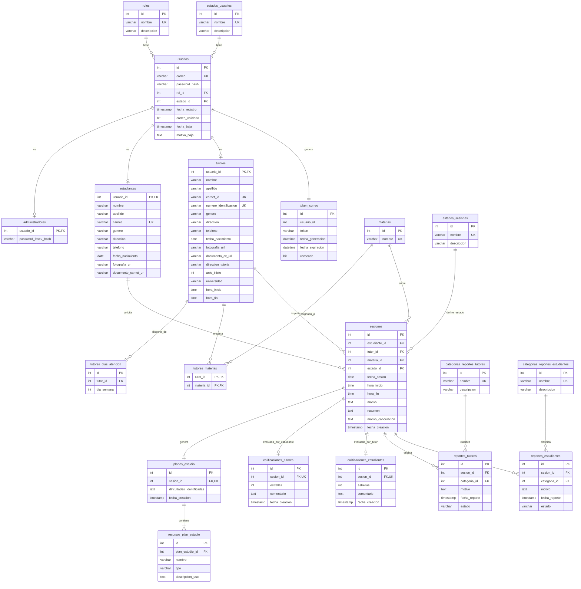

# DIAGRAMA ENTIDAD RELACIÓN DEL NEGOCIO

---

## Consideraciones de Diseño y Normalización (3FN)

1. **Cumplimiento de 3FN en `planes_estudio`**:
   - Para evitar redundancias y dependencias transitivas (`plan_estudio -> sesion -> tutor -> datos_tutor`), no se duplican en la entidad los campos `nombre_tutor`, `numero_identificacion_tutor`, `especialidad_tutor` ni `fecha_ultima_sesion`.
   - Toda esta información se obtiene mediante consultas relacionales (`JOIN`) con las tablas `sesiones`, `tutores` y `materias` a través de la clave foránea `sesion_id`.
2. **Cardinalidad de `recursos_plan_estudio` (1:N)**:
   - Cumple con la Primera Forma Normal (1FN) al modelar los recursos recomendados (nombre, tipo y descripción de uso) en una entidad dependiente, permitiendo múltiples recursos por plan de estudio sin almacenar estructuras compuestas o listas en una sola columna.
3. **Calificaciones Mutuas**:
   - `calificaciones_tutores`: Almacena la puntuación (0-5 estrellas) y comentario opcional emitidos por el estudiante hacia el tutor tras la sesión atendida.
   - `calificaciones_estudiantes`: Almacena la puntuación (0-5 estrellas) y comentario emitidos por el tutor evaluando al estudiante en la sesión.
4. **Reportes de Conducta e Incidencias**:
   - Los catálogos `categorias_reportes_tutores` y `categorias_reportes_estudiantes` almacenan las listas predefinidas exigidas por el negocio.
   - Las entidades `reportes_tutores` y `reportes_estudiantes` quedan vinculadas a la sesión origen (`sesion_id`) y a la categoría correspondiente (`categoria_id`), manteniendo el motivo y estado para seguimiento por parte del administrador.