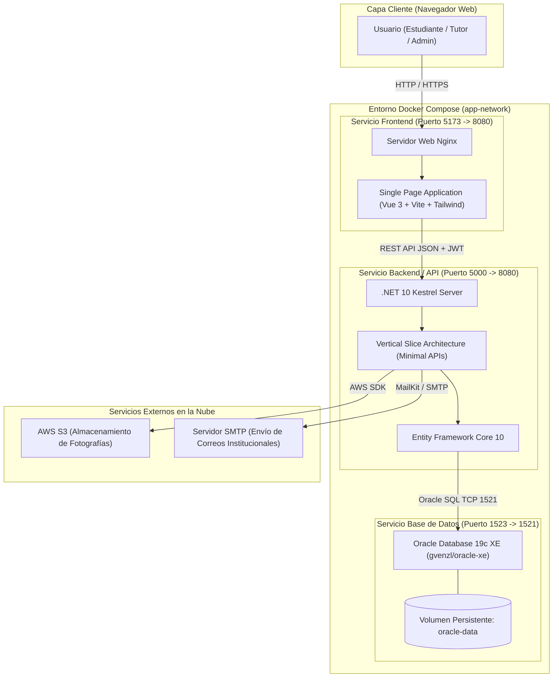
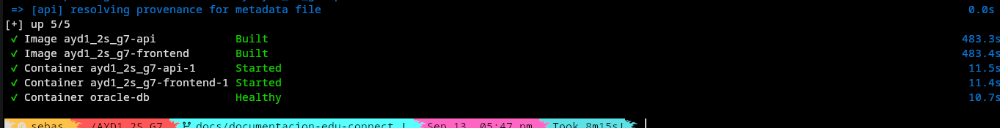
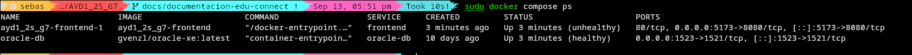
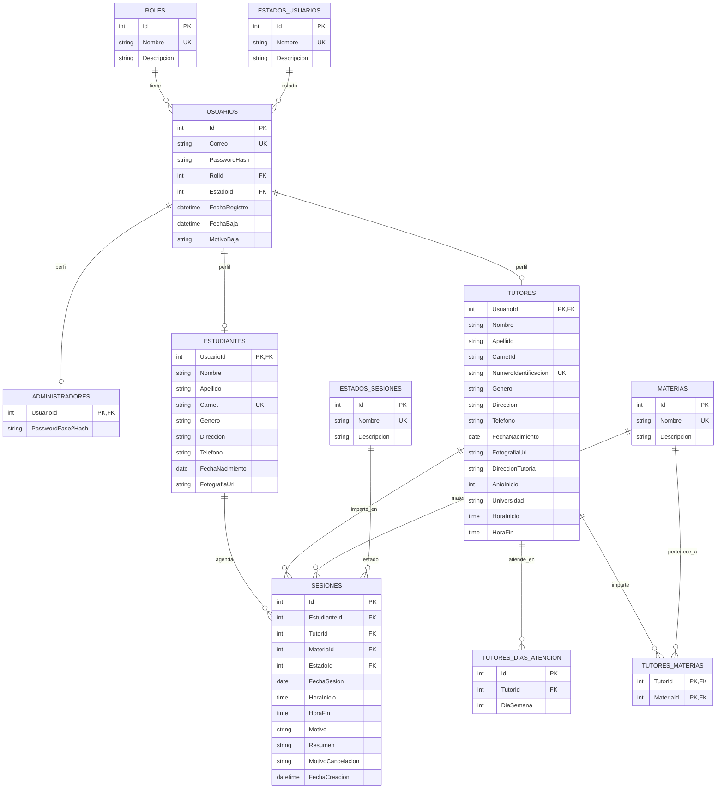

# Manual Técnico de Arquitectura e Instalación — EduConnect

**Universidad de San Carlos de Guatemala**  
**Facultad de Ingeniería — Escuela de Ciencias y Sistemas**  
**Análisis y Diseño de Sistemas 1  — Segundo Semestre 2026**  
**Grupo 7**

---

### Ficha Técnica y Equipo de Desarrollo
* **Nombre del Sistema:** EduConnect — Plataforma de Gestión de Tutorías Académicas
* **Repositorio del Proyecto:** [Grupo 7 - AYD1](https://github.com/Sebastian-G-0607/AYD1_2S_G7.git)

* **Roles del Equipo de Desarrollo:**

    | Nombre Completo | Carnet | Rol Asignado |
    | :--- | :---: | :---: |
    | **Carlos Eduardo Lau López** | 202202812 | **Scrum Master** / Desarrollador |
    | **Eduardo Sebastián Gutiérrez Felipe** | 202300694 | **Product Owner** / Desarrollador |
    | **Christian David Chinchilla Santos** | 202308227 | Equipo de Desarrollo |
    | **Josue Daniel Revolorio Martinez** | 202102984 | Equipo de Desarrollo |
    | **Sebastian Antonio Romero Tzitzimit** | 202201690 | Equipo de Desarrollo |
    | **Keitlyn Valentina Tunchez Castañeda** | 202201139 | Equipo de Desarrollo |
---

## 1. Visión General y Arquitectura del Sistema

EduConnect está construido sobre una arquitectura cliente-servidor desacoplada y contenedorizada mediante Docker Compose, garantizando portabilidad absoluta, separación estricta de responsabilidades e independencia de entornos operativos.



### 1.1 Decisiones Arquitectónicas Principales

1. **Backend — Vertical Slice Architecture (.NET 10 Minimal APIs):**
   - Se descartó el modelo clásico de controladores monolíticos en capas (`Controllers/`, `Services/`, `Repositories/`) en favor de un enfoque organizado por **características de negocio (`Features/`)**.
   - Cada caso de uso (ej. `RegistrarEstudiante`, `ProgramarSesion`, `AdminTwoFactor`) reside en su propio directorio autocontenido, albergando sus DTOs específicos de entrada/salida y la lógica del endpoint con **Minimal APIs** de alto rendimiento.
   - Acceso a datos mediante **Entity Framework Core 10** conectándose directamente al motor **Oracle Database 19c XE**.

2. **Frontend — Feature-Driven Architecture (Vue 3 + TypeScript + Tailwind CSS):**
   - Aplicación de una sola página (**SPA**) construida con **Vue 3** utilizando estrictamente la sintaxis moderna de **Composition API (`<script setup lang="ts">`)**.
   - Modularización por dominios (`src/features/*`), aislamiento de componentes atómicos compartidos (`src/components/ui/*`), layouts estructurales (`AuthLayout`, `DashboardLayout`) y guardias de navegación tipados para control de roles (`Admin`, `Tutor`, `Estudiante`).
   - Sistema de diseño propio adaptado desde los prototipos creados en **Google Stitch**, sin el uso de Bootstrap ni plantillas genéricas.

3. **Orquestación y Persistencia:**
   - Orquestación con **Docker Compose** que administra una red tipo bridge aislada (`app-network`) y un volumen nombrado (`oracle-data`) para que los datos persistan entre reinicios de contenedores.
   - El backend implementa **migraciones automáticas (`MigrateDbAsync`)** y un mecanismo de siembra de datos iniciales (**Seeding**) que crea catálogos y el usuario Administrador automáticamente.

---

## 2. Requisitos del Entorno e Instalación

### 2.1 Requisitos de Hardware Recomendados
* **Procesador:** CPU de 64 bits con al menos 4 núcleos (Intel Core i5 / AMD Ryzen 5 o superior).
* **Memoria RAM:** Mínimo 8 GB de memoria RAM (recomendado 16 GB debido a la demanda de memoria de Oracle XE).
* **Almacenamiento:** Mínimo 15 GB de espacio libre en disco (para imágenes Docker, capas de compilación y volumen de Oracle).

### 2.2 Requisitos de Software
* **Sistema Operativo:** Linux (Ubuntu 22.04+, Debian 12+, Fedora, Arch), Windows 10/11 con WSL2, o macOS con Docker Desktop.
* **Docker Engine:** Versión 24.0 o superior.
* **Docker Compose:** Versión 2.20 o superior (`docker compose` con soporte para V2).
* **Git:** Para control de versiones y clonación del repositorio.

*(Opcional únicamente para desarrollo local fuera de Docker):*
* **.NET SDK:** Versión 10.0 preview / oficial.
* **Node.js:** Versión 22.x LTS o superior con **pnpm** (v9+) o **npm** (v10+).

---

## 3. Configuración de Variables de Entorno

El sistema se parametriza mediante un archivo de variables de entorno `.env` ubicado en la raíz del proyecto. Este archivo alimenta tanto al contenedor de la API como al del Frontend.

### 3.1 Diccionario de Variables de Entorno

| Variable | Tipo | Servicio | Propósito y Descripción |
| :--- | :---: | :---: | :--- |
| `ConnectionStrings__edu_connect_serviceDB` | Cadena | Backend | Cadena de conexión hacia Oracle Database (`oracle-db:1521/XEPDB1`). |
| `Jwt__Key` | Secreto | Backend | Llave simétrica de al menos 256 bits para firmar y verificar tokens JWT y derivar la clave AES para 2FA. |
| `Jwt__Issuer` | Cadena | Backend | Emisor del token (`edu-connect-service`). |
| `Jwt__Audience` | Cadena | Backend | Audiencia autorizada (`edu-connect-client`). |
| `Jwt__ExpirationMinutes` | Numérico | Backend | Tiempo de vigencia del token JWT (recomendado: 120 minutos). |
| `AllowedOrigins` | Cadena | Backend | Orígenes permitidos por CORS (ej. `*` o `http://localhost:5173`). |
| `AllowedHosts` | Cadena | Backend | Hosts permitidos por ASP.NET Core (`*`). |
| `AdminUser__Email` | Correo | Backend | Correo inicial del usuario Administrador del sistema. |
| `AdminUser__Password` | Cadena | Backend | Contraseña del primer factor de autenticación del Administrador. |
| `AdminUser__PasswordFase2` | Cadena | Backend | Contraseña esperada tras descifrar el archivo `auth2-ayd1.txt` en el segundo factor. |
| `Smtp__Host` | Cadena | Backend | Servidor SMTP para envío de correos de aprobación, rechazo y cancelaciones. |
| `Smtp__Port` | Numérico | Backend | Puerto del servidor SMTP (ej. 587 para TLS o 465 para SSL). |
| `Smtp__User` | Cadena | Backend | Usuario / correo de la cuenta SMTP. |
| `Smtp__Password` | Secreto | Backend | Contraseña de aplicación de la cuenta SMTP. |
| `Smtp__EnableSsl` | Booleano | Backend | Habilita cifrado SSL/TLS para el envío de correos (`true` / `false`). |
| `Smtp__From` | Correo | Backend | Dirección de correo del remitente institucional. |
| `Smtp__FromName` | Cadena | Backend | Nombre visible del remitente (`EduConnect Tutorías`). |
| `S3__AWS_ACCESS_KEY_ID` | Secreto | Backend | Identificador de acceso de AWS IAM para almacenamiento S3. |
| `S3__AWS_SECRET_ACCESS_KEY` | Secreto | Backend | Llave secreta de AWS IAM. |
| `S3__AWS_REGION` | Cadena | Backend | Región de AWS donde reside el bucket (ej. `us-east-1`). |
| `S3__S3_BUCKET_NAME` | Cadena | Backend | Nombre del bucket S3 para alojar fotos de tutores y estudiantes. |
| `VITE_API_URL` | URL | Frontend | URL base de la API consumida por el cliente web (`http://localhost:5000`). |
| `VITE_APP_ENV` | Cadena | Frontend | Entorno de despliegue (`production` o `development`). |

---

## 4. Guía Paso a Paso de Despliegue con Docker Compose

### Paso 1: Clonar y Ubicarse en el Proyecto
```bash
git clone https://github.com/Sebastian-G-0607/AYD1_2S_G7.git
cd AYD1_2S_G7
```

### Paso 2: Crear el Archivo de Configuración `.env`
Crea el archivo `.env` en la raíz copiando la plantilla base y asignando las credenciales deseadas:
```bash
cp .env.example .env
```

### Paso 3: Construir y Levantar los Contenedores
Ejecuta el siguiente comando para compilar las imágenes Docker y poner en marcha todos los servicios en segundo plano:
```bash
docker compose up --build -d
```


### Paso 4: Monitorear el Proceso de Arranque
Dado que el motor Oracle Database XE realiza verificaciones internas en su primer arranque, puedes monitorear el estado de salud con:
```bash
docker compose ps
docker compose logs -f api
```

### Paso 5: Puertos y URLs de Acceso

| Servicio | Contenedor | Puerto Anfitrión | URL de Acceso Local |
| :--- | :--- | :---: | :--- |
| **Frontend Web** | `frontend` | **5173** | [http://localhost:5173](http://localhost:5173) |
| **Backend REST API** | `api` | **5000** | [http://localhost:5000](http://localhost:5000) |
| **Swagger UI (OpenAPI)** | `api` | **5000** | [http://localhost:5000/swagger](http://localhost:5000/swagger) |
| **Oracle Database XE** | `oracle-db` | **1523** | `localhost:1523/XEPDB1` |

---

## 5. Modelo de Datos y Esquema de Base de Datos (Oracle XE)

### 5.1 Diagrama Entidad-Relación (ER)



### 5.2 Configuración del Contexto de Base de Datos (EF Core)

* **Referencia de Código:**
```c#
public class edu_connect_serviceContext(DbContextOptions<edu_connect_serviceContext> options)
    : DbContext(options)
{
    public DbSet<Rol> Roles => Set<Rol>();

    public DbSet<EstadoUsuario> EstadosUsuarios => Set<EstadoUsuario>();

    public DbSet<EstadoSesion> EstadosSesiones => Set<EstadoSesion>();

    public DbSet<Usuario> Usuarios => Set<Usuario>();

    public DbSet<Administrador> Administradores => Set<Administrador>();

    public DbSet<Estudiante> Estudiantes => Set<Estudiante>();

    public DbSet<Tutor> Tutores => Set<Tutor>();

    public DbSet<TutorDiaAtencion> TutoresDiasAtencion => Set<TutorDiaAtencion>();

    public DbSet<Materia> Materias => Set<Materia>();

    public DbSet<TutorMateria> TutoresMaterias => Set<TutorMateria>();

    public DbSet<Sesion> Sesiones => Set<Sesion>();

    protected override void ConfigureConventions(ModelConfigurationBuilder configurationBuilder)
    {
        configurationBuilder.Properties<DateOnly>()
            .HaveConversion<DateOnlyConverter>();

        configurationBuilder.Properties<TimeOnly>()
            .HaveConversion<TimeOnlyConverter>();
    }

    protected override void OnModelCreating(ModelBuilder modelBuilder)
    {
        modelBuilder.ApplyConfigurationsFromAssembly(typeof(edu_connect_serviceContext).Assembly);
    }
}

```

### 5.3 Datos Semilla y Catálogos Iniciales
Al ejecutarse `MigrateDbAsync()`, el sistema ejecuta automáticamente el método `SeedCatalogsAndData()` presente en `DataExtensions.cs`, asegurando que la base de datos cuente inmediatamente con:
* **Roles:** `Admin`, `Estudiante`, `Tutor`.
* **Estados de Usuario:** `PENDIENTE`, `APROBADO`, `RECHAZADO`, `INACTIVO`.
* **Estados de Sesión:** `PENDIENTE`, `ATENDIDA`, `CANCELADA_TUTOR`, `CANCELADA_ESTUDIANTE`.
* **50 Materias Universitarias:** Cálculo Diferencial e Integral, Álgebra Lineal, Física, Estructuras de Datos, IA, etc.
* **Usuario Administrador:** Creado con correo y contraseña encriptada derivados de las variables de entorno.

---

## 6. Seguridad y Mecanismos Criptográficos

### 6.1 Hashing de Contraseñas (BCrypt)
Para garantizar la protección de credenciales según los estándares de la industria:
- Las contraseñas se procesan mediante la biblioteca `BCrypt.Net-Next`.
- Se genera un salt criptográfico aleatorio único por cada contraseña.
- Se previene el ataque por tablas arcoíris (*rainbow tables*).

### 6.2 Autenticación de Dos Factores (2FA) con Cifrado AES-256-CBC
El inicio de sesión del Administrador implementa una verificación física criptográfica única:

```
[Administrador] ──── Credenciales Primer Factor ────► [/auth/admin-login]
                                                             │
                                                     Emite TempToken JWT
                                                     (Válido por 5 min)
                                                             │
[Administrador] ──── Sube archivo auth2-ayd1.txt ──► [/auth/admin-2fa]
                                                             │
                                                  1. Extrae IV (16 bytes)
                                                  2. Deriva clave vía SHA-256(Jwt:Key)
                                                  3. Descifra texto vía AES-256-CBC
                                                  4. Compara resultado == PasswordFase2
                                                             │
                                                     Emite Token Final JWT
                                                     (Rol: Administrador)
```


---

## 7. Catálogo Exhaustivo de Endpoints de la API (RESTful)

### 7.1 Módulo de Autenticación (`/auth` y `/api`)

| Método | Ruta | Rol Requerido | Descripción |
| :---: | :--- | :---: | :--- |
| `POST` | `/auth/login` | Público | Autentica a estudiantes y tutores activos (estado `APROBADO`). |
| `POST` | `/auth/admin-login` | Público | Valida credenciales primarias de Administrador y emite token 2FA temporal. |
| `POST` | `/auth/admin-2fa` | `AdminPending2FA` | Procesa el archivo `auth2-ayd1.txt`, descifra AES y emite token de Administrador. |
| `GET` | `/auth/me` | Autenticado | Retorna los datos y rol del usuario autenticado en la sesión actual. |

### 7.2 Módulo de Administrador (`/api/admin`)

| Método | Ruta | Rol Requerido | Descripción |
| :---: | :--- | :---: | :--- |
| `GET` | `/api/admin/estudiantes/pendientes` | `Administrador` | Lista estudiantes en estado `PENDIENTE` para su evaluación. |
| `PATCH` | `/api/admin/estudiantes/{id}/estado` | `Administrador` | Aprueba o rechaza solicitud de estudiante y dispara notificación por correo. |
| `GET` | `/api/admin/estudiantes/activos` | `Administrador` | Lista estudiantes con cuenta activa (`APROBADO`). |
| `POST` | `/api/admin/estudiantes/{id}/baja` | `Administrador` | Da de baja a un estudiante con motivo y envía correo de notificación. |
| `GET` | `/api/admin/tutores/pendientes` | `Administrador` | Lista tutores en estado `PENDIENTE` junto a sus materias y credenciales. |
| `PATCH` | `/api/admin/tutores/{id}/estado` | `Administrador` | Aprueba o rechaza a un tutor y notifica por correo electrónico. |
| `GET` | `/api/admin/tutores/activos` | `Administrador` | Lista tutores aceptados y activos en la plataforma. |
| `POST` | `/api/admin/tutores/{id}/baja` | `Administrador` | Da de baja a un tutor con motivo y envía notificación por correo. |
| `GET` | `/api/admin/usuarios/dados-de-baja` | `Administrador` | Lista consolidada de usuarios inactivos con fecha y motivo de baja (HU-09). |
| `GET` | `/api/admin/reportes/tutores-mas-atenciones`| `Administrador` | Reporte de ranking de tutores con mayor número de sesiones atendidas. |
| `GET` | `/api/admin/reportes/materias-mayor-demanda`| `Administrador` | Reporte estadístico de las materias más solicitadas por estudiantes. |
| `GET` | `/api/admin/reportes/resumen` | `Administrador` | Métricas globales de usuarios activos, sesiones agendadas y tutorías finalizadas. |

### 7.3 Módulo de Estudiantes (`/api/estudiantes`)

| Método | Ruta | Rol Requerido | Descripción |
| :---: | :--- | :---: | :--- |
| `POST` | `/api/estudiantes/registro` | Público | Registra una nueva cuenta de estudiante en estado `PENDIENTE`. |
| `GET` | `/api/estudiantes/perfil` | `Estudiante` | Consulta los datos personales del perfil del estudiante en sesión. |
| `PUT` | `/api/estudiantes/perfil` | `Estudiante` | Actualiza datos de perfil y/o contraseña (validando contraseña actual). |
| `GET` | `/api/estudiantes/historial-sesiones` | `Estudiante` | Historial de tutorías atendidas (con resúmenes) y canceladas. |

### 7.4 Módulo de Tutores (`/api/tutores`)

| Método | Ruta | Rol Requerido | Descripción |
| :---: | :--- | :---: | :--- |
| `POST` | `/api/tutores/registro` | Público | Registra a un tutor con foto obligatoria en S3 y materias asociadas. |
| `GET` | `/api/tutores/perfil` | `Tutor` | Consulta la información profesional y académica del tutor. |
| `PUT` | `/api/tutores/perfil` | `Tutor` | Actualiza datos profesionales y contraseña del tutor. |
| `POST` | `/api/tutores/horario` | `Tutor` | Establece o actualiza los días y rango de horas de atención. |
| `GET` | `/api/tutores/horario` | `Tutor` | Consulta el horario de atención configurado por el tutor. |
| `GET` | `/api/tutores/explorar` | `Estudiante` | Explora tutores con filtros avanzados (materia, experiencia, edad, universidad). |
| `GET` | `/api/tutores/{id}/disponibilidad` | `Estudiante` | Consulta disponibilidad de horas libres y ocupadas para una fecha dada. |
| `GET` | `/api/tutores/dashboard-estadisticas` | `Tutor` | Métricas de rendimiento, sesiones de hoy y totales del tutor. |
| `GET` | `/api/tutores/historial-sesiones` | `Tutor` | Historial completo de sesiones del tutor con filtros de estado. |

### 7.5 Módulo de Sesiones de Tutoría (`/api/sesiones`)

| Método | Ruta | Rol Requerido | Descripción |
| :---: | :--- | :---: | :--- |
| `POST` | `/api/sesiones/programar` | `Estudiante` | Agenda sesión validando disponibilidad, días de atención y no traslapes. |
| `GET` | `/api/sesiones/activas` | `Estudiante` | Consulta las próximas sesiones activas del estudiante. |
| `GET` | `/api/sesiones/pendientes` | `Tutor` | Lista de tutorías pendientes por atender ordenadas por proximidad. |
| `POST` | `/api/sesiones/{id}/atender` | `Tutor` | Marca la sesión como atendida y registra el resumen/recomendaciones. |
| `POST` | `/api/sesiones/{id}/cancelar-tutor`| `Tutor` | Cancela la sesión, libera el cupo y envía correo con motivo y disculpas. |
| `POST` | `/api/sesiones/{id}/cancelar-estudiante`| `Estudiante` | Cancela la sesión activa y libera de inmediato el horario del tutor. |

---

## 8. Arquitectura y Estructura del Frontend (Vue 3 + Vite)

### 8.1 Organización Modular de Directorios (`src/`)

```text
edu-connect-client/src/
├── assets/             # Estilos globales Tailwind CSS y recursos estáticos
├── components/ui/      # Componentes UI atómicos reutilizables (BaseButton, BaseModal, etc.)
├── composables/        # Lógica reactiva reutilizable (useTheme, useAuth)
├── features/           # Módulos organizados por dominio de negocio:
│   ├── admin/          # Aprobaciones, usuarios activos y reportes
│   ├── auth/           # Login, registro y segundo factor 2FA
│   ├── session-booking/# Calendario y reserva de tutorías
│   ├── student-*/      # Historial, perfil y sesiones activas de alumnos
│   ├── tutor-*/        # Dashboard, horarios, atención, historial y perfil
│   └── tutors-explorer/# Catálogo y filtros avanzados de tutores
├── layouts/            # Plantillas maestras (AuthLayout y DashboardLayout)
├── pages/              # Vistas asociadas directamente a rutas de Vue Router
├── router/             # Definición de rutas, metadatos y Navigation Guards
└── services/           # Cliente Axios e interceptores Bearer JWT
```

### 8.2 Despliegue en Nginx y Sustitución de Variables en Caliente
El contenedor del frontend utiliza una imagen optimizada de Alpine Linux con Nginx. Antes de iniciar el servidor web, el script `docker-entrypoint.sh` inyecta las variables de entorno de Docker en un script cargado por el navegador (`public/env-config.js`), permitiendo reconfigurar la URL de la API sin tener que recompilar el bundle de TypeScript.

```php 
    location / {
        try_files $uri $uri/ /index.html;
    }
```

---

## 9. Diagnóstico y Solución de Problemas Frecuentes

### 9.1 El servicio API se detiene al iniciar por primera vez
* **Causa:** El contenedor de Oracle XE aún se encuentra inicializando su base de datos interna y preparando el tablespace.
* **Solución:** El backend cuenta con 10 reintentos automáticos en `DataExtensions.cs`. Si aún así expira, simplemente espera a que Oracle reporte `healthy` en `docker compose ps` y reinicia el servicio con:
  ```bash
  docker compose restart api
  ```

### 9.2 Error en la verificación del archivo 2FA (`auth2-ayd1.txt`)
* **Causa:** La variable `Jwt:Key` utilizada para descifrar el archivo debe ser exactamente la misma con la que se generó el payload Base64.
* **Solución:** Asegúrate de que la variable `Jwt__Key` en tu archivo `.env` coincida con la configuración del proyecto y que el archivo cargado sea estrictamente el provisto en `CosasQuePuedenServir/auth2-ayd1.txt`.

### 9.3 Los correos no se envían al aprobar usuarios o cancelar sesiones
* **Causa:** Credenciales SMTP no configuradas o puerto bloqueado por el proveedor de red.
* **Solución:** Verifica que `Smtp__Host`, `Smtp__Port` (587) y la contraseña de aplicación configurada en el `.env` sean válidas. Si trabajas en un entorno de pruebas sin conexión a internet, las excepciones SMTP son capturadas y registradas en el log del backend sin interrumpir la transacción del usuario.
