# Manual de Usuario – EduConnect

## Inicio de Sesión y Registro

Esta sección corresponde a las pantallas de acceso a la plataforma, comunes para todos los roles.

- **Inicio de Sesión:** formulario con los campos Correo Electrónico y Contraseña, junto con un enlace para ir al registro en caso de no tener cuenta todavía. Si las credenciales son incorrectas, o la cuenta aún no ha sido aprobada por un administrador, el sistema muestra un mensaje indicando el motivo.

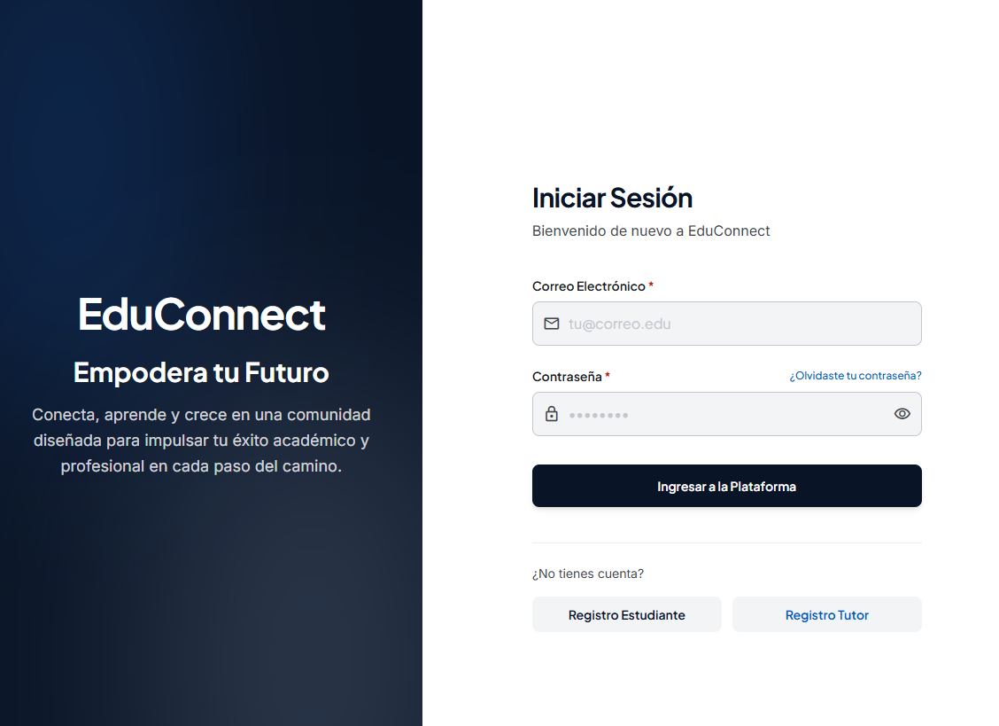

- **Registro de Estudiante:** formulario para crear una cuenta de estudiante, solicitando: Nombre, Apellido, Carnet Universitario, Género, Teléfono, Fecha de nacimiento, Dirección, fotografía de perfil (opcional), Correo electrónico, Contraseña y Confirmar Contraseña. Tras enviarlo, la cuenta queda pendiente de aprobación por un administrador.

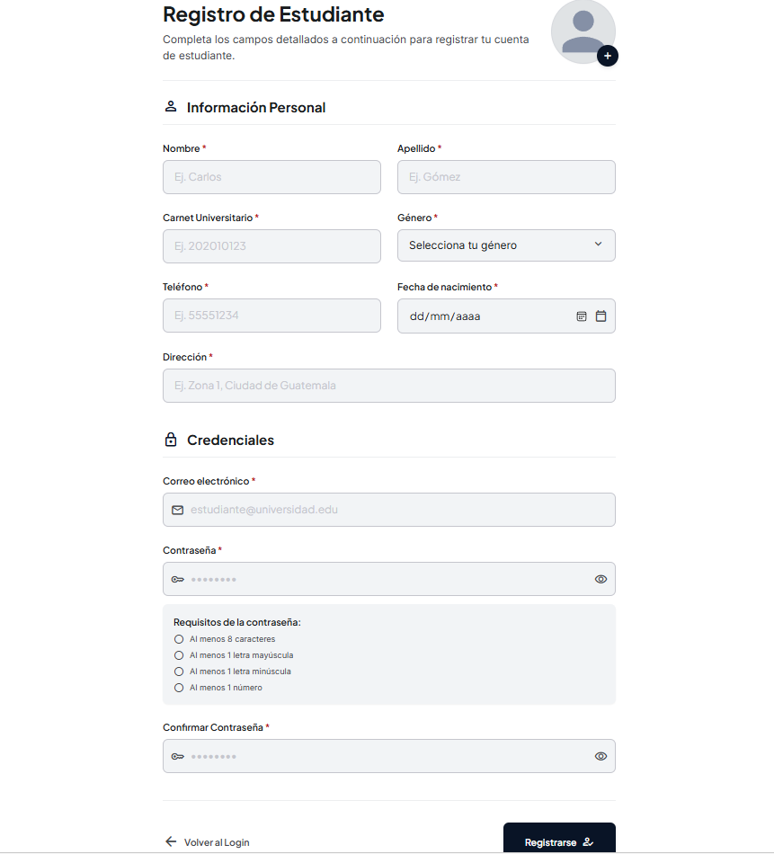

- **Registro de Tutor:** formulario para crear una cuenta de tutor, solicitando: Nombre, Apellido, Carnet Universitario/Tutor, DPI, Género, Teléfono, Fecha de nacimiento, Dirección de Residencia.

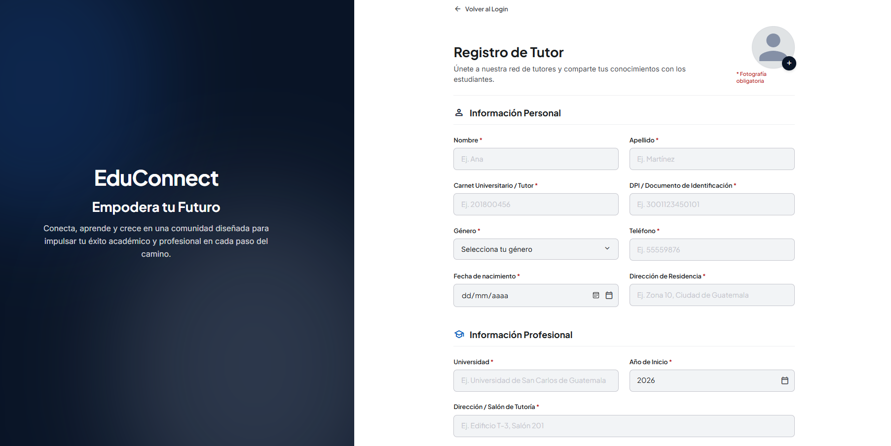
Universidad, Año de Inicio, Dirección/Salón de Tutoría, Materias de Especialidad, días y horario de atención, fotografía de perfil (obligatoria), Correo electrónico y Contraseña. Tras enviarlo, la cuenta queda pendiente de aprobación por un administrador.

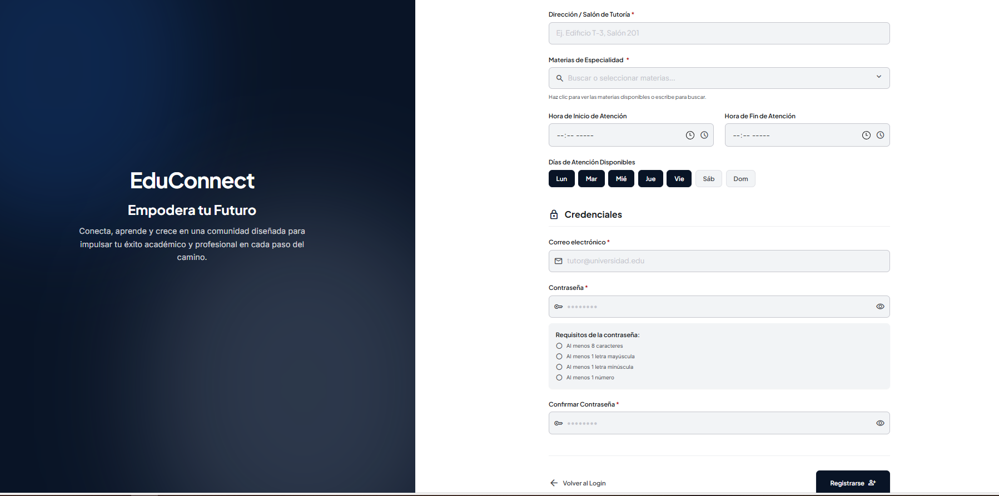
---

## Parte 1: Panel de Administrador

El rol de Administrador gestiona el ingreso de nuevos usuarios a la plataforma, supervisa las cuentas activas y consulta reportes generales del sistema. Para acceder a este panel es necesario iniciar sesión con las credenciales de administrador y completar un segundo factor de autenticación.

---

### 1.1 Inicio de sesión de Administrador (Doble Autenticación)

El acceso al panel de administrador requiere dos pasos:

1. **Credenciales iniciales:** ingrese correo y contraseña de administrador.
2. **Verificación (2FA):** suba el archivo `auth2-ayd1.txt` con la contraseña cifrada del segundo factor. Solo con ambos pasos validados se concede acceso al panel.

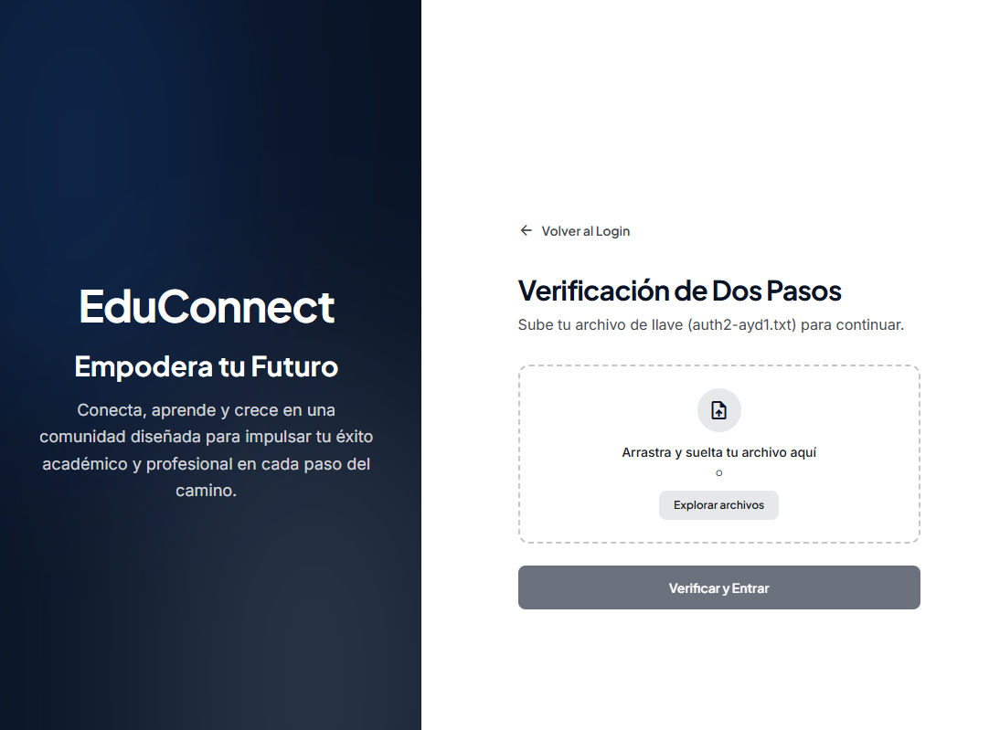

---

### 1.2 Aprobaciones Pendientes

Pantalla principal donde el administrador revisa las solicitudes de registro de nuevos estudiantes y tutores.

- **Pestañas "Estudiantes Pendientes" / "Tutores Pendientes":** alternan el listado visible, cada una con un contador de solicitudes en espera.
- **Buscador:** filtra la lista por nombre, carnet, ID o correo.
- **Botón "Actualizar":** recarga la lista de solicitudes desde el servidor.
- **Botón "Filtrar":** botón visual reservado para futuros filtros adicionales; actualmente no tiene función activa.
- **Botón "Exportar Lista":** botón visual reservado para exportar el listado; actualmente no tiene función activa.
- **Tarjeta de cada solicitud:** muestra los datos del solicitante y botones **Aceptar** / **Rechazar**, cada uno con una ventana de confirmación. Al aceptar, la cuenta se activa; al rechazar, se puede indicar un motivo opcional. En ambos casos se notifica por correo al usuario.

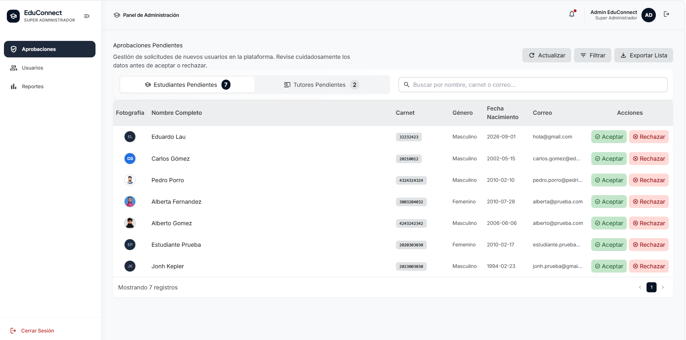

---

### 1.3 Gestión de Usuarios

Permite administrar a los usuarios ya aprobados.

- **Pestañas superiores "Usuarios Activos" / "Usuarios Dados de Baja":** alternan entre ambos listados.
- **Sub-pestañas "Estudiantes" / "Tutores":** filtran el listado por tipo de usuario.
- **Buscador:** filtra por nombre o correo electrónico.
- **Contador de totales:** muestra la cantidad de usuarios en la categoría seleccionada.
- **Opción "Dar de baja":** disponible en cada fila de usuario activo. Abre una ventana de confirmación que solicita un motivo obligatorio. Al confirmar, el usuario pierde acceso de inmediato, recibe un correo de notificación y pasa al listado de dados de baja, donde queda registrada la fecha y el motivo.

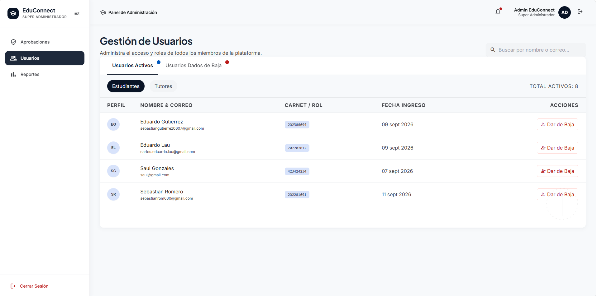

---

### 1.4 Reportes (Visión General Académica)

Presenta métricas generales del uso de la plataforma.

- **Gráfico de barras:** tutores con más estudiantes atendidos, según sesiones marcadas como atendidas.
- **Gráfico circular:** materias con mayor demanda, según solicitudes y sesiones registradas.
- **Pestañas "Todos" / "Tutores" / "Materias":** alternan las tablas de detalle mostradas debajo de los gráficos.
- **Tabla "Ranking de Tutores por Estudiantes Atendidos":** listado ordenado de tutores según su volumen de atención.
- **Tabla "Demanda de Materias y Asignaturas":** listado ordenado de materias según su demanda.
- **Botón "Exportar Reporte":** botón visual reservado para exportar la información; actualmente no tiene función activa.

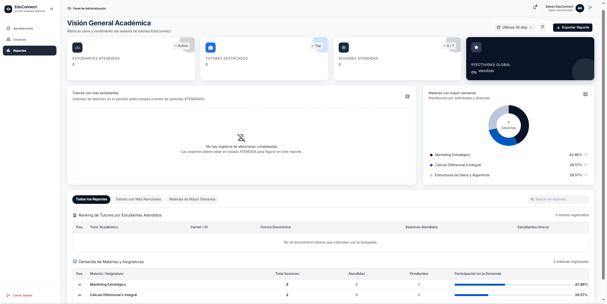

---

### Resumen de navegación — Administrador

| Sección | Ruta | Descripción |
|---|---|---|
| Aprobaciones Pendientes | `/admin/aprobaciones` | Aceptar o rechazar registros de estudiantes y tutores |
| Gestión de Usuarios | `/admin/usuarios` | Ver usuarios activos, darlos de baja y consultar bajas anteriores |
| Reportes | `/admin/reportes` | Consultar métricas y estadísticas generales de la plataforma |

## Parte 2: Panel de Tutor

El rol de Tutor gestiona sus sesiones de tutoría, configura sus horarios de atención, consulta su historial y administra su perfil profesional.

---

### 2.1 Dashboard — Mis Sesiones Pendientes

Pantalla principal del tutor tras iniciar sesión.

- **Botón "Filtrar":** botón visual reservado para futuros filtros; actualmente no tiene función activa.
- **Botón "Nueva Sesión":** botón visual reservado; actualmente no tiene función activa (las sesiones las programan los estudiantes).
- **Tarjetas de estadísticas:**
  - **Sesiones Pendientes:** cantidad de sesiones por atender, con indicador de cuántas son para el día de hoy.
  - **Sesiones Atendidas (Mes):** cantidad de sesiones completadas en el mes.
  - **Sesiones Canceladas:** cantidad total de cancelaciones.
- **Tabla de sesiones pendientes:** lista cada sesión con fecha, hora, nombre del estudiante, materia y motivo, ordenadas por fecha más próxima. Cada fila tiene dos acciones:
  - **Marcar como Atendida:** abre una ventana donde el tutor debe escribir un resumen de la sesión (obligatorio) y, opcionalmente, recomendaciones para el estudiante. Al guardar, la sesión pasa a estado "Atendida" y desaparece de la lista de pendientes.
  - **Cancelar Sesión:** abre una ventana de confirmación donde se puede indicar un motivo opcional. Al confirmar, se notifica al estudiante y la sesión desaparece de la lista de pendientes.
- **Estado vacío:** si no hay sesiones pendientes, se muestra un mensaje junto a un botón "Ver Historial" que enlaza a la sección de historial.

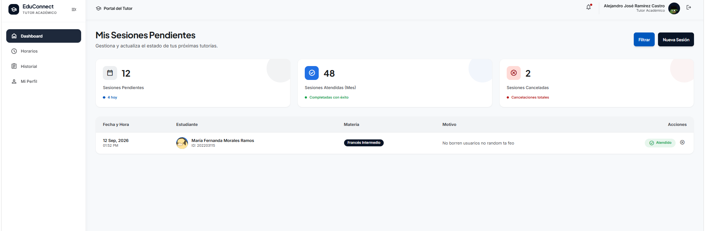

---

### 2.2 Configuración de Horarios

Permite al tutor definir y modificar los días y el rango de horas en que atiende tutorías.

- **Selector de días:** botones para marcar uno o varios días de la semana en los que se atenderá.
- **Hora de inicio / Hora de finalización:** definen el rango de atención, aplicado por igual a todos los días seleccionados.
- **Panel "Resumen":** muestra en todo momento los días y el horario actualmente seleccionados antes de guardar.
- **Botón "Guardar cambios":** aplica la configuración. Si existen sesiones ya agendadas que quedarían fuera del nuevo horario, el sistema rechaza el cambio y muestra un mensaje indicando cuál sesión genera el conflicto, hasta que esta sea reprogramada o cancelada.
- Al ingresar a esta pantalla, el formulario se precarga automáticamente con el horario configurado previamente, si existe.

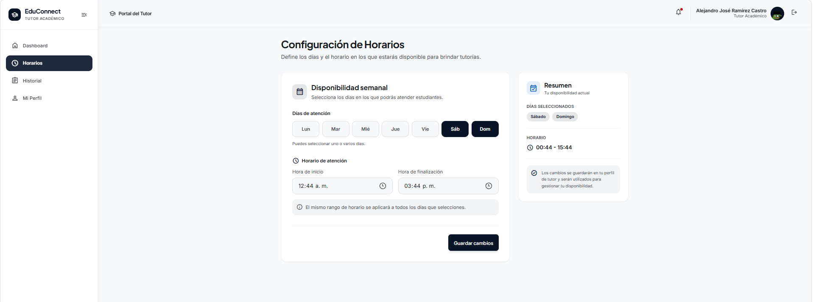

---

### 2.3 Historial de Sesiones

Muestra el registro completo de tutorías atendidas y canceladas del tutor.

- **Filtro por Fecha:** muestra únicamente las sesiones de la fecha seleccionada.
- **Filtro por Estudiante o Correo:** busca por nombre, apellido o correo del estudiante.
- **Indicador de filtros activos:** muestra cuántos filtros están aplicados, con opción de quitarlos individualmente o limpiarlos todos.
- **Tabla de historial:** columnas de Fecha, Hora, Estudiante, Correo y Estado (Atendida, Cancelada por el tutor, Cancelada por el estudiante).

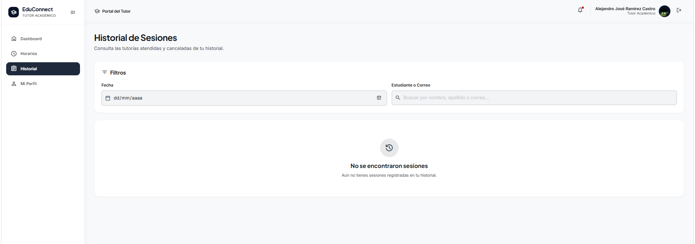

---

### 2.4 Mi Perfil

Permite al tutor consultar y actualizar su información.

- **Fotografía de perfil:** puede reemplazarse desde esta misma pantalla.
- **Información personal:** Nombre, Apellido, Carnet Universitario/Tutor, DPI, Género, Teléfono, Fecha de nacimiento y Dirección de residencia. Todos los campos son editables.
- **Información profesional:** Universidad, Año de inicio y Dirección/Salón de Tutoría. Editables.
- **Cuenta:** muestra el correo electrónico, el cual no puede modificarse.
- **Botón "Guardar cambios":** aplica las actualizaciones al perfil.
- **Sección "Cambiar contraseña":** solicita la contraseña actual, la nueva contraseña (validada contra los requisitos de seguridad) y su confirmación. Requiere que ambas contraseñas coincidan antes de habilitar el botón "Cambiar contraseña".

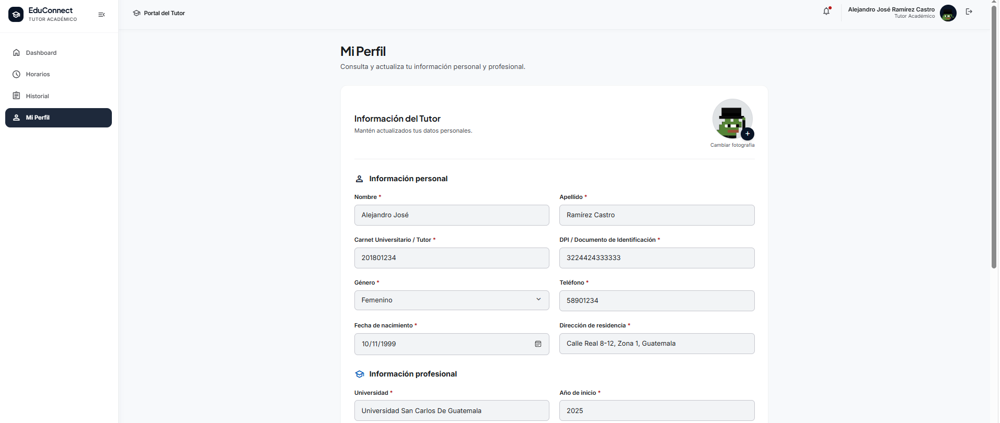

---

### Resumen de navegación — Tutor

| Sección | Ruta | Descripción |
|---|---|---|
| Dashboard | `/tutor/dashboard` | Ver y gestionar sesiones pendientes |
| Horarios | `/tutor/horarios` | Configurar días y rango de atención |
| Historial | `/tutor/historial` | Consultar sesiones atendidas y canceladas |
| Mi Perfil | `/tutor/perfil` | Ver y actualizar datos personales y contraseña |

## Parte 3: Panel de Estudiante

El rol de Estudiante permite buscar tutores, consultar su disponibilidad, programar y gestionar sesiones de tutoría, revisar su historial y administrar su perfil.

---

### 3.1 Explorar Tutores

Pantalla principal del estudiante tras iniciar sesión. Muestra el listado de tutores disponibles en la plataforma, excluyendo a aquellos con los que ya se tiene una sesión activa.

- **Barra de filtros:**
  - **Materia:** filtra tutores según la especialidad que imparten.
  - **Universidad:** filtra por universidad de graduación.
  - **Experiencia mínima:** filtra por años mínimos de experiencia dando tutorías.
  - **Edad máxima:** filtra por edad máxima del tutor.
  - **Género:** filtra entre "Cualquiera", "Femenino" o "Masculino".
  - **Botón "Limpiar todos":** restablece todos los filtros aplicados.
- **Chips de filtros activos:** muestran de forma resumida los filtros en uso, cada uno con opción de quitarlo individualmente.
- **Selector de vista:** alterna entre presentación en cuadrícula o en lista.
- **Tarjeta de tutor:** muestra fotografía, nombre completo, materias que imparte, dirección de tutoría, universidad y años de experiencia. Incluye dos botones:
  - **Ícono de reloj:** abre la ventana de "Horarios y Disponibilidad" del tutor sin salir de esta pantalla.
  - **"Ver Perfil y Horarios":** lleva a la pantalla de programación de sesión con ese tutor.
- **Estado vacío:** si ningún tutor coincide con los filtros, se muestra un mensaje junto a un botón para restablecerlos.

---

### 3.2 Horarios y Disponibilidad (ventana emergente)

Se abre desde el ícono de reloj en la tarjeta del tutor, o desde el botón "Ver horarios disponibles" dentro de la pantalla de programar sesión.

- **Selector de fecha:** al cambiarlo, consulta automáticamente la disponibilidad del tutor para ese día.
- **Resumen del tutor:** muestra los días que atiende y su rango de horario general.
- **Cuadrícula de bloques horarios:** cada bloque representa un horario del día seleccionado, marcado como "Disponible" u "Ocupado" según corresponda.
- Si el tutor no atiende en la fecha elegida, se muestra un aviso indicándolo en lugar de la cuadrícula.

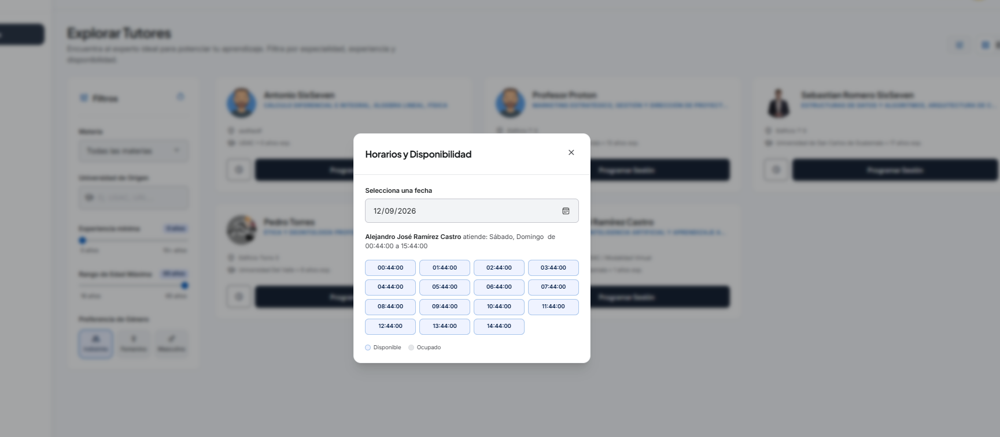

---

### 3.3 Programar Sesión

Se accede desde el botón "Ver Perfil y Horarios" de una tarjeta de tutor.

- **Datos del tutor:** muestra su información de perfil como referencia antes de agendar.
- **Formulario de programación:** solicita fecha, hora, materia (entre las que imparte el tutor seleccionado) y motivo de la sesión.
- **Botón "Ver horarios disponibles":** abre la misma ventana de disponibilidad descrita en la sección anterior, para consultar antes de elegir fecha y hora.
- **Validaciones al enviar:** el sistema verifica que la fecha y hora estén dentro del horario del tutor y que no exista traslape con otra sesión. Si alguna validación falla, se muestra el motivo específico.
- **Reumen de Tutor seleccionado:** En el lado derecho podra observar un resumen del tutor que a seleccionado en una tarjeta flotante.

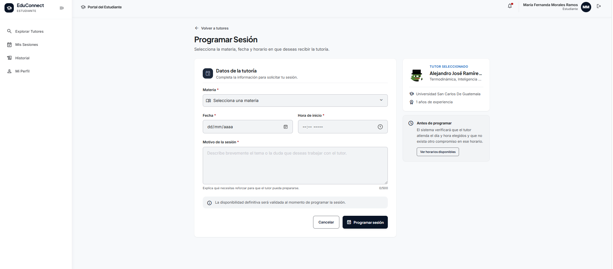

---

### 3.4 Mis Sesiones

Muestra las sesiones activas (aún no atendidas ni canceladas) del estudiante.

- **Botón "Filtrar":** despliega opciones para filtrar por estado: Todas, Próximas, Pendientes, Confirmadas.
- **Botón "Nueva Sesión":** lleva a la pantalla de Explorar Tutores.
- **Tarjeta de sesión:** muestra los datos de la tutoría agendada, con opción de **cancelar**. Al cancelar, se solicita confirmación; una vez confirmada, la sesión se retira de la lista y el horario queda liberado para otros estudiantes.
- **Estado vacío:** si no hay sesiones agendadas, se muestra un botón para ir a Explorar Tutores.

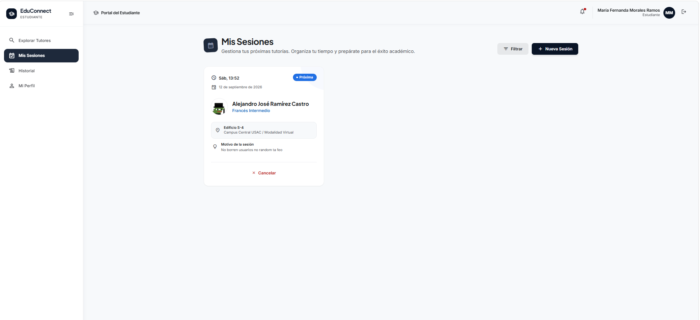

---

### 3.5 Historial de Sesiones

Muestra el registro completo de tutorías pasadas del estudiante, atendidas o canceladas.

- **Tarjetas resumen:** Total de sesiones, Sesiones Atendidas y Sesiones Canceladas.
- **Selector de estado:** filtra entre Todos los estados, Atendidas, Canceladas por ti o Canceladas por el tutor.
- **Buscador:** filtra por tutor, materia o motivo.
- **Tabla de historial:** columnas de Fecha, Tutor, Materia, Motivo, Dirección y Estado.
- **Columna "Resumen":** disponible únicamente en sesiones atendidas. Al presionar el ícono, se abre una ventana con el resumen que el tutor registró al finalizar la sesión.

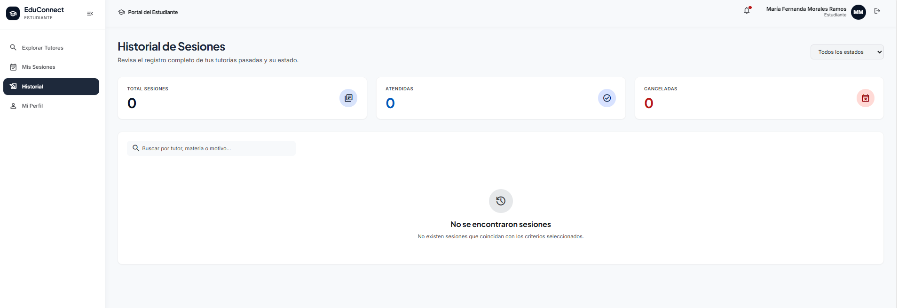

---

### 3.6 Mi Perfil

Permite al estudiante consultar y actualizar su información.

- **Fotografía de perfil:** puede reemplazarse desde esta pantalla.
- **Información personal:** Nombres, Apellidos, Carnet universitario, Género, Teléfono, Fecha de nacimiento y Dirección. Todos los campos son editables, a excepción del correo electrónico.
- **Sección "Cambiar contraseña":** solicita la contraseña actual, la nueva contraseña y su confirmación antes de permitir el cambio.

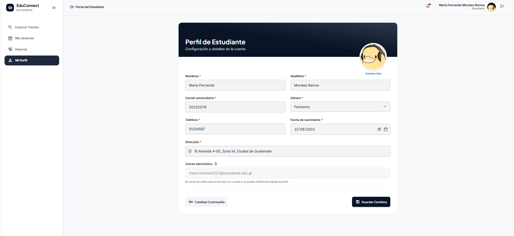

---

### Resumen de navegación — Estudiante

| Sección | Ruta | Descripción |
|---|---|---|
| Explorar Tutores | `/estudiante/explorar-tutores` | Buscar y filtrar tutores disponibles |
| Programar Sesión | `/estudiante/tutores/:tutorId` | Consultar disponibilidad y agendar sesión con un tutor |
| Mis Sesiones | `/estudiante/mis-sesiones` | Ver y cancelar sesiones activas |
| Historial | `/estudiante/historial` | Consultar sesiones pasadas y resúmenes de tutorías atendidas |
| Mi Perfil | `/estudiante/mi-perfil` | Ver y actualizar datos personales y contraseña |

---

## Cierre

Este manual describe el funcionamiento completo de EduConnect para los tres roles de la plataforma: Administrador, Tutor y Estudiante. Cada sección detalla las pantallas disponibles, sus elementos y el flujo esperado de uso, sirviendo como guía de referencia tanto para nuevos usuarios como para el equipo de desarrollo durante las pruebas y el mantenimiento del sistema.
