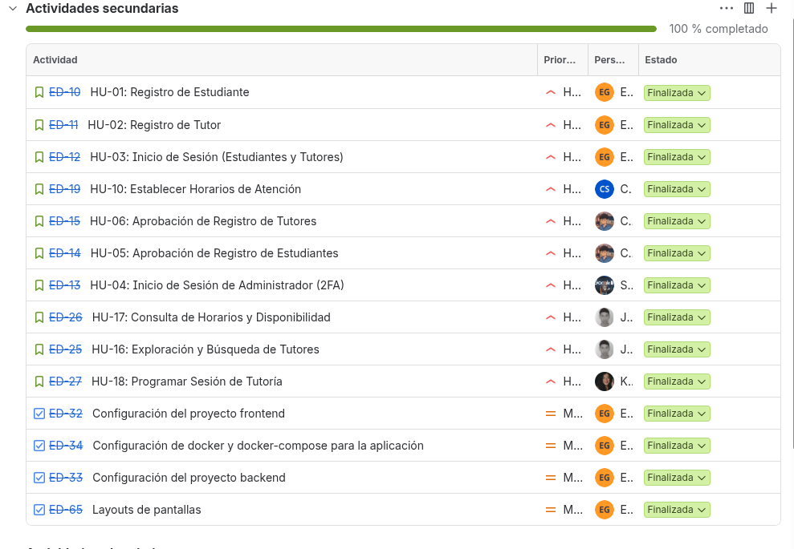

# Product Backlog & Estimaciones (Jira) — EduConnect

**Universidad de San Carlos de Guatemala (USAC)**  
**Facultad de Ingeniería — Escuela de Ciencias y Sistemas**  
**Análisis y Diseño de Sistemas 1 (AYD1) — Segundo Semestre 2026**  
**Grupo 7**

---

### Gestión del Proyecto
* **Herramienta de Gestión:** Jira Software Cloud
* **URL del Tablero en Jira:** [EduConnect G7 Jira Workspace](https://edu-connect-g7.atlassian.net/jira/software/projects/ED/summary)
* **Product Owner:** Eduardo Sebastián Gutiérrez Felipe (202300694)
* **Scrum Master:** Carlos Eduardo Lau López (202202812)
* **Equipo de Desarrollo:** Carlos Lau, Eduardo Gutiérrez, Christian Chinchilla, Josue Revolorio, Sebastian Romero, Keitlyn Tunchez.

---

## 1. Metodología de Estimación (Planning Poker / Story Points)

Para la estimación del esfuerzo de cada Historia de Usuario en Jira se utilizó la técnica de **Planning Poker** basada en la **secuencia de Fibonacci modificada (1, 2, 3, 5, 8, 13)**:

* **1 - 2 Puntos (Baja Complejidad / Esfuerzo Reducido):** Tareas puntuales, consultas sencillas o interfaces de solo lectura con poca lógica (ej. listados básicos o consultas de catálogo).
* **3 Puntos (Complejidad Media-Baja):** Formularios estándar con validaciones comunes en frontend y backend, o endpoints CRUD directos con actualización de estado.
* **5 Puntos (Complejidad Media-Alta):** Flujos completos que integran validaciones de negocio cruzadas (ej. validaciones de traslapes de horario, envío de correos asíncronos o autenticación 2FA con descifrado criptográfico).
* **8 Puntos (Alta Complejidad):** Flujos críticos con alta interacción entre múltiples entidades, filtros multidimensionales, subida de archivos binarios a la nube (AWS S3) o generación de reportes analíticos con agregación en base de datos.
* **13 Puntos (Complejidad Muy Alta / Épicas desglosadas):** Si una historia llegaba a este puntaje, fue desglosada en historias más atómicas para cumplir con la definición de preparado (*Definition of Ready*).

---

## 2. Resumen General del Product Backlog

A continuación se presenta la tabla consolidada del Product Backlog priorizado, con su asignación a Sprint y la estimación en **Story Points (SP)** tal como debe reflejarse en Jira:

| Código | Épica / Módulo | Título de la Historia de Usuario | Prioridad | Dependencias | Story Points | Sprint |
| :---: | :--- | :--- | :---: | :---: | :---: | :---: |
| **HU-01** | Registro y Autenticación | Registro de Estudiante | Alta | Ninguna | **5** | Sprint 1 |
| **HU-02** | Registro y Autenticación | Registro de Tutor | Alta | Ninguna | **5** | Sprint 1 |
| **HU-03** | Registro y Autenticación | Inicio de Sesión (Estudiantes y Tutores) | Alta | HU-01, HU-02, HU-05, HU-06 | **3** | Sprint 1 |
| **HU-04** | Registro y Autenticación | Inicio de Sesión de Administrador con Segundo Factor (2FA) | Alta | Ninguna | **5** | Sprint 1 |
| **HU-05** | Administrador | Aprobación de Registro de Estudiantes | Alta | HU-01 | **3** | Sprint 1 |
| **HU-06** | Administrador | Aprobación de Registro de Tutores | Alta | HU-02 | **3** | Sprint 1 |
| **HU-10** | Tutor | Establecer Horarios de Atención | Alta | HU-03 | **5** | Sprint 1 |
| **HU-16** | Estudiante | Exploración y Búsqueda de Tutores | Alta | HU-02, HU-06 | **5** | Sprint 1 |
| **HU-17** | Estudiante | Consulta de Horarios y Disponibilidad | Alta | HU-10, HU-16 | **5** | Sprint 1 |
| **HU-18** | Estudiante | Programar Sesión de Tutoría | Alta | HU-17 | **8** | Sprint 1 |
| **HU-07** | Administrador | Gestión de Usuarios Activos | Media | HU-05, HU-06 | **5** | Sprint 2 |
| **HU-08** | Administrador | Generación de Reportes | Media | HU-12, HU-18 | **8** | Sprint 2 |
| **HU-09** | Administrador | Visualización de usuarios dados de baja | Media | HU-05, HU-06, HU-07 | **3** | Sprint 2 |
| **HU-11** | Tutor | Actualizar Horarios de Atención | Media | HU-10 | **5** | Sprint 2 |
| **HU-12** | Tutor | Gestión y Atención de Sesiones Pendientes | Alta | HU-18 | **5** | Sprint 2 |
| **HU-13** | Tutor | Cancelación de Sesión por el Tutor | Alta | HU-12 | **5** | Sprint 2 |
| **HU-14** | Tutor | Historial de Sesiones | Alta | HU-12, HU-13 | **3** | Sprint 2 |
| **HU-15** | Tutor | Ver y actualizar perfil | Alta | HU-02 | **5** | Sprint 2 |
| **HU-19** | Estudiante | Gestión de Sesiones Activas (Cancelaciones) | Media | HU-18 | **5** | Sprint 2 |
| **HU-20** | Estudiante | Visualización de Historial de Sesiones | Baja | HU-12, HU-13, HU-19 | **3** | Sprint 2 |
| **HU-21** | Estudiante | Gestión de Perfil | Baja | HU-01 | **5** | Sprint 2 |
| **TOTAL** | | **21 Historias de Usuario** | | | **99 SP** | |

**Totales por sprint:** Sprint 1: **47 puntos** · Sprint 2: **52 puntos**.

---

## 3. Evidencias del Product Backlog en Jira

---

## 4. Detalle de Historias de Usuario y Tareas Técnicas (Sub-Tasks en Jira)

A continuación se detalla cada Historia de Usuario con la estructura que se encuentra configurada en Jira: descripción de usuario, criterios de aceptación, estimación y el desglose de subtareas para Backend, Frontend y Base de Datos.

---

### ÉPICA 1: MÓDULO DE REGISTRO Y AUTENTICACIÓN

#### HU-01: Registro de Estudiante
* **Identificador en Jira:** HU-01
* **Estimación:** 5 Story Points
* **Prioridad:** Alta
* **Sprint Asignado:** Sprint 1
* **Descripción:** Yo como estudiante universitario quiero registrarme en la plataforma ingresando mis datos personales y credenciales para poder acceder a las tutorías académicas.
* **Criterios de Aceptación:**
  1. El formulario solicita: nombres, apellidos, carnet universitario, género, dirección, teléfono, fecha de nacimiento, correo institucional/personal y contraseña.
  2. Permite subir una fotografía de perfil de forma opcional.
  3. La contraseña debe exigir al menos 8 caracteres, con al menos una letra mayúscula, una minúscula y un número.
  4. La contraseña se almacena de forma encriptada (BCrypt).
  5. El sistema valida la unicidad del correo electrónico y el carnet antes de persistir el registro.
* **Sub-tareas Técnicas en Jira:**
  - `[BACKEND]` Crear endpoint `POST /api/estudiantes/registro` con validaciones de campos y hashing de contraseña.
  - `[FRONTEND]` Crear vista `StudentRegisterPage.vue` con formulario interactivo y componente de validación de contraseña en vivo.
  - `[DATABASE]` Mapear entidad `Estudiante` vinculada a `Usuario` con estado inicial `PENDIENTE`.

---

#### HU-02: Registro de Tutor
* **Identificador en Jira:** HU-02
* **Estimación:** 5 Story Points
* **Prioridad:** Alta
* **Sprint Asignado:** Sprint 1
* **Descripción:** Yo como tutor quiero registrarme ingresando mi perfil profesional, materias de especialidad y dirección de atención para ofrecer sesiones de tutoría.
* **Criterios de Aceptación:**
  1. Solicita: nombre, apellido, carnet/ID, fecha de nacimiento, género, dirección, teléfono, número de identificación de tutor, materias que imparte, modalidad/dirección de tutoría, correo, año de inicio de tutorías, universidad de egreso y contraseña.
  2. Carga obligatoria de fotografía de perfil (almacenada en AWS S3).
  3. Validación de unicidad de correo y número de identificación de tutor.
  4. Contraseña robusta (mínimo 8 caracteres, mayúscula, minúscula, número).
* **Sub-tareas Técnicas en Jira:**
  - `[BACKEND]` Crear endpoint `POST /api/tutores/registro` con servicio S3 para subida de foto y asociación de materias múltiples.
  - `[FRONTEND]` Diseñar `TutorRegisterPage.vue` con selector múltiple de materias y componente para recorte/subida de foto.
  - `[DATABASE]` Crear tablas `Tutores`, `Materias` y tabla intermedia `TutoresMaterias`.

---

#### HU-03: Inicio de Sesión (Estudiantes y Tutores)
* **Identificador en Jira:** HU-03
* **Estimación:** 3 Story Points
* **Prioridad:** Alta
* **Sprint Asignado:** Sprint 1
* **Descripción:** Yo como usuario quiero iniciar sesión con mi correo y contraseña para acceder a las opciones de mi rol.
* **Criterios de Aceptación:**
  1. El sistema verifica si el usuario está en estado `APROBADO`. Si está en estado `PENDIENTE`, `RECHAZADO` o `INACTIVO`, impide el ingreso e indica la causa.
  2. Muestra mensajes específicos en caso de credenciales incorrectas.
  3. Proporciona enlaces directos a las páginas de registro de estudiante y tutor.
  4. Emite un token JWT con los claims correspondientes al rol autenticado.
* **Sub-tareas Técnicas en Jira:**
  - `[BACKEND]` Implementar endpoint `POST /auth/login` con validación de hash BCrypt y generación de JWT.
  - `[FRONTEND]` Crear `LoginPage.vue` y configurar el enrutador con redirección automática según el rol recibido.
  - `[DATABASE]` Validar índices en columna `Correo` para agilizar la búsqueda de credenciales.

---

#### HU-04: Inicio de Sesión de Administrador (Doble Autenticación 2FA)
* **Identificador en Jira:** HU-04
* **Estimación:** 5 Story Points
* **Prioridad:** Alta
* **Sprint Asignado:** Sprint 1
* **Descripción:** Yo como administrador quiero iniciar sesión mediante doble factor de autenticación para asegurar el acceso al panel administrativo.
* **Criterios de Aceptación:**
  1. El administrador ingresa primero con su correo y contraseña predeterminada.
  2. Tras validar el primer paso, el sistema emite un token provisional de 5 minutos y redirige a la vista 2FA.
  3. En la vista 2FA se carga el archivo físico `auth2-ayd1.txt` que contiene un payload en Base64 cifrado con AES-256-CBC.
  4. Al descifrar exitosamente el archivo y coincidir con la clave de fase 2, se entrega el JWT definitivo de Administrador.
* **Sub-tareas Técnicas en Jira:**
  - `[BACKEND]` Crear endpoints `POST /auth/admin-login` y `POST /auth/admin-2fa` con lógica criptográfica AES.
  - `[FRONTEND]` Crear páginas `LoginPage.vue` (primer paso) y `AdminTwoFactorPage.vue` con zona de arrastrar y soltar archivo (*dropzone*).
  - `[CONFIG]` Configurar variables de entorno `AdminUser:Password` y `AdminUser:PasswordFase2` diferenciadas.

---

### ÉPICA 2: MÓDULO DE ADMINISTRADOR

#### HU-05: Aprobación de Registro de Estudiantes
* **Identificador en Jira:** HU-05
* **Estimación:** 3 Story Points
* **Prioridad:** Alta
* **Sprint Asignado:** Sprint 1
* **Descripción:** Yo como administrador quiero consultar la lista de estudiantes pendientes de aprobación para aceptar o rechazar sus solicitudes y enviarles una notificación.
* **Criterios de Aceptación:**
  1. Listado con foto (o avatar por defecto), nombre completo, carnet, género, fecha de nacimiento y correo.
  2. Botones de acción "Aceptar" y "Rechazar" en cada registro.
  3. Envío de correo automático al estudiante notificándole la decisión tomada.
* **Sub-tareas Técnicas en Jira:**
  - `[BACKEND]` Crear endpoints `GET /api/admin/estudiantes/pendientes` y `PATCH /api/admin/estudiantes/{id}/estado`.
  - `[BACKEND]` Conectar servicio de correos SMTP con plantilla de correo institucional de aprobación/rechazo.
  - `[FRONTEND]` Crear componente `AdminApprovalsStudentList.vue` con modales de confirmación.

---

#### HU-06: Aprobación de Registro de Tutores
* **Identificador en Jira:** HU-06
* **Estimación:** 3 Story Points
* **Prioridad:** Alta
* **Sprint Asignado:** Sprint 1
* **Descripción:** Yo como administrador quiero revisar la lista de tutores pendientes para validar sus materias y credenciales antes de admitirlos.
* **Criterios de Aceptación:**
  1. Lista con fotografía obligatoria, nombre, carnet/ID, género, especialidades, número de identificación y correo.
  2. Opciones individuales de aprobar o rechazar con envío inmediato de notificación por correo electrónico.
* **Sub-tareas Técnicas en Jira:**
  - `[BACKEND]` Crear endpoints `GET /api/admin/tutores/pendientes` y `PATCH /api/admin/tutores/{id}/estado`.
  - `[FRONTEND]` Crear componente `AdminApprovalsTutorList.vue` integrado en el panel de aprobaciones.

---

#### HU-07: Gestión de Usuarios Activos y Bajas
* **Identificador en Jira:** HU-07
* **Estimación:** 5 Story Points
* **Prioridad:** Media
* **Sprint Asignado:** Sprint 2
* **Descripción:** Yo como administrador quiero consultar la lista de estudiantes y tutores activos para poder darlos de baja con un motivo justificado.
* **Criterios de Aceptación:**
  1. Vista con pestañas independientes para estudiantes activos y tutores activos.
  2. Botón "Dar de baja" que despliega un modal exigiendo el motivo de la baja.
  3. Notificación inmediata por correo electrónico al usuario dado de baja informándole la razón.
  4. Cambio de estado a `INACTIVO` e imposibilidad de iniciar sesión a partir de ese momento.
* **Sub-tareas Técnicas en Jira:**
  - `[BACKEND]` Crear endpoints de listado y endpoints `POST /api/admin/estudiantes/{id}/baja` y `POST /api/admin/tutores/{id}/baja`.
  - `[FRONTEND]` Crear `AdminActiveUsersView.vue` con tabla interactiva, buscador y modal de captura de motivo de baja.

---

#### HU-08: Generación de Reportes del Sistema
* **Identificador en Jira:** HU-08
* **Estimación:** 8 Story Points
* **Prioridad:** Media
* **Sprint Asignado:** Sprint 2
* **Descripción:** Yo como administrador quiero generar reportes visuales para conocer la demanda de materias y el rendimiento de los tutores.
* **Criterios de Aceptación:**
  1. Reporte 1: Tutores con mayor cantidad de estudiantes atendidos (ranking con métricas y porcentaje).
  2. Reporte 2: Materias con mayor cantidad de sesiones solicitadas.
  3. Visualización con tarjetas de resumen global, tablas ordenables y gráficos interactivos.
* **Sub-tareas Técnicas en Jira:**
  - `[BACKEND]` Crear endpoints `GET /api/admin/reportes/tutores-mas-atenciones` y `GET /api/admin/reportes/materias-mayor-demanda`.
  - `[FRONTEND]` Crear `AdminReportsView.vue` con componentes de visualización gráfica basada en CSS/SVG y tablas de resumen.

---

#### HU-09: Visualización de Usuarios Dados de Baja
* **Identificador en Jira:** HU-09
* **Estimación:** 3 Story Points
* **Prioridad:** Media
* **Sprint Asignado:** Sprint 2
* **Descripción:** Yo como administrador quiero auditar la lista de usuarios dados de baja para consultar la fecha y motivo de su remoción.
* **Criterios de Aceptación:**
  1. Listado consolidado que muestra tipo de usuario, nombre, correo, fecha exacta de baja y motivo registrado.
* **Sub-tareas Técnicas en Jira:**
  - `[BACKEND]` Crear endpoint `GET /api/admin/usuarios/dados-de-baja`.
  - `[FRONTEND]` Añadir pestaña de auditoría de usuarios inactivos en `AdminActiveUsersView.vue`.

---

### ÉPICA 3: MÓDULO DE TUTOR

#### HU-10: Establecer Horarios de Atención
* **Identificador en Jira:** HU-10
* **Estimación:** 5 Story Points
* **Prioridad:** Alta
* **Sprint Asignado:** Sprint 1
* **Descripción:** Yo como tutor quiero configurar los días de la semana y el rango de horas en los que impartiré tutorías.
* **Criterios de Aceptación:**
  1. Permite seleccionar los días hábiles de atención (ej. Lunes a Viernes).
  2. Permite definir una hora de inicio y una hora de fin uniforme para todos los días seleccionados.
* **Sub-tareas Técnicas en Jira:**
  - `[BACKEND]` Crear endpoint `POST /api/tutores/horario` para registrar o actualizar el horario base.
  - `[FRONTEND]` Diseñar `TutorScheduleView.vue` con selectores de días y selectores de tiempo.
  - `[DATABASE]` Crear tabla `TutoresDiasAtencion` vinculada al tutor.

---

#### HU-11: Actualizar Horarios de Atención con Validación
* **Identificador en Jira:** HU-11
* **Estimación:** 5 Story Points
* **Prioridad:** Media
* **Sprint Asignado:** Sprint 2
* **Descripción:** Yo como tutor quiero modificar mi disponibilidad validando que no se afecten sesiones previamente agendadas.
* **Criterios de Aceptación:**
  1. Valida que no existan sesiones activas o pendientes fuera del nuevo rango o en días desmarcados.
  2. Si existen conflictos, bloquea el guardado e indica qué sesiones deben atenderse o cancelarse previamente.
* **Sub-tareas Técnicas en Jira:**
  - `[BACKEND]` Implementar validación en `ConfigurarHorarioEndpoint.cs` comprobando sesiones `PENDIENTE` activas.
  - `[FRONTEND]` Mostrar alertas detalladas de conflicto de horarios en `TutorScheduleView.vue`.

---

#### HU-12: Dashboard y Atención de Sesiones Pendientes
* **Identificador en Jira:** HU-12
* **Estimación:** 5 Story Points
* **Prioridad:** Alta
* **Sprint Asignado:** Sprint 2
* **Descripción:** Yo como tutor quiero visualizar mis sesiones pendientes ordenadas por fecha más próxima y marcarlas como atendidas con un resumen pedagógico.
* **Criterios de Aceptación:**
  1. Tabla ordenada cronológicamente con fecha, hora, nombre del estudiante, materia y motivo de la duda.
  2. Botón "Atender" que abre modal obligatorio para redactar el resumen o recomendaciones brindadas.
  3. Tras guardar el resumen, la sesión pasa a estado `ATENDIDA` y se retira de las pendientes.
* **Sub-tareas Técnicas en Jira:**
  - `[BACKEND]` Crear endpoints `GET /api/sesiones/pendientes` y `POST /api/sesiones/{id}/atender`.
  - `[FRONTEND]` Crear `TutorDashboardView.vue`, `TutorSessionsTable.vue` y `CompleteSessionModal.vue`.

---

#### HU-13: Cancelación de Sesión por el Tutor
* **Identificador en Jira:** HU-13
* **Estimación:** 5 Story Points
* **Prioridad:** Alta
* **Sprint Asignado:** Sprint 2
* **Descripción:** Yo como tutor quiero poder cancelar una tutoría pendiente notificando al estudiante y liberando el horario en mi agenda.
* **Criterios de Aceptación:**
  1. Modal de confirmación que solicita el motivo de la cancelación.
  2. Cambio de estado a `CANCELADA_TUTOR` y liberación inmediata del bloque de tiempo.
  3. Envío de correo automático al estudiante con los datos de la sesión y un mensaje de disculpa.
* **Sub-tareas Técnicas en Jira:**
  - `[BACKEND]` Crear endpoint `POST /api/sesiones/{id}/cancelar-tutor` con envío de correo SMTP.
  - `[FRONTEND]` Crear componente `CancelSessionModal.vue`.

---

#### HU-14: Historial de Sesiones del Tutor
* **Identificador en Jira:** HU-14
* **Estimación:** 3 Story Points
* **Prioridad:** Alta
* **Sprint Asignado:** Sprint 2
* **Descripción:** Yo como tutor quiero consultar el registro histórico de todas mis sesiones (atendidas y canceladas).
* **Criterios de Aceptación:**
  1. Listado filtrable por rango de fechas y por estado (`ATENDIDA`, `CANCELADA_TUTOR`, `CANCELADA_ESTUDIANTE`).
  2. Visualización de fecha, hora, nombre del estudiante, materia y motivo.
* **Sub-tareas Técnicas en Jira:**
  - `[BACKEND]` Crear endpoint `GET /api/tutores/historial-sesiones`.
  - `[FRONTEND]` Crear `TutorHistoryView.vue` con filtros reactivos.

---

#### HU-15: Perfil del Tutor
* **Identificador en Jira:** HU-15
* **Estimación:** 5 Story Points
* **Prioridad:** Alta
* **Sprint Asignado:** Sprint 2
* **Descripción:** Yo como tutor quiero ver y actualizar mi información personal y profesional, así como cambiar mi contraseña de acceso.
* **Criterios de Aceptación:**
  1. Permite modificar campos excepto el correo electrónico.
  2. Permite reemplazar la foto de perfil en S3.
  3. Cambio de contraseña exige ingresar y validar la contraseña actual antes de aplicar el nuevo hash.
* **Sub-tareas Técnicas en Jira:**
  - `[BACKEND]` Crear endpoints `GET /api/tutores/perfil` y `PUT /api/tutores/perfil`.
  - `[FRONTEND]` Crear `TutorProfileView.vue` con formulario de perfil y formulario de cambio de clave.

---

### ÉPICA 4: MÓDULO DE ESTUDIANTE

#### HU-16: Exploración y Búsqueda Avanzada de Tutores
* **Identificador en Jira:** HU-16
* **Estimación:** 5 Story Points
* **Prioridad:** Alta
* **Sprint Asignado:** Sprint 1
* **Descripción:** Yo como estudiante quiero explorar los tutores disponibles y filtrarlos por múltiples criterios para encontrar al más idóneo.
* **Criterios de Aceptación:**
  1. La vista principal lista tutores activos excluyendo aquellos con quienes ya se tiene una sesión activa programada.
  2. Tarjetas con foto, nombre completo, materias, dirección física u online y universidad.
  3. Filtros avanzados: por materia, años de experiencia, sexo, edad y universidad de graduación.
* **Sub-tareas Técnicas en Jira:**
  - `[BACKEND]` Crear endpoint `GET /api/tutores/explorar` con filtros dinámicos en EF Core.
  - `[FRONTEND]` Crear `StudentTutorsExplorerPage.vue`, `TutorFilterSidebar.vue` y `TutorCard.vue`.

---

#### HU-17: Consulta de Horarios y Disponibilidad por Fecha
* **Identificador en Jira:** HU-17
* **Estimación:** 5 Story Points
* **Prioridad:** Alta
* **Sprint Asignado:** Sprint 1
* **Descripción:** Yo como estudiante quiero seleccionar un tutor y ver qué horas tiene libres u ocupadas en una fecha seleccionada.
* **Criterios de Aceptación:**
  1. Muestra los días de la semana en que atiende el tutor.
  2. Al seleccionar una fecha específica en el calendario, despliega los bloques de hora indicando si están disponibles u ocupados.
  3. Informa claramente si el tutor no labora en el día seleccionado.
* **Sub-tareas Técnicas en Jira:**
  - `[BACKEND]` Crear endpoint `GET /api/tutores/{id}/disponibilidad` calculando bloques ocupados según sesiones agendadas.
  - `[FRONTEND]` Crear `SessionBookingView.vue` con selector de fecha interactivo y grilla de horarios.

---

#### HU-18: Programación de Sesión de Tutoría
* **Identificador en Jira:** HU-18
* **Estimación:** 8 Story Points
* **Prioridad:** Alta
* **Sprint Asignado:** Sprint 1
* **Descripción:** Yo como estudiante quiero agendar una tutoría completando el formulario de reserva para asegurar mi espacio de asesoría.
* **Criterios de Aceptación:**
  1. Solicita: fecha, hora de inicio, materia (del catálogo del tutor) y motivo detallado de la consulta.
  2. Valida que el tutor atienda ese día y que el horario esté libre.
  3. Impide que un estudiante tenga más de una sesión activa con el mismo tutor.
  4. Impide que un estudiante agende dos sesiones a la misma hora en el mismo día (evita traslapes).
* **Sub-tareas Técnicas en Jira:**
  - `[BACKEND]` Crear endpoint `POST /api/sesiones/programar` con validaciones de concurrencia y reglas de negocio.
  - `[FRONTEND]` Implementar flujo de confirmación de reserva en `SessionBookingView.vue`.

---

#### HU-19: Gestión y Cancelación de Sesiones Activas
* **Identificador en Jira:** HU-19
* **Estimación:** 5 Story Points
* **Prioridad:** Media
* **Sprint Asignado:** Sprint 2
* **Descripción:** Yo como estudiante quiero ver mis sesiones activas agendadas y poder cancelar una sesión si no podré asistir.
* **Criterios de Aceptación:**
  1. Listado con fecha, hora, nombre del tutor, materia, dirección y motivo.
  2. Opción para cancelar sesión con confirmación requerida.
  3. Al cancelar, el estado cambia a `CANCELADA_ESTUDIANTE` y el horario del tutor queda libre inmediatamente para otros alumnos.
* **Sub-tareas Técnicas en Jira:**
  - `[BACKEND]` Crear endpoints `GET /api/sesiones/activas` y `POST /api/sesiones/{id}/cancelar-estudiante`.
  - `[FRONTEND]` Crear `StudentSessionsPage.vue` y `StudentSessionCard.vue`.

---

#### HU-20: Visualización de Historial de Sesiones del Estudiante
* **Identificador en Jira:** HU-20
* **Estimación:** 3 Story Points
* **Prioridad:** Baja
* **Sprint Asignado:** Sprint 2
* **Descripción:** Yo como estudiante quiero revisar el historial de tutorías pasadas para consultar los resúmenes y recomendaciones dadas por los tutores.
* **Criterios de Aceptación:**
  1. Lista sesiones finalizadas (`ATENDIDA`) y canceladas (por estudiante o tutor).
  2. Para las sesiones atendidas, muestra visiblemente el resumen/notas pedagógicas redactadas por el tutor.
* **Sub-tareas Técnicas en Jira:**
  - `[BACKEND]` Crear endpoint `GET /api/estudiantes/historial-sesiones`.
  - `[FRONTEND]` Crear `StudentHistoryPage.vue` con acordeón de detalles y resúmenes.

---

#### HU-21: Perfil del Estudiante
* **Identificador en Jira:** HU-21
* **Estimación:** 5 Story Points
* **Prioridad:** Baja
* **Sprint Asignado:** Sprint 2
* **Descripción:** Yo como estudiante quiero consultar y actualizar mis datos personales y contraseña para mantener mi cuenta al día.
* **Criterios de Aceptación:**
  1. Modificación de datos personales (excepto correo institucional).
  2. Modificación opcional de fotografía de perfil.
  3. Cambio de contraseña con validación de clave actual.
* **Sub-tareas Técnicas en Jira:**
  - `[BACKEND]` Crear endpoints `GET /api/estudiantes/perfil` y `PUT /api/estudiantes/perfil`.
  - `[FRONTEND]` Crear `StudentProfilePage.vue` con pestañas de información y seguridad.
