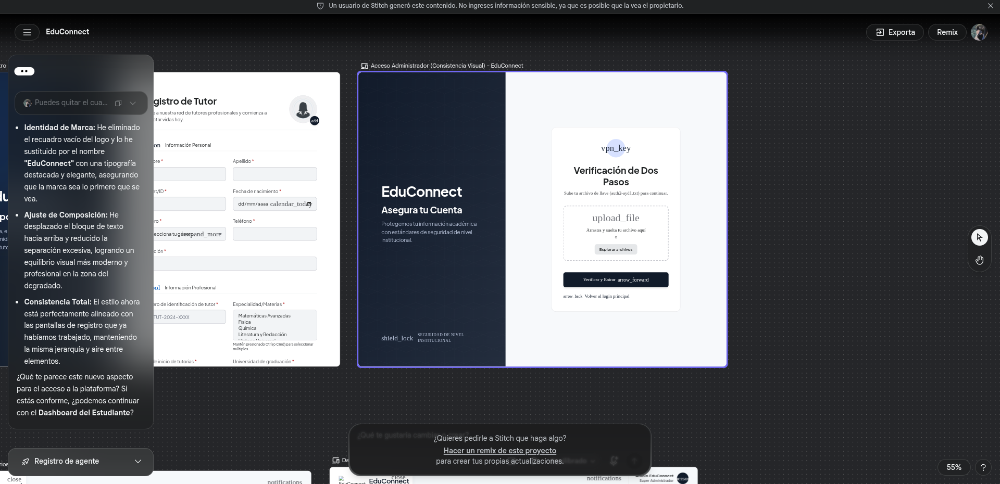
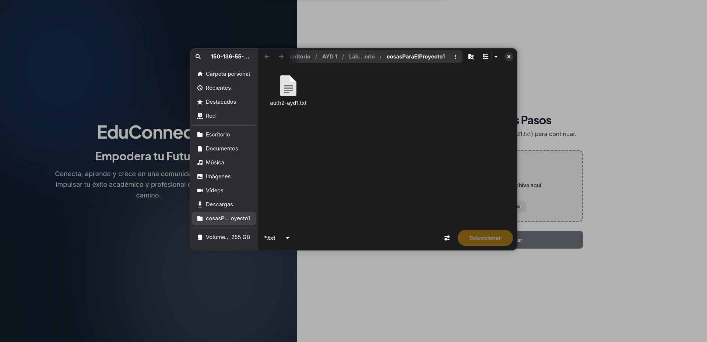
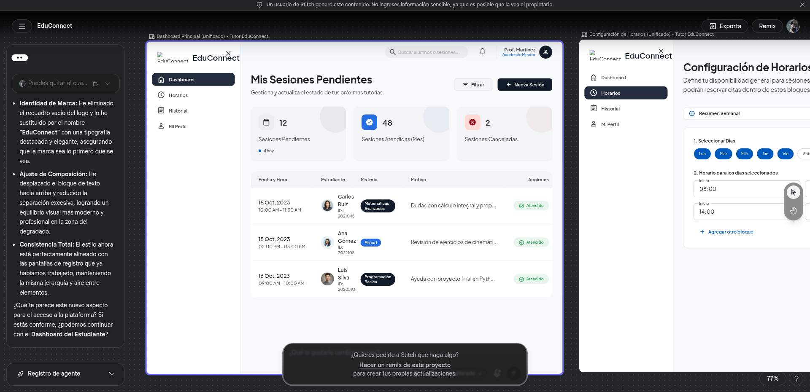
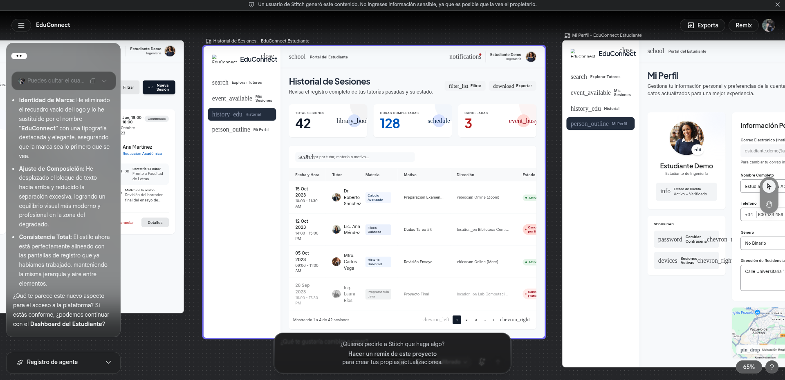
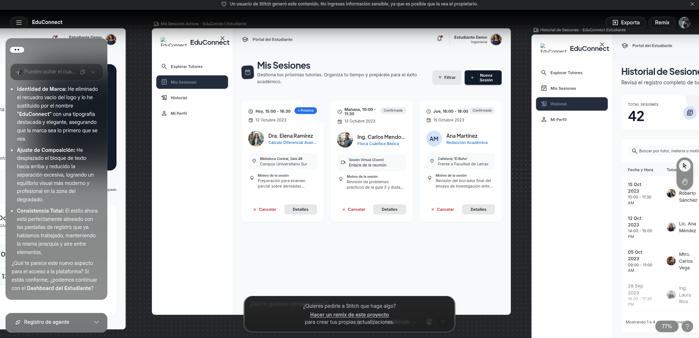
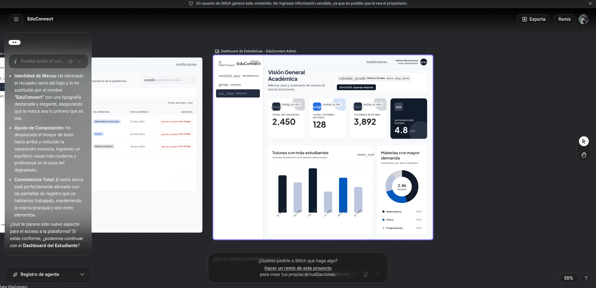
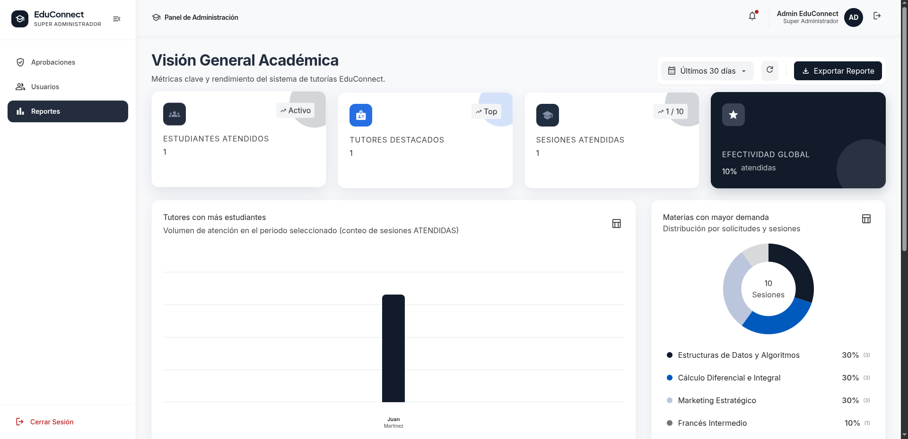

# Prototipado y Diseño Frontend con Google Stitch — EduConnect

### Documentos relacionados

- [Requerimientos Funcionales](../requerimientos/requerimientos-funcionales.md)
- [Principios de Usabilidad de Nielsen](../ux-ui/principios-nielsen.md)
- [Manual de Usuario](../manual-usuario/manual-usuario.md)
- [Manual Técnico](../manual-tecnico/manual-tecnico.md)

**Universidad de San Carlos de Guatemala**  
**Facultad de Ingeniería — Escuela de Ciencias y Sistemas**  
**Análisis y Diseño de Sistemas 1  — 2do Semestre 2026**  
**Grupo 7**

---

### Información del Proyecto
* **Proyecto en Google Stitch:** [EduConnect Stitch Project](https://stitch.withgoogle.com/projects/11044310364948617047)
* **Stack Frontend:** Vue 3 (Composition API con `<script setup lang="ts">`), TypeScript, Tailwind CSS 3.4, Vite 6, Pinia, Vue Router 4.
* **Integrantes del Equipo:**
  - Carlos Eduardo Lau López (202202812) — Scrum Master / Desarrollador
  - Eduardo Sebastián Gutiérrez Felipe (202300694) — Product Owner / Desarrollador
  - Christian David Chinchilla Santos (202308227) — Desarrollador
  - Josue Daniel Revolorio Martinez (202102984) — Desarrollador
  - Sebastian Antonio Romero Tzitzimit (202201690) — Desarrollador
  - Keitlyn Valentina Tunchez Castañeda (202201139) — Desarrolladora

---

## 1. Introducción al Proceso de Diseño con Google Stitch

Para el desarrollo del frontend de **EduConnect**, el equipo adoptó un enfoque centrado en el usuario (*User-Centered Design*) utilizando **Google Stitch** como herramienta de prototipado rápido y diseño de interfaces.

Stitch permitió al equipo:
1. **Validar flujos de navegación complejos** antes de escribir código (ej. el flujo de agendamiento sin traslapes y la doble autenticación con archivo físico).
2. **Establecer un Design System coherente**, definiendo paletas de color institucionales, tipografías y escalas de espaciado que luego se exportaron directamente a la configuración de **Tailwind CSS**.
3. **Evitar el uso de plantillas prefabricadas o genéricas**, garantizando una interfaz 100% personalizada acorde a las directrices de la cátedra de Análisis y Diseño de Sistemas 1.

---

## 2. Sistema de Diseño (Design System) y Tokens Visuales

El diseño conceptualizado en Google Stitch se tradujo en variables y utilidades dentro de `tailwind.config.js` y `src/assets/styles/main.css`:

### 2.1 Paleta de Color Institucional
* **Primary (`#091426`):** Azul marino profundo institucional, utilizado en barras de navegación, encabezados principales y botones primarios.
* **Primary Container (`#1E293B`):** Tono complementario para tarjetas destacadas y paneles laterales oscuros.
* **Secondary / Accent (`#0058BE` y `#2170E4`):** Azul vibrante para elementos interactivos, enlaces, estados activos y botones de acción secundaria.
* **Background / Surface (`#F7F9FB`):** Fondo neutro claro de alto contraste que reduce la fatiga visual.
* **Surface Container / Cards (`#FFFFFF` y `#ECEEF0`):** Fondos de contenedores y tarjetas de contenido.
* **Badges y Estados:**
  - `APROBADO` / `ATENDIDA`: Verde esmeralda institucional (`#10B981` / `#D1FAE5`).
  - `PENDIENTE`: Ámbar cálido (`#F59E0B` / `#FEF3C7`).
  - `RECHAZADO` / `CANCELADA`: Rojo carmesí (`#EF4444` / `#FEE2E2`).

### 2.2 Tipografía
* **Display y Títulos:** `Plus Jakarta Sans` (pesos 600, 700 y 800) para una identidad moderna y legible.
* **Cuerpo y Formularios:** `Inter` (pesos 400 y 500) para máxima legibilidad en textos descriptivos y campos de entrada.

---

## 3. Módulos Prototipados en Stitch vs Implementación en Vue 3

### 3.1 Módulo 1: Autenticación y Verificación en Dos Pasos (2FA)

#### A. Prototipo en Google Stitch
El prototipo planteó una pantalla dividida (*split layout*): a la izquierda un panel informativo con el lema institucional de seguridad y a la derecha el formulario interactivo. Para el segundo factor de administrador, se ideó una zona visual de arrastre (*drag-and-drop*) para el archivo `auth2-ayd1.txt`.


#### B. Implementación Real en Código
La estructura prototipada se implementó de forma modular en `AuthLayout.vue` y `AdminTwoFactorForm.vue`.
```css 
<div
  :class="[
    'flex flex-col items-center justify-center w-full min-h-[190px] p-6 border-2 border-dashed rounded-xl cursor-pointer transition-all duration-200 text-center',
    isOver && !fileRef
      ? 'border-primary bg-surface-container-high'
      : fileRef
        ? 'border-primary/40 bg-surface-container-low'
        : 'border-outline-variant hover:border-primary/50 bg-surface-container-lowest hover:bg-surface-container-low'
  ]"
  @dragenter.prevent="onDragEnter"
  @dragover.prevent
  @dragleave.prevent="onDragLeave"
  @drop.prevent="onDrop"
  @click="!fileRef && fileInputRef?.click()"
>
  <input
    id="file"
    ref="fileInputRef"
    accept=".txt"
    class="hidden"
    type="file"
    @change="onFileChange"
  />
</div>
```

---

### 3.2 Módulo 2: Explorador de Tutores y Filtros Avanzados (Estudiante)

#### A. Prototipo en Google Stitch
Se diseñó una vista estilo catálogo con una barra lateral (*sidebar*) retráctil en móviles que aloja los filtros multidimensionales:
- Filtro por materias (con autocompletado).
- Control deslizante (*slider*) o selector para años de experiencia.
- Filtro por universidad y género.
- Grilla responsiva de tarjetas con foto, nombre, badges de especialidad y dirección de tutoría.



#### B. Implementación Real en Código
Se desarrolló mediante el componente `TutorFilterSidebar.vue` y la grilla reactiva en `TutorsExplorerView.vue`.

```cs
const materia = defineModel<string>('materia', { default: '' })
const universidad = defineModel<string>('universidad', { default: '' })
const experienciaMinima = defineModel<number>('experienciaMinima', { default: 0 })
const edadMaxima = defineModel<number>('edadMaxima', { default: 65 })
const genero = defineModel<'any' | 'female' | 'male'>('genero', { default: 'any' })

```


---

### 3.3 Módulo 3: Reserva de Sesión y Disponibilidad por Fecha (Estudiante)

#### A. Prototipo en Google Stitch
Para la reserva de citas se prototipó un flujo visual interactivo:
1. Selección de fecha en un calendario mensual.
2. Generación automática de las ranuras de tiempo (*time slots*), coloreando en azul las horas libres y en gris/deshabilitadas las horas ocupadas o fuera del horario laboral.
3. Formulario flotante de confirmación con materia y motivo de consulta.


#### B. Implementación Real en Código
Implementado en `SessionBookingView.vue` comunicándose con el endpoint de disponibilidad del backend.

```html
<div v-else class="grid grid-cols-3 sm:grid-cols-4 gap-2">
  <div
    v-for="bloque in availability.bloques"
    :key="bloque.horaInicio"
    :class="[
      'rounded-lg py-2 px-1 text-center text-xs font-semibold border',
      bloque.disponible
        ? 'bg-secondary-fixed/40 text-on-secondary-fixed border-secondary/30'
        : 'bg-surface-container-high text-on-surface-variant border-outline-variant/30 line-through'
    ]"
  >
    {{ bloque.horaInicio }}
  </div>
</div>

<div class="flex items-center gap-4 text-xs text-on-surface-variant">
  <span class="flex items-center gap-1.5">
    <span class="w-3 h-3 rounded-full bg-secondary-fixed/40 border border-secondary/30" />
    Disponible
  </span>
  <span class="flex items-center gap-1.5">
    <span
      class="w-3 h-3 rounded-full bg-surface-container-high border border-outline-variant/30"
    />
    Ocupado
  </span>
</div>
```

---

### 3.4 Módulo 4: Dashboard y Gestión de Sesiones del Tutor

#### A. Prototipo en Google Stitch
El dashboard del tutor se prototipó con un enfoque analítico y operativo:
- Tarjetas superiores de resumen (Sesiones Hoy, Pendientes, Total Atendidas).
- Tabla principal ordenada cronológicamente con las sesiones más próximas.
- Modales interactivos para:
  1. "Atender Sesión": formulario para redactar notas y recomendaciones académicas.
  2. "Cancelar Sesión": advertencia de impacto y campo para justificar la cancelación ante el alumno.



#### B. Implementación Real en Código
Implementado en `TutorDashboardView.vue`, `TutorSessionsTable.vue` y `CompleteSessionModal.vue`.
```
<label for="complete-resumen" class="text-xs font-semibold text-on-surface">
  Resumen de la sesión *
</label>

<textarea
  id="complete-resumen"
  v-model="form.resumen"
  rows="3"
  placeholder="Temas cubiertos, dudas resueltas..."
  required
  class="w-full bg-surface-container-low text-on-surface px-4 py-3 rounded-lg border border-outline-variant/40 focus:outline-none focus:ring-2 focus:ring-secondary/40 focus:border-secondary text-sm resize-none"
/>
```

```
function handleSubmit() {
  if (!form.resumen.trim()) return
  emit('submit', { ...form })
}
```

```
<BaseButton
  variant="primary"
  size="md"
  :loading="loading"
  :disabled="!form.resumen.trim()"
  @click="handleSubmit"
>
  Guardar y Finalizar
</BaseButton>
```

---

### 3.5 Módulo 5: Panel de Aprobaciones y Reportes (Administrador)

#### A. Prototipo en Google Stitch
Se diseñaron dos vistas clave:
1. **Aprobaciones de Cuentas:** Pestañas separadas para Estudiantes y Tutores, con botones directos de Aprobación y Rechazo.
2. **Reportes:** Tarjetas de estadísticas globales, gráficos de barras de las materias con mayor demanda y ranking de tutores con más estudiantes atendidos.



#### B. Implementación Real en Código
Implementado en `AdminApprovalsView.vue` y `AdminReportsView.vue`.

```
const {
  tutoresReport,
  resumen,
  totalEstudiantesAtendidos,
  maxAtencionesTutor,
  donutSegments,
  filteredTutores,
  filteredMaterias
} = useAdminReports()

<div
  v-for="(tutor, idx) in tutoresReport.slice(0, 6)"
  :key="tutor.tutorId"
  :class="getBarColor(idx)"
  :style="{
    height: `${Math.max(
      12,
      Math.round(
        (tutor.totalSesionesAtendidas / maxAtencionesTutor) * 88
      )
    )}%`
  }"
>
  <div class="font-semibold">
    {{ tutor.totalSesionesAtendidas }} sesiones
  </div>

  <div>
    {{ tutor.totalEstudiantesAtendidos }} estudiantes
  </div>

  <span>{{ tutor.nombreCompleto }}</span>
</div>

<circle
  v-for="seg in donutSegments"
  :key="seg.materiaId"
  :class="seg.strokeClass"
  cx="50"
  cy="50"
  fill="transparent"
  r="40"
  stroke-width="20"
  :stroke-dasharray="seg.dashArray"
  :stroke-dashoffset="seg.dashOffset"
/>

<div
  v-for="seg in donutSegments.slice(0, 4)"
  :key="seg.materiaId"
  class="flex items-center justify-between"
>
  <span>{{ seg.nombreMateria }}</span>
  <span>{{ seg.porcentajeDemanda }}%</span>
  <span>({{ seg.totalSesiones }})</span>
</div>

<tr v-for="tutor in filteredTutores" :key="tutor.tutorId">
  <td>{{ tutor.nombreCompleto }}</td>
  <td>{{ tutor.totalSesionesAtendidas }} atendidas</td>
  <td>{{ tutor.totalEstudiantesAtendidos }}</td>
</tr>

<tr v-for="materia in filteredMaterias" :key="materia.materiaId">
  <td>{{ materia.nombreMateria }}</td>
  <td>{{ materia.totalSesiones }}</td>
  <td>{{ materia.sesionesAtendidas }}</td>
  <td>{{ materia.sesionesPendientes }}</td>
  <td>
    {{ materia.porcentajeDemanda }}%
  </td>
</tr>


``` 




---

## 4. Conclusiones sobre el Uso de Google Stitch

* **Alineación Rápida del Equipo:** Permitió a los 6 desarrolladores visualizar exactamente qué debía construirse antes de iniciar los Sprints de desarrollo en Jira.
* **Componentización Directa:** Al tener definidos los layouts en Stitch, la creación de componentes Vue 3 y clases Tailwind fue ágil y directa.
* **Cero Retrabajo en Maquetación:** No fue necesario rediseñar vistas durante las etapas finales, cumpliendo con la exigencia de no usar plantillas genéricas.
