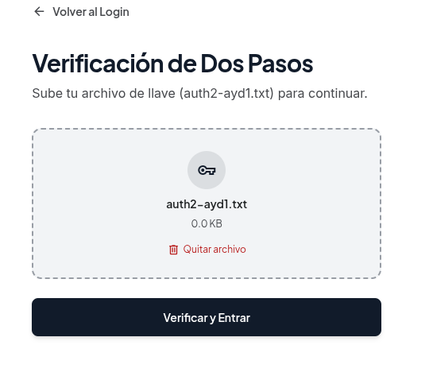

# Requerimientos No Funcionales (RNF) — EduConnect

**Universidad de San Carlos de Guatemala**  
**Facultad de Ingeniería — Escuela de Ciencias y Sistemas**  
**Análisis y Diseño de Sistemas 1  — 2do Semestre 2026**  
**Grupo 7**

---

## Integrantes del Equipo

| Nombre Completo | Carnet | Rol Asignado |
| :--- | :---: | :---: |
| **Carlos Eduardo Lau López** | 202202812 | **Scrum Master** / Desarrollador |
| **Eduardo Sebastián Gutiérrez Felipe** | 202300694 | **Product Owner** / Desarrollador |
| **Christian David Chinchilla Santos** | 202308227 | Equipo de Desarrollo |
| **Josue Daniel Revolorio Martinez** | 202102984 | Equipo de Desarrollo |
| **Sebastian Antonio Romero Tzitzimit** | 202201690 | Equipo de Desarrollo |
| **Keitlyn Valentina Tunchez Castañeda** | 202201139 | Equipo de Desarrollo |
---

## 1. Introducción y Marco de Referencia

El presente documento especifica los **Requerimientos No Funcionales (RNF)** para la plataforma web **EduConnect**, un sistema integral para la gestión de tutorías académicas universitarias.

Los requerimientos no funcionales definen los atributos de calidad, restricciones arquitectónicas, estándares de seguridad, rendimiento, mantenibilidad y experiencia de usuario que el sistema debe satisfacer para garantizar una operación robusta, confiable y escalable.

Para la clasificación y estandarización de estos requerimientos, se utiliza como marco de referencia el estándar internacional **ISO/IEC 25010 (System and Software Quality Models)**.

---

## 2. Clasificación de Requerimientos No Funcionales (ISO/IEC 25010)

```
                       ┌─────────────────────────────────────────────────┐
                       │        CALIDAD DEL SOFTWARE (ISO/IEC 25010)      │
                       └───────────────────────┬─────────────────────────┘
        ┌───────────────────┬──────────────────┼───────────────────┬───────────────────┐
        ▼                   ▼                  ▼                   ▼                   ▼
┌───────────────┐   ┌───────────────┐  ┌───────────────┐   ┌───────────────┐   ┌───────────────┐
│ 1. Seguridad  │   │2. Rendimiento │  │3. Disponib. y │   │4. Usabilidad  │   │5. Portabil. y │
│  y Privacidad │   │ y Eficiencia  │  │  Tolerancia   │   │  y UX/Nielsen │   │ Mantenibilidad│
└───────────────┘   └───────────────┘  └───────────────┘   └───────────────┘   └───────────────┘
```

---

## 3. Matriz Detallada de Requerimientos No Funcionales

### 3.1 Categoría 1: Seguridad y Confidencialidad (Security)

#### RNF-01: Cifrado y Almacenamiento Seguro de Credenciales
* **Descripción:** Todas las contraseñas de los usuarios (Estudiantes, Tutores y Administradores) deben ser almacenadas en la base de datos mediante un algoritmo de derivación de claves criptográficamente seguro, impidiendo el almacenamiento o transmisión en texto plano.
* **Mecanismo de Implementación:** 
  - Se implementa el algoritmo **BCrypt** con factor de costo predeterminado para el hashing de contraseñas.
  - Ningún endpoint ni log del sistema debe registrar contraseñas sin procesar.
``` cs
var adminUser = new Usuario
{
    Correo = email,
    PasswordHash = BCrypt.Net.BCrypt.HashPassword(password),
    RolId = adminRol.Id,
    EstadoId = aprobadoEstado.Id,
    FechaRegistro = DateTime.UtcNow
};
```
* **Criterio de Aceptación:** Verificar directamente en la tabla `Usuarios` de Oracle que la columna `PasswordHash` contenga hashes BCrypt (`$2a$11$...`) y nunca la contraseña en claro.

---

#### RNF-02: Doble Factor de Autenticación Criptográfico (2FA) para Administrador
* **Descripción:** El acceso al panel de administración debe exigir un segundo factor de autenticación basado en la verificación de un archivo físico denominado `auth2-ayd1.txt`, el cual contiene un payload cifrado.
* **Mecanismo de Implementación:**
  - El primer factor emite un token temporal de vida corta (5 minutos) con claim `rol = AdminPending2FA`.
  - El segundo factor valida el archivo cargado mediante descifrado simétrico **AES-256-CBC** utilizando un vector de inicialización (IV) de 16 bytes y la clave derivada por SHA-256 desde la variable `Jwt:Key`.
  - La contraseña del archivo debe ser estrictamente distinta a la contraseña del primer factor.

```cs
string decrypted;
try
{
    using var aes = Aes.Create();
    aes.Key = key;
    aes.IV = iv;
    aes.Mode = CipherMode.CBC;
    aes.Padding = PaddingMode.PKCS7;

    using var decryptor = aes.CreateDecryptor();
    var plain = decryptor.TransformFinalBlock(cipher, 0, cipher.Length);
    decrypted = Encoding.UTF8.GetString(plain);
}
catch
{
    return Results.Problem(
        statusCode: StatusCodes.Status400BadRequest,
        title: "Desencriptado fallido",
        detail: "No se pudo desencriptar el contenido del archivo con la clave del servidor."
    );
}
``` 

---

#### RNF-03: Autenticación Stateless y Autorización Basada en Roles (RBAC)
* **Descripción:** Las solicitudes a endpoints protegidos deben validarse mediante tokens de acceso firmados digitalmente, restringiendo operaciones según el rol del usuario autenticado (`Admin`, `Estudiante`, `Tutor`).
* **Mecanismo de Implementación:**
  - Utilización de **JSON Web Tokens (JWT)** firmados mediante HMAC-SHA256 con tiempo de expiración configurable (120 minutos por defecto).
  - Los endpoints de Minimal APIs aplican extensiones de autorización `RequireAuthorization(AppRoles.Administrador)`, `RequireAuthorization(AppRoles.Tutor)` o `RequireAuthorization(AppRoles.Estudiante)`.
  - En el frontend, `router/guards.ts` valida la existencia y vigencia del token y los roles autorizados antes de resolver cada transición de navegación.
``` cs
if (to.meta.requiresAuth && !isAuthenticated) {
  next({ name: 'login', query: { redirect: to.fullPath } })
  return
}

if (to.meta.roles && Array.isArray(to.meta.roles) && to.meta.roles.length > 0 && homePath) {
  const allowedRoles = to.meta.roles.map(r => String(r).toLowerCase().trim())
  const isAllowed = allowedRoles.some(r => userRole.toLowerCase().trim().includes(r))

  if (!isAllowed) {
    if (to.path !== homePath) {
      next({ path: homePath })
      return
    }
  }
}
```

---

#### RNF-04: Aprobación Administrativa Previa (Control de Acceso de Cuentas)
* **Descripción:** Los usuarios con roles de Estudiante y Tutor no podrán autenticarse en la plataforma hasta que un Administrador haya revisado y aprobado formalmente su solicitud de registro.
* **Mecanismo de Implementación:**
  - Los usuarios recién registrados reciben automáticamente el estado `PENDIENTE`.
  - El endpoint de inicio de sesión valida que `usuario.Estado.Nombre == "APROBADO"`. Si el estado es `PENDIENTE`, `RECHAZADO` o `INACTIVO`, el sistema deniega el acceso retornando un código HTTP 401 con el motivo detallado.

```cs
if (to.meta.requiresAuth && !isAuthenticated) {
  next({ name: 'login', query: { redirect: to.fullPath } })
  return
}

if (to.meta.roles && Array.isArray(to.meta.roles) && to.meta.roles.length > 0 && homePath) {
  const allowedRoles = to.meta.roles.map(r => String(r).toLowerCase().trim())
  const isAllowed = allowedRoles.some(r => userRole.toLowerCase().trim().includes(r))
  if (!isAllowed) {
    if (to.path !== homePath) {
      next({ path: homePath })
      return
    }
  }
}
```

---

### 3.2 Categoría 2: Rendimiento y Eficiencia (Performance Efficiency)

#### RNF-05: Tiempos de Respuesta de la API
* **Descripción:** Todas las operaciones transaccionales estándar (búsqueda de tutores, agendamiento de sesiones, consulta de horarios y login) deben responder en un tiempo inferior a **500 milisegundos** bajo condiciones normales de carga en red local.
* **Mecanismo de Implementación:**
  - Consultas optimizadas con Entity Framework Core utilizando proyecciones (`.Select(...)`) para transferir únicamente los campos requeridos por los DTOs.
  - Uso de `.AsNoTracking()` en endpoints de solo lectura (como listado de tutores, disponibilidad y catálogos) para omitir la sobrecarga del rastreador de cambios de EF Core.
```cs
var query = dbContext.Tutores
    .AsNoTracking()
    .Include(tutor => tutor.Usuario)
    .Include(tutor => tutor.TutorMaterias)
        .ThenInclude(tutorMateria => tutorMateria.Materia)
    .Where(tutor => tutor.Usuario.Estado.Nombre == "APROBADO");

if (!string.IsNullOrWhiteSpace(filtros.Materia))
{
    var materiaFiltro = filtros.Materia.Trim().ToLower();
    query = query.Where(tutor => tutor.TutorMaterias
        .Any(tutorMateria => EF.Functions.Like(
            tutorMateria.Materia.Nombre.ToLower(),
            $"%{materiaFiltro}%")));
}

if (!string.IsNullOrWhiteSpace(filtros.Universidad))
{
    var universidadFiltro = filtros.Universidad.Trim().ToLower();
    query = query.Where(tutor => EF.Functions.Like(
        tutor.Universidad.ToLower(),
        $"%{universidadFiltro}%"));
}

if (!string.IsNullOrWhiteSpace(filtros.Genero))
{
    var generoFiltro = GeneroValidator.TryNormalize(
        filtros.Genero,
        out var generoNormalizado)
            ? generoNormalizado
            : filtros.Genero.Trim().ToLower();

    query = query.Where(tutor => tutor.Genero == generoFiltro);
}

var anioActual = DateTime.UtcNow.Year;

if (filtros.ExperienciaMinima.HasValue)
{
    query = query.Where(tutor =>
        anioActual - tutor.AnioInicio >= filtros.ExperienciaMinima.Value);
}

var hoy = DateOnly.FromDateTime(DateTime.UtcNow);

if (filtros.EdadMinima.HasValue)
{
    var fechaNacimientoMaxima =
        hoy.AddYears(-filtros.EdadMinima.Value);

    query = query.Where(tutor =>
        tutor.FechaNacimiento <= fechaNacimientoMaxima);
}

if (filtros.EdadMaxima.HasValue)
{
    var fechaNacimientoMinima =
        hoy.AddYears(-filtros.EdadMaxima.Value - 1);

    query = query.Where(tutor =>
        tutor.FechaNacimiento > fechaNacimientoMinima);
}

var tutores = await query.ToListAsync(cancellationToken);

```

---

#### RNF-06: Optimización del Bundle Frontend y Carga Asíncrona
* **Descripción:** La aplicación cliente debe cargar de forma ligera en el navegador del usuario sin descargar recursos innecesarios en la carga inicial.
* **Mecanismo de Implementación:**
  - Compilación optimizada mediante **Vite 6** con división de código automática (*code splitting*).
  - Carga diferida (*lazy loading*) de todas las páginas mediante importaciones dinámicas `() => import('@/pages/...')` en el enrutador Vue.
  - Servido de activos comprimidos y cacheados mediante el servidor web **Nginx**.
```cs
component: () => import('@/pages/LoginPage.vue')
component: () => import('@/pages/StudentRegisterPage.vue')
component: () => import('@/pages/TutorRegisterPage.vue')
component: () => import('@/pages/AdminApprovalsPage.vue')
component: () => import('@/pages/AdminUsersPage.vue')
component: () => import('@/pages/AdminReportsPage.vue')
component: () => import('@/pages/AdminTwoFactorPage.vue')
component: () => import('@/pages/StudentTutorsExplorerPage.vue')
component: () => import('@/pages/StudentSessionsPage.vue')
component: () => import('@/pages/TutorDashboardPage.vue')
component: () => import('@/pages/TutorSchedulePage.vue')
component: () => import('@/pages/TutorHistoryPage.vue')
component: () => import('@/pages/TutorProfilePage.vue')
component: () => import('@/pages/StudentTutorDetailPage.vue')
component: () => import('@/pages/StudentHistoryPage.vue')
component: () => import('@/pages/StudentProfilePage.vue')
```

---

### 3.3 Categoría 3: Confiabilidad, Disponibilidad y Tolerancia a Fallos (Reliability)

#### RNF-07: Resiliencia en Conexión y Migraciones Automáticas de Base de Datos
* **Descripción:** El backend debe ser capaz de inicializarse correctamente aún cuando el motor de base de datos Oracle XE se encuentre en proceso de arranque (proceso que típicamente toma entre 30 y 60 segundos).
* **Mecanismo de Implementación:**
  - Implementación de una política de reintentos exponencial en `MigrateDbAsync()` con hasta 10 intentos y pausas de 5 segundos entre reintentos.
  - Integración de healthcheck activo en el servicio `oracle-db` de Docker Compose antes de iniciar el contenedor de la API (`condition: service_healthy`).
```cs
for (var attempt = 1; attempt <= maxRetries; attempt++)
{
    try
    {
        logger.LogInformation(
            "Intentando aplicar migraciones a la base de datos (intento {Attempt}/{MaxRetries})...",
            attempt,
            maxRetries);

        var dbContext =
            scope.ServiceProvider.GetRequiredService<edu_connect_serviceContext>();

        await dbContext.Database.MigrateAsync();

        logger.LogInformation("Migraciones aplicadas exitosamente.");
        break;
    }
    catch (Exception ex)
    {
        if (attempt == maxRetries)
        {
            logger.LogError(
                ex,
                "No se pudo migrar la base de datos después de {MaxRetries} intentos.",
                maxRetries);

            throw;
        }

        logger.LogWarning(
            "Base de datos no disponible aún ({Message}). Reintentando en {Delay}s...",
            ex.Message,
            retryDelay.TotalSeconds);

        await Task.Delay(retryDelay);
    }
}
```
---

#### RNF-08: Manejo Centralizado y Estandarizado de Errores (RFC 7807)
* **Descripción:** Ninguna excepción no controlada debe exponer trazas internas de la aplicación, cadenas de conexión o detalles del servidor al usuario final.
* **Mecanismo de Implementación:**
  - Registro del middleware `GlobalExceptionHandler` que implementa `IExceptionHandler` de ASP.NET Core.
  - Formateo de respuestas de error bajo el estándar **RFC 7807 (ProblemDetails)**, retornando atributos estándar como `status`, `title`, `detail` e `instance`.
```cs 
var problemDetails = new ProblemDetails
{
    Status = statusCode,
    Title = title,
    Detail = exception.Message,
    Instance = httpContext.Request.Path
};

var handled = await _problemDetailsService.TryWriteAsync(new ProblemDetailsContext
{
    HttpContext = httpContext,
    ProblemDetails = problemDetails,
    Exception = exception
});
```

---

### 3.4 Categoría 4: Usabilidad y Experiencia de Usuario (Usability)

#### RNF-09: Cumplimiento de Principios Heurísticos de Jakob Nielsen
* **Descripción:** La interfaz gráfica de EduConnect debe cumplir estrictamente con al menos 6 de las 10 heurísticas de usabilidad de Jakob Nielsen, garantizando una interacción intuitiva y libre de fricciones.
* **Heurísticas Implementadas:**
  1. **Visibilidad del estado del sistema:** Indicadores visuales de carga (spinners), mensajes de confirmación tras registrar citas y badges de estado (`APROBADO`, `PENDIENTE`, `ATENDIDA`, `CANCELADA`).
  2. **Coincidencia entre el sistema y el mundo real:** Vocabulario académico natural (tutores, materias, carnet, semestres, sesiones).
  3. **Control y libertad del usuario:** Modales con botones claros de "Cancelar", confirmación obligatoria previa a acciones destructivas y navegación con migas de pan / botones "Atrás".
  4. **Consistencia y estándares:** Paleta de color coherente, sistema de tipografía unificado (Plus Jakarta Sans / Inter) y componentes de diseño atómicos (`BaseButton`, `BaseInput`, `BaseModal`).
  5. **Prevención de errores:** Deshabilitación de horarios no disponibles, validación en tiempo real de longitud y complejidad de contraseñas, y bloqueo de traslapes de sesiones.
  6. **Reconocimiento antes que memorización:** Selectores con autocompletado y etiquetas claras en filtros avanzados de búsqueda de tutores.

---

#### RNF-10: Diseño Responsivo y Personalizado (No plantillas genéricas)
* **Descripción:** La interfaz debe adaptarse a diferentes resoluciones de pantalla (escritorio, tablet y móvil) utilizando un sistema de estilos propio sin recurrir a Bootstrap ni plantillas comerciales descargadas.
* **Mecanismo de Implementación:**
  - Maquetación utilitaria basada en **Tailwind CSS 3.4** configurada a partir de los prototipos diseñados en **Google Stitch**.
  - Layouts estructurales separados: `AuthLayout.vue` para flujos públicos de autenticación y `DashboardLayout.vue` con sidebar retráctil para áreas autenticadas.

---

### 3.5 Categoría 5: Mantenibilidad y Arquitectura de Software (Maintainability)

#### RNF-11: Arquitectura Limpia por Características (Vertical Slice & Feature-Driven)
* **Descripción:** El código fuente tanto del backend como del frontend debe organizarse por casos de uso y dominios de negocio, reduciendo el acoplamiento transversal y facilitando el mantenimiento y la escalabilidad independiente de módulos.
* **Mecanismo de Implementación:**
  - **Backend:** Patrón *Vertical Slice Architecture* en `Features/{Modulo}/{CasoDeUso}/` conteniendo en un mismo directorio el Endpoint y los DTOs asociados.
  - **Frontend:** Estructura modular en `src/features/{feature-name}/` con sus respectivos componentes, composables, servicios y tipos.

---

#### RNF-12: Separación de Configuración y Código Fuente (12-Factor App)
* **Descripción:** Ningún secreto, credencial, cadena de conexión o URL de servicio externo debe estar escrita directamente en duro (*hardcoded*) en el código fuente del proyecto.
* **Mecanismo de Implementación:**
  - Configuración mediante variables de entorno en archivos `.env` (siguiendo las plantillas `.env.example`).
  - Carga dinámica en el frontend durante el inicio del contenedor Nginx mediante el script `docker-entrypoint.sh` que genera el archivo `public/env-config.js`.
```cs
cat <<EOF > "${ENV_FILE}"
window.__ENV__ = {
  VITE_API_URL: "${VITE_API_URL:-http://localhost:5000/api}",
  VITE_APP_ENV: "${VITE_APP_ENV:-production}",
  VITE_APP_NAME: "${VITE_APP_NAME:-EduConnect}",
  VITE_APP_VERSION: "${VITE_APP_VERSION:-1.0.0}"
};
EOF
```

### 3.6 Categoría 6: Portabilidad y Despliegue (Portability)

#### RNF-13: Contenedorización Completa con Docker y Orquestación Multi-Servicio
* **Descripción:** La totalidad de los componentes requeridos para la ejecución del sistema (motor de base de datos, API de backend y frontend web) deben compilarse y ejecutarse mediante un único comando de orquestación, eliminando dependencias de software instalado en la máquina anfitriona.
* **Mecanismo de Implementación:**
  - Creación de Dockerfiles multi-etapa (*multi-stage builds*) para el backend en .NET 10 y el frontend en Vue/Vite/Nginx.
  - Archivo `docker-compose.yaml` unificado con configuración de red aislada tipo bridge (`app-network`) y volumen persistente (`oracle-data`).
```js
services:
  oracle-db:
    image: gvenzl/oracle-xe:latest
    container_name: oracle-db
    ports:
      - "1523:1521"
    environment:
      - ORACLE_PASSWORD=Oracle12345
      - APP_USER=api_dev
      - APP_USER_PASSWORD=ApiDev1234
    volumes:
      - oracle-data:/opt/oracle/oradata
    healthcheck:
      test: ["CMD", "/opt/oracle/healthcheck.sh"]
      interval: 10s
      timeout: 5s
      retries: 10
      start_period: 30s
    networks:
      - app-network

  api:
    build:
      context: ./edu-connect-service
      dockerfile: Dockerfile
    ports:
      - "5000:8080"
    environment:
      - ASPNETCORE_ENVIRONMENT=Development
    depends_on:
      oracle-db:
        condition: service_healthy
    networks:
      - app-network
    env_file:
      - .env

  frontend:
    build:
      context: ./edu-connect-client
      dockerfile: Dockerfile
    ports:
      - "5173:8080"
    depends_on:
      - api
    networks:
      - app-network
    env_file:
      - .env
```

---

### 3.7 Categoría 7: Integridad de Datos y Persistencia (Data Integrity)

#### RNF-14: Integridad Referencial y Reglas de Dominio en Base de Datos
* **Descripción:** La base de datos debe impedir inconsistencias de agendamiento, registros duplicados y estados huérfanos a través de restricciones del motor relacional.
* **Mecanismo de Implementación:**
  - Restricciones únicas (`Unique Constraints`) en correos electrónicos, carnet universitario y número de identificación de tutores.
  - Claves foráneas con validación estricta entre sesiones, tutores, estudiantes y materias.
  - Control de concurrencia y validación previa a nivel de endpoint para evitar traslapes de horario y duplicidad de sesiones entre un mismo estudiante y tutor.
``` cs
var sesionActivaMismoTutor = await dbContext.Sesiones
    .AsNoTracking()
    .AnyAsync(
        sesion =>
            sesion.EstudianteId == idUsuario &&
            sesion.TutorId == request.TutorId &&
            sesion.EstadoId == estadoPendiente.Id,
        cancellationToken
    );

if (sesionActivaMismoTutor)
{
    return Results.Problem(
        statusCode: StatusCodes.Status409Conflict,
        title: "Sesión activa existente",
        detail: "Ya tiene una sesión activa programada con este tutor."
    );
}

var sesionesTutor = await dbContext.Sesiones
    .AsNoTracking()
    .Where(sesion =>
        sesion.TutorId == request.TutorId &&
        sesion.FechaSesion == request.FechaSesion &&
        sesion.EstadoId == estadoPendiente.Id)
    .ToListAsync(cancellationToken);

var tutorOcupado = sesionesTutor.Any(sesion =>
{
    var horaFinExistente =
        sesion.HoraFin ?? sesion.HoraInicio.Add(DuracionSesion);

    return request.HoraInicio < horaFinExistente &&
           horaFinSesion > sesion.HoraInicio;
});

if (tutorOcupado)
{
    return Results.Problem(
        statusCode: StatusCodes.Status409Conflict,
        title: "Horario no disponible",
        detail: "El tutor ya tiene una sesión programada que se traslapa con el horario seleccionado."
    );
});

var sesionesEstudiante = await dbContext.Sesiones
    .AsNoTracking()
    .Where(sesion =>
        sesion.EstudianteId == idUsuario &&
        sesion.FechaSesion == request.FechaSesion &&
        sesion.EstadoId == estadoPendiente.Id)
    .ToListAsync(cancellationToken);

var estudianteOcupado = sesionesEstudiante.Any(sesion =>
{
    var horaFinExistente =
        sesion.HoraFin ?? sesion.HoraInicio.Add(DuracionSesion);

    return request.HoraInicio < horaFinExistente &&
           horaFinSesion > sesion.HoraInicio;
});

if (estudianteOcupado)
{
    return Results.Problem(
        statusCode: StatusCodes.Status409Conflict,
        title: "Conflicto de horario",
        detail: "Ya tiene otra sesión programada que se traslapa con el horario seleccionado."
    );
}
```
---

## 4. Matriz de Resumen y Trazabilidad de RNF

| ID | Requerimiento No Funcional | Categoría ISO 25010 | Métrica de Verificación | Estado |
| :---: | :--- | :--- | :--- | :---: |
| **RNF-01** | Cifrado BCrypt de contraseñas | Seguridad | Hash irreversible en BD; sin passwords en logs | **Cumplido** |
| **RNF-02** | 2FA con archivo cifrado AES-256 | Seguridad | Validación exitosa de `auth2-ayd1.txt` | **Cumplido** |
| **RNF-03** | Autenticación JWT y RBAC | Seguridad | Rechazo 401/403 en endpoints sin token/rol | **Cumplido** |
| **RNF-04** | Aprobación previa por Administrador | Seguridad | Bloqueo de login a usuarios en estado `PENDIENTE` | **Cumplido** |
| **RNF-05** | Tiempo de respuesta de API < 500ms | Rendimiento | Mediciones HTTP logging y Network tab | **Cumplido** |
| **RNF-06** | Code splitting y Lazy Loading | Rendimiento | Chunks asíncronos generados por Vite | **Cumplido** |
| **RNF-07** | Tolerancia al arranque de Oracle XE | Confiabilidad | Reintentos automáticos y healthcheck en Docker | **Cumplido** |
| **RNF-08** | Manejo global RFC 7807 | Confiabilidad | Respuestas estandarizadas `ProblemDetails` | **Cumplido** |
| **RNF-09** | Heurísticas de Jakob Nielsen | Usabilidad | Evaluación heurística con al menos 6 principios | **Cumplido** |
| **RNF-10** | Maquetación responsiva con Tailwind | Usabilidad | Adaptabilidad móvil y escritorio sin plantillas | **Cumplido** |
| **RNF-11** | Vertical Slice y Feature-Driven | Mantenibilidad | Cohesión por caso de uso en Backend y Frontend | **Cumplido** |
| **RNF-12** | Variables de entorno (12-Factor) | Mantenibilidad | Inyección vía Docker y `.env` sin hardcoding | **Cumplido** |
| **RNF-13** | Contenedorización Docker Compose | Portabilidad | Ejecución exitosa con `docker compose up -d` | **Cumplido** |
| **RNF-14** | Restricciones de unicidad y traslapes | Integridad | Bloqueo de sesiones duplicadas o traslapadas | **Cumplido** |
