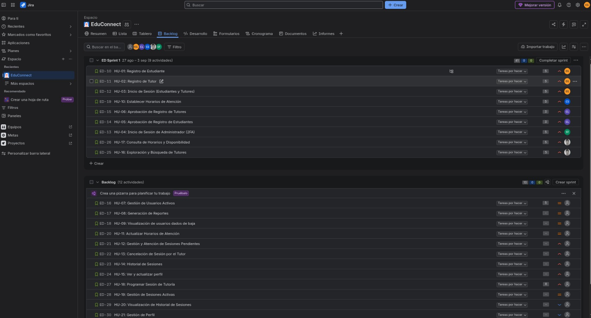
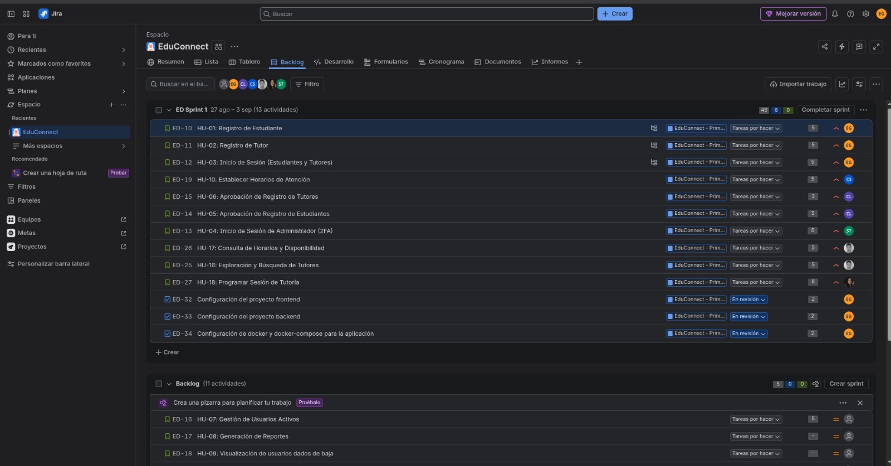
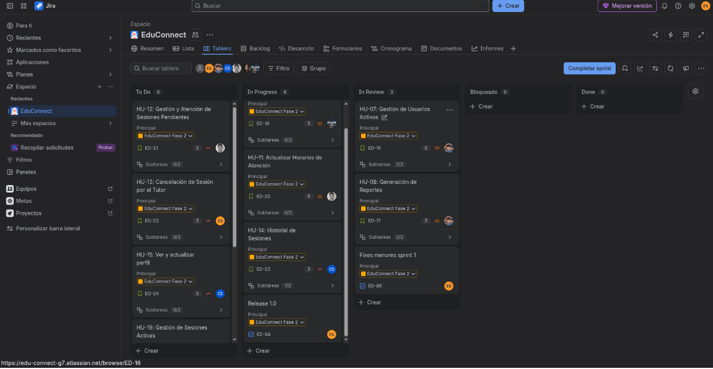

# Gestión Ágil del Proyecto: Tablero Kanban y Evidencias — EduConnect

**Universidad de San Carlos de Guatemala**  
**Facultad de Ingeniería — Escuela de Ciencias y Sistemas**  
**Análisis y Diseño de Sistemas 1  — Segundo Semestre 2026**  
**Grupo 7**

---

### Información General del Equipo y Gestión
* **Herramienta de Gestión Ágil:** Jira Software Cloud (Atlassian)
* **URL del Tablero Público/Compartido en Jira:**  
  [https://edu-connect-g7.atlassian.net/?continue=https%3A%2F%2Fedu-connect-g7.atlassian.net%2Fwelcome%2Fsoftware%3FprojectId%3D10000&atlOrigin=eyJpIjoiZDI4NjFkNjZlMDg2NDU4NTkwODAyZTU3MDE](https://edu-connect-g7.atlassian.net/?continue=https%3A%2F%2Fedu-connect-g7.atlassian.net%2Fwelcome%2Fsoftware%3FprojectId%3D10000&atlOrigin=eyJpIjoiZDI4NjFkNjZlMDg2NDU4NTkwODAyZTU3MDE)
* **Enlace de Reuniones Virtuales (Google Meet):**  
  [https://meet.google.com/bxn-iweb-mby](https://meet.google.com/bxn-iweb-mby)
* **Prototipo Interactivo en Google Stitch:**  
  [https://stitch.withgoogle.com/projects/11044310364948617047](https://stitch.withgoogle.com/projects/11044310364948617047)

### Roles del Equipo
| Nombre Completo | Carnet | Rol Asignado |
| :--- | :---: | :---: |
| Carlos Eduardo Lau López | 202202812 | **Scrum Master** / Desarrollador |
| Eduardo Sebastián Gutiérrez Felipe | 202300694 | **Product Owner** / Desarrollador |
| Christian David Chinchilla Santos | 202308227 | Equipo de Desarrollo |
| Josue Daniel Revolorio Martinez | 202102984 | Equipo de Desarrollo |
| Sebastian Antonio Romero Tzitzimit | 202201690 | Equipo de Desarrollo |
| Keitlyn Valentina Tunchez Castañeda | 202201139 | Equipo de Desarrollo |

---

## 1. Configuración del Tablero Kanban en Jira

El flujo de trabajo del equipo se diseñó e implementó respetando estrictamente las 5 columnas obligatorias solicitadas en el enunciado del proyecto, reflejando el ciclo de vida real de cada tarjeta (*issue*):

```
┌─────────────┐     ┌─────────────┐     ┌─────────────┐     ┌─────────────┐     ┌─────────────┐
│    TO-DO    │ ──► │   BLOCKED   │ ──► │ IN PROGRESS │ ──► │   TEST/QA   │ ──► │   DEPLOY    │
│             │     │ (Bloqueado) │     │ (En Curso)  │     │(Validación) │     │(Completado) │
└─────────────┘     └─────────────┘     └─────────────┘     └─────────────┘     └─────────────┘
```

### 1.1 Definición y Reglas de las Columnas

1. **`TO-DO` (Por Hacer):**
   - Aloja las Historias de Usuario y subtareas técnicas priorizadas y estimadas en Story Points que forman parte del Sprint Backlog activo.
   - **Criterio de Entrada (Definition of Ready - DoR):** La historia cuenta con descripción clara, criterios de aceptación definidos, dependencias resueltas y estimación acordada en Planning Poker.

2. **`BLOCKED` (Bloqueado / Impedimento):**
   - Columna dedicada a visibilizar de forma inmediata cualquier tarea que no pueda avanzar debido a impedimentos técnicos, dependencias no resueltas de otros integrantes, dudas de requerimientos o problemas de infraestructura.
   - **Regla del Scrum Master:** Toda tarjeta que entra a `BLOCKED` debe ser abordada prioritariamente en la siguiente Daily Scrum para eliminar el cuello de botella.

3. **`IN PROGRESS` (En Curso):**
   - Agrupa las tareas que están siendo codificadas activamente por uno o más desarrolladores del equipo.
   - **Límite de Trabajo en Curso (WIP Limit):** Máximo 2 tareas activas por desarrollador para evitar dispersión del esfuerzo.

4. **`TEST/QA` (Pruebas y Control de Calidad):**
   - Tareas cuya codificación ha concluido y que se encuentran en proceso de revisión por pares (*code review*), pruebas de endpoints en Postman o validación cruzada en el navegador.
   - El evaluador verifica que la solución cumpla todos los criterios de aceptación antes de permitir su paso a producción.

5. **`DEPLOY` (Desplegado / Listo):**
   - Tareas completamente integradas, probadas y validadas en el entorno contenedorizado con Docker Compose.
   - **Criterio de Salida (Definition of Done - DoD):** Código revisado, sin errores de compilación o linter, endpoint/pantalla funcional, contenedor reconstruido y probado en el flujo integral de EduConnect.

---

## 2. Capturas de Seguimiento del Tablero Kanban (Evidencias de Sprints)

A continuación se presentan las evidencias fotográficas obligatorias que demuestran la evolución dinámica del tablero Kanban durante los dos Sprints de desarrollo:

---

### 2.1 Sprint 1: Fundaciones, Autenticación y Reserva Base

#### A. Inicio del Sprint 1
* **Fecha:** Inicio del ciclo de desarrollo del Sprint 1.
* **Descripción:** Muestra el tablero Kanban recién inicializado con las 10 historias del Sprint 1 (HU-01 a HU-06, HU-10, HU-16 a HU-18) y sus respectivas subtareas desglosadas ubicadas en la columna `TO-DO`.



---

#### B. Durante el Desarrollo del Sprint 1
* **Fecha:** Mitad de ejecución del Sprint 1.
* **Descripción:** Muestra el avance activo del equipo con tarjetas en `IN PROGRESS` (desarrollo de registro de tutores, endpoints de Minimal APIs y maquetación en Vue 3), tarjetas en revisión dentro de `TEST/QA` y algunas tarjetas que requirieron resolución en `BLOCKED`.


---

#### C. Fin del Sprint 1
* **Fecha:** Cierre del Sprint 1 y entrega de la primera versión funcional.
* **Descripción:** Muestra el cumplimiento del objetivo del Sprint 1 con la totalidad de historias completadas y movidas a la columna `DEPLOY`.


---

### 2.2 Sprint 2: Gestión Activa, Cancelaciones, Bajas, Reportes y Perfiles

#### A. Inicio del Sprint 2
* **Fecha:** Planificación y arranque del Sprint 2.
* **Descripción:** Tablero con las 11 historias restantes del Product Backlog (HU-07 a HU-09, HU-11 a HU-15, HU-19 a HU-21) cargadas en la columna `TO-DO` tras la sesión de Sprint Planning 2.


---

#### B. Durante el Desarrollo del Sprint 2
* **Fecha:** Mitad de ejecución del Sprint 2.
* **Descripción:** Muestra el trabajo en paralelo de las alertas de cancelación por correo electrónico, el cálculo analítico de reportes administrativos y la edición de perfiles en `IN PROGRESS` y `TEST/QA`.


---

#### C. Fin del Sprint 2
* **Fecha:** Conclusión de la plataforma EduConnect.
* **Descripción:** Tablero completamente cerrado con el 100% de los Story Points completados en la columna `DEPLOY`, garantizando un entregable funcional y listo para entrega.


---

## 3. Registro y Enlaces de Grabaciones de Eventos SCRUM

De acuerdo con las directrices del proyecto, se registraron en video las ceremonias ágiles realizadas por el equipo a lo largo de los dos Sprints:

### 3.1 Sprint Planning Meetings (Mínimo 2 grabaciones)
Sesiones de selección de historias del Product Backlog, estimación con Planning Poker y asignación de tareas técnicas:

| Evento |  Duración Estimada | Plataforma | Enlace a la Grabación |
| :--- |  :---: | :---: | :--- |
| **Sprint Planning 1** |  45 min | Drive | [Grabcion Sprint 1](https://drive.google.com/file/d/1ri4orJFaydUjhzw5CqiIwb76Mna0RGkg/view?usp=drive_link) |
| **Sprint Planning 2** | 40 min | Drive | [Grabación Sprint 2](https://drive.google.com/file/d/1beKELHINHqWvxiWkoaeZViC2a6F17LKB/view?usp=drive_link) |

---

### 3.2 Daily Scrum Meetings (Mínimo 12 reuniones registradas)
Reuniones diarias de sincronización de 15 minutos respondiendo a las tres preguntas: *¿Qué hice ayer?*, *¿Qué voy a hacer hoy?*, *¿Tengo algún impedimento?*.

El registro escrito de las reuniones, las minutas con nombres y carnets, y las capturas del estado diario del tablero se encuentran en los siguientes documentos:

- [Daily Scrums del Sprint 1](../scrum/sprint-1/sprint-dailies.md)
- [Daily Scrums del Sprint 2](../scrum/sprint-2/sprint-dailies.md)


### 3.3 Sprint Retrospective Meetings (Mínimo 2 grabaciones)
Reuniones de inspección y adaptación al finalizar cada iteración evaluando: *¿Qué se hizo bien?*, *¿Qué se hizo mal?*, *¿Qué mejoras implementar?*.

| Evento | Fecha | Duración Estimada | Plataforma | Enlace a la Grabación / Documento |
| :--- | :---: | :---: | :---: | :--- |
| **Sprint Retrospective 1** | 3 de septiembre de 2026 | 30 min | Google Drive | [Ver Video en Google Drive](https://drive.google.com/file/d/1_vpaSY4U2ffFfP7xb4tgmE0YvEiARGTP/view?usp=drive_link) \| [Ver Documento](../scrum/sprint-1/sprint-retrospective.md) |
| **Sprint Retrospective 2** | 13 de septiembre de 2026 | 35 min | Google Drive  | [PEGA_AQUÍ_EL_ENLACE_AL_VIDEO_DE_RETRO_2] \| [Ver Documento](../scrum/sprint-2/sprint-retrospective.md) |

---

## 4. Métricas y Conclusiones de la Gestión con Jira Kanban

1. **Visibilidad en Tiempo Real:** El uso de las 5 columnas permitió al Scrum Master y al Product Owner identificar rápidamente bloqueos en la integración del motor Oracle XE y en la validación del descifrado AES del segundo factor (2FA).
2. **Distribución Equitativa de Cargas:** Gracias a la descomposición de historias en subtareas técnicas con etiquetas (`[BACKEND]`, `[FRONTEND]`, `[DATABASE]`), los 6 integrantes del equipo trabajaron simultáneamente sin generar traslapes o conflictos de código.
3. **Trazabilidad Total:** Cada commit y rama de Git Flow (`feature/carnet`) se vinculó directamente al identificador de tarea de Jira, garantizando la trazabilidad desde el requerimiento inicial hasta el despliegue final.
