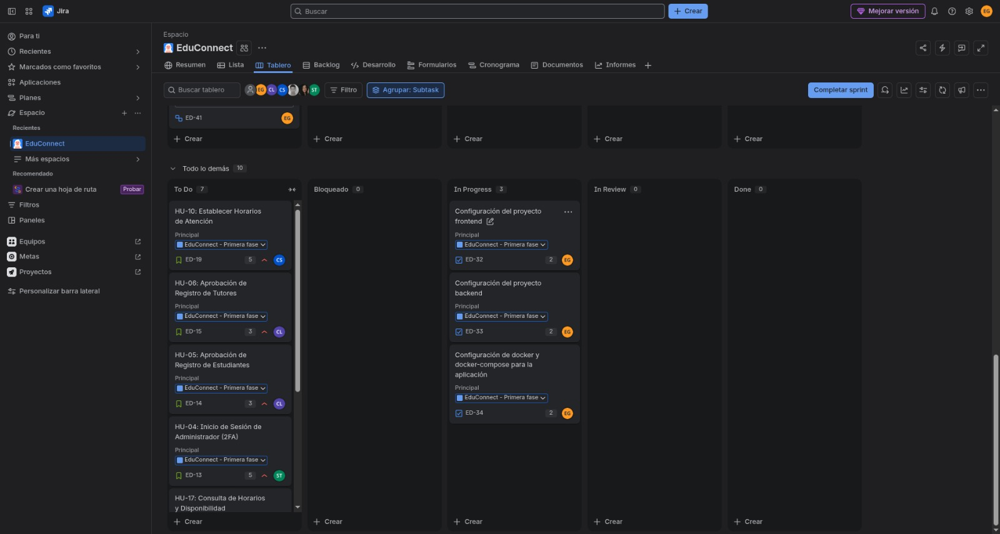

# Sprint 1 — Planificación, Dailies y Evidencias de Desarrollo

### Documentos relacionados

- [README del proyecto](../../README.md)
- [Tablero Kanban y evidencias](../../docs/tablero-kanban/tablero.md)
- [Sprint Planning 1](sprint-planning.md)
- [Sprint Retrospective 1](sprint-retrospective.md)
- [Calificación del equipo](calificacion-equipo.md)

**Universidad de San Carlos de Guatemala (USAC)**  
**Facultad de Ingeniería — Escuela de Ciencias y Sistemas**  
**Análisis y Diseño de Sistemas 1 (AYD1) — Segundo Semestre 2026**  
**Grupo 7**

---

### Ficha Técnica del Sprint 1
* **Herramienta de Gestión:** Jira Software Cloud
* **URL del Tablero:** [EduConnect G7 Jira Workspace](https://edu-connect-g7.atlassian.net/jira/software/projects/ED/summary)
* **Roles en el Sprint:**
  - **Carlos Eduardo Lau López** (202202812) — **Scrum Master** / Desarrollador
  - **Eduardo Sebastián Gutiérrez Felipe** (202300694) — **Product Owner** / Desarrollador
  - **Christian David Chinchilla Santos** (202308227) — Desarrollador
  - **Josue Daniel Revolorio Martinez** (202102984) — Desarrollador
  - **Sebastian Antonio Romero Tzitzimit** (202201690) — Desarrollador
  - **Keitlyn Valentina Tunchez Castañeda** (202201139) — Desarrolladora

---

## 1. Objetivos del Sprint 1

El objetivo central del **Sprint 1** fue establecer la infraestructura fundacional de EduConnect, garantizando los mecanismos de autenticación segura para los tres roles y permitiendo el flujo primario de agendamiento de tutorías:

1. **Configuración Base e Infraestructura:** Configuración de proyectos base en .NET 10 Minimal APIs, Vue 3 con Vite y Tailwind CSS, y orquestación multi-contenedor con Docker Compose y Oracle XE.
2. **Registro y Control de Acceso:** Formularios de registro de estudiantes y tutores con contraseñas encriptadas (BCrypt), almacenamiento de fotos en AWS S3 y validación de unicidad.
3. **Flujo de Aprobación Administrativa:** Panel administrativo para evaluar y aprobar/rechazar solicitudes de ingreso con envío automático de notificaciones por correo SMTP.
4. **Segundo Factor Criptográfico (2FA):** Acceso seguro para administradores mediante descifrado AES-256-CBC del archivo físico `auth2-ayd1.txt`.
5. **Horarios y Búsqueda de Tutores:** Configuración de días/horas de atención del tutor y catálogo público de tutores con filtros avanzados.
6. **Programación Base de Sesiones:** Formulario de agendamiento con validación estricta de no traslapes y no duplicidad de citas activas.

---

## 2. Historias de Usuario Asignadas en el Sprint 1

| Código | Título de la Historia de Usuario | Responsable Principal | Story Points | Estado Final |
| :---: | :--- | :--- | :---: | :---: |
| **HU-01** | Registro de Estudiante | Eduardo Gutiérrez | 5 SP | **DEPLOY (Done)** |
| **HU-02** | Registro de Tutor con Foto y Especialidades | Eduardo Gutiérrez | 8 SP | **DEPLOY (Done)** |
| **HU-03** | Inicio de Sesión de Estudiantes y Tutores (Validación Aprobación) | Eduardo Gutiérrez | 5 SP | **DEPLOY (Done)** |
| **HU-04** | Inicio de Sesión de Administrador con 2FA (`auth2-ayd1.txt`) | Sebastian Romero | 5 SP | **DEPLOY (Done)** |
| **HU-05** | Aprobación de Registro de Estudiantes con Correo | Carlos Lau | 5 SP | **DEPLOY (Done)** |
| **HU-06** | Aprobación de Registro de Tutores con Correo | Carlos Lau | 5 SP | **DEPLOY (Done)** |
| **HU-10** | Establecer Horarios de Atención del Tutor | Christian Chinchilla | 5 SP | **DEPLOY (Done)** |
| **HU-16** | Exploración y Búsqueda Avanzada de Tutores con Filtros | Josue Revolorio | 8 SP | **DEPLOY (Done)** |
| **HU-17** | Consulta de Horarios y Disponibilidad por Fecha | Josue Revolorio | 5 SP | **DEPLOY (Done)** |
| **HU-18** | Programar Sesión de Tutoría (Sin traslapes ni duplicados) | Keitlyn Tunchez | 8 SP | **DEPLOY (Done)** |
| **TOTAL** | **10 Historias de Usuario completadas** | | **59 SP** | **100% Cumplido** |

---

## 3. Evidencias del Tablero Kanban durante el Sprint 1

A continuación se registran los tres estados obligatorios del tablero Kanban de Jira que evidencian la progresión de las tareas a través de las 5 columnas (`TO-DO`, `BLOCKED`, `IN PROGRESS`, `TEST/QA`, `DEPLOY`):

### 3.1 Estado Inicial del Tablero Kanban (Inicio del Sprint 1)
* **Fecha:** 28 de agosto de 2026
* **Descripción:** Tras la sesión de Sprint Planning, las 10 historias seleccionadas y sus tareas técnicas fueron ingresadas y asignadas en la columna `TO-DO`.

---

### 3.2 Estado Intermedio del Tablero Kanban (Desarrollo Activo)
* **Fecha:** 31 de agosto de 2026
* **Descripción:** El equipo trabajando en paralelo. Se observan tareas de backend de registro y horarios en `IN PROGRESS`, endpoints en revisión de calidad en `TEST/QA` y tarjetas de infraestructura ya completadas.

---

### 3.3 Estado Final del Tablero Kanban (Cierre del Sprint 1)
* **Fecha:** 3 de septiembre de 2026
* **Descripción:** Cierre exitoso del Sprint 1 con la totalidad de los 59 Story Points completados, probados e integrados en la columna `DEPLOY`.

---

## 4. Grabaciones de Ceremonias del Sprint 1

| Evento Scrum | Fecha | Plataforma | Enlace de la Grabación |
| :--- | :---: | :---: | :--- |
| **Sprint Planning 1** | 28 de agosto de 2026 | Google Drive| [Sprint 1 ](https://drive.google.com/file/d/1ri4orJFaydUjhzw5CqiIwb76Mna0RGkg/view?usp=drive_link) |

---

## 5. Registro Cronológico Completo de Daily Scrums (Sprint 1)

A continuación se presenta la transcripción íntegra de las reuniones diarias del equipo durante los 7 días del Sprint 1:

---

### Daily 1: 28 de agosto de 2026

* **Josue Revolorio:**
  - *¿Qué hice ayer?:* Participé en la Sprint Planning con el equipo, revisamos el Product Backlog, estimamos el esfuerzo y me asignaron las historias HU-16 y HU-17.
  - *¿Qué voy a hacer hoy?:* Realizar la carga de tareas y análisis de requerimientos de Exploración de tutores.
  - *Bloqueos o Dudas:* De momento no hay bloqueos, todo claro para arrancar.
* **Keitlyn Tunchez:**
  - *¿Qué hice ayer?:* Participé en la Sprint Planning con el equipo, revisamos el Product Backlog, estimamos el esfuerzo y me asignaron la historia HU-18: Programar Sesión de Tutoría.
  - *¿Qué voy a hacer hoy?:* Realizar la carga de tareas en Jira y comenzar con el análisis de requerimientos para el endpoint de programación de sesiones de tutoría.
  - *Bloqueos o dudas:* De momento todo bien, no hay dudas ni bloqueos.
* **Eduardo Lau:**
  - *¿Qué hice ayer?:* Participé en el sprint planning, revisamos los product backlogs, asignamos historias de usuarios y estimamos el esfuerzo de cada tarea.
  - *¿Qué voy a hacer hoy?:* Comenzar con el desarrollo de la HU-05, módulo de aprobación de Registro de Estudiantes.
  - *Bloqueos o dudas:* Ninguna.
* **Christian Chinchilla:**
  - *¿Qué hice ayer?:* Participé en el Sprint Planning, donde revisamos el Product Backlog, asignamos las historias de usuario y estimamos los esfuerzos correspondientes. Se me asignó la HU-10: Establecer horarios de atención.
  - *¿Qué voy a hacer hoy?:* Comenzar con el desarrollo de la HU-10, iniciando la creación y configuración de los horarios de atención del tutor.
  - *Bloqueos o dudas:* Ninguna.
* **Sebastian Romero:**
  - *¿Qué hice ayer?:* Participé en el sprint planning, donde expusimos los product backlogs con base a las historias de usuarios, usando como referencias las estimaciones y la demanda.
  - *¿Qué voy a hacer hoy?:* Comprender la estructura del proyecto para empezar el desarrollo de la historia de usuario 4 que se me fue asignada.
  - *Bloqueos o dudas:* Ninguna.
* **Eduardo Gutierrez:**
  - *¿Qué hice ayer?:* Participé en el sprint planning, revisamos el product backlog, asignamos historias de usuario y estimamos esfuerzos.
  - *¿Qué voy a hacer hoy?:* Análisis y desglose de tareas. Comenzar con la configuración de los proyectos base (ED-32 y ED-33) y configuración de Docker Compose.
  - *Bloqueos o dudas:* Ninguna.

---

### Daily 2: 29 de agosto de 2026

* **Josue Revolorio:**
  - *¿Qué hice ayer?:* Realicé la carga de las subtareas en Jira para las HU-16 y HU-17 y finalicé el análisis de requerimientos de la exploración de tutores.
  - *¿Qué voy a hacer hoy?:* Comenzaré con el desarrollo técnico de la HU-16, creando la consulta en la base de datos y avanzando en el backend con el endpoint para listar y filtrar los tutores disponibles.
  - *Bloqueos o dudas:* Ninguno por el momento, tengo todo lo necesario para iniciar.
* **Keitlyn Tunchez:**
  - *¿Qué hice ayer?:* Organicé en Jira las actividades que voy a realizar para la HU-18 y revisé qué se necesita para poder llevar a cabo la programación de una tutoría.
  - *¿Qué voy a hacer hoy?:* Empezaré con el desarrollo del endpoint de la HU-18 para poder registrar las sesiones y tomaré en cuenta las validaciones necesarias para su programación.
  - *Bloqueos o dudas:* Hasta el momento no se me ha presentado ningún inconveniente para avanzar.
* **Eduardo Lau:**
  - *¿Qué hice ayer?:* Comencé con el desarrollo de la HU-05. Diseñé las consultas en la base de datos y creé los endpoints en el backend para consultar, aprobar y rechazar a los estudiantes pendientes.
  - *¿Qué voy a hacer hoy?:* Trabajar en el frontend para crear la vista de aprobación de estudiantes con su respectiva información (foto, carnet, etc.) y configurar el envío de correos de notificación.
  - *Bloqueos o dudas:* Ninguna.
* **Christian Chinchilla:**
  - *¿Qué hice ayer?:* Realicé la configuración y organización de las subtareas correspondientes a la HU-10: Establecer horarios de atención, contemplando Backend y Frontend.
  - *¿Qué voy a hacer hoy?:* Comenzar con el desarrollo de la HU-10 para establecer los horarios de atención del tutor.
  - *Bloqueos o dudas:* Ninguna.
* **Sebastian Romero:**
  - *¿Qué hice ayer?:* Comprendí cómo se está trabajando el proyecto y qué tecnologías se usarán.
  - *¿Qué voy a hacer hoy?:* Voy a seguir investigando y crear la ruta y arquitectura para la doble autenticación.
  - *Bloqueos o dudas:* Ningún bloqueo.
* **Eduardo Gutierrez:**
  - *¿Qué hice ayer?:* Configurar los proyectos frontend y backend. Configurar docker compose para orquestación de contenedores.
  - *¿Qué voy a hacer hoy?:* Endpoints de registro de estudiante y de tutor. Endpoint de login.
  - *Bloqueos o dudas:* Ningún bloqueo.

---

### Daily 3: 30 de agosto de 2026

* **Josue Revolorio:**
  - *¿Qué hice ayer?:* Avancé con la estructura inicial de la consulta para la HU-16.
  - *¿Qué voy a hacer hoy?:* Retomar de lleno la HU-16 para completar la consulta en la base de datos y dejar listo el endpoint en el backend que permite listar y filtrar tutores.
  - *Bloqueos o dudas:* Ningún bloqueo técnico, únicamente ajustar mis tiempos para ponerme al día.
* **Keitlyn Tunchez:**
  - *¿Qué hice ayer?:* Avancé con la preparación para trabajar la HU-18, revisando las actividades que debía realizar y los requerimientos relacionados con la programación de sesiones.
  - *¿Qué voy a hacer hoy?:* Terminaré de preparar mi entorno de trabajo con la versión actual del proyecto y comenzaré a familiarizarme con la estructura del backend para iniciar posteriormente el desarrollo de mi endpoint.
  - *Bloqueos o dudas:* Por el momento no tengo ningún impedimento para continuar.
* **Eduardo Lau:**
  - *¿Qué hice ayer?:* Finalicé la vista del frontend para la HU-05 con los botones de acción y dejé funcionando la integración con el servicio de correos para notificar al estudiante. Moví la historia a TEST/QA.
  - *¿Qué voy a hacer hoy?:* Comenzar con la HU-06. Trabajaré en la base de datos y los endpoints del backend para consultar y cambiar el estado de aprobación de los tutores pendientes.
  - *Bloqueos o dudas:* Ninguna, reutilizaré parte de la lógica de correos de la HU-05 para avanzar más rápido.
* **Christian Chinchilla:**
  - *¿Qué hice ayer?:* Establecer horarios de atención en la parte del Backend manejando los endpoints para configurar y actualizar horarios.
  - *¿Qué voy a hacer hoy?:* Comenzar con el desarrollo del Frontend de la HU-10.
  - *Bloqueos o dudas:* Ninguna.
* **Sebastian Romero:**
  - *¿Qué hice ayer?:* Investigué y tracé la ruta para desarrollar mi tarea.
  - *¿Qué voy a hacer hoy?:* Comenzaré con el desarrollo de la HU-04 enfocándome únicamente en la parte del backend.
  - *Bloqueos o dudas:* Ninguna.
* **Eduardo Gutierrez:**
  - *¿Qué hice ayer?:* Endpoints de registro y login.
  - *¿Qué voy a hacer hoy?:* Formulario de inicio de sesión frontend.
  - *Bloqueos o dudas:* Ningún bloqueo.

---

### Daily 4: 31 de agosto de 2026

* **Josue Revolorio:**
  - *¿Qué hice ayer?:* Avancé en la definición del modelo de datos para la HU-16 y estuve analizando los parámetros necesarios para las búsquedas.
  - *¿Qué voy a hacer hoy?:* Desarrollar la consulta en la base de datos para obtener a los tutores y construir el endpoint en el backend para el filtrado.
  - *Bloqueos o dudas:* Ninguno.
* **Keitlyn Tunchez:**
  - *¿Qué hice ayer?:* Avancé con la preparación para trabajar la HU-18, revisando los requerimientos de la historia y dejando listo mi entorno de trabajo.
  - *¿Qué voy a hacer hoy?:* Comenzaré con el desarrollo del backend para programar sesiones, creando la estructura necesaria y trabajando en el endpoint para registrar una nueva sesión de tutoría.
  - *Bloqueos o dudas:* Por el momento no tengo ningún impedimento para continuar.
* **Eduardo Lau:**
  - *¿Qué hice ayer?:* Terminé los endpoints del backend y las consultas de la base de datos para la HU-06 correspondientes a los tutores.
  - *¿Qué voy a hacer hoy?:* Desarrollar la vista en el frontend para mostrar la lista de tutores con sus datos específicos (especialidad, número de identificación) y conectar la aprobación/rechazo con el envío de correos.
  - *Bloqueos o dudas:* Ninguna.
* **Christian Chinchilla:**
  - *¿Qué hice ayer?:* Finalicé el desarrollo del Backend de la HU-10: Establecer horarios de atención.
  - *¿Qué voy a hacer hoy?:* Comenzar con el desarrollo del Frontend de la HU-10.
  - *Bloqueos o dudas:* Ninguna.
* **Sebastian Romero:**
  - *¿Qué hice ayer?:* Comencé con el desarrollo de la HU-04 enfocándome en la parte del backend.
  - *¿Qué voy a hacer hoy?:* Seguiré con la generación del archivo cifrado que es necesario para la doble autenticación.
  - *Bloqueos o dudas:* ¿Cómo generamos la clave de acceso para derivar el cifrado simétrico? (Resuelto por el equipo acordando derivar la clave vía SHA-256 de `Jwt:Key`).
* **Eduardo Gutierrez:**
  - *¿Qué hice ayer?:* Formulario de inicio de sesión frontend.
  - *¿Qué voy a hacer hoy?:* Formulario de registro de tutores y de estudiantes.
  - *Bloqueos o dudas:* Ningún bloqueo ni duda.

---

### Daily 5: 1 de septiembre de 2026

* **Josue Revolorio:**
  - *¿Qué hice ayer?:* Dejé finalizada la consulta en la base de datos y el endpoint en el backend para listar y filtrar los tutores (HU-16).
  - *¿Qué voy a hacer hoy?:* Trabajar en el frontend, construyendo la vista de exploración de tutores y los controles visuales para los filtros de búsqueda.
  - *Bloqueos o dudas:* Ninguno, todo claro para continuar con el desarrollo del frontend.
* **Keitlyn Tunchez:**
  - *¿Qué hice ayer?:* Comencé a trabajar en el backend de la HU-18, creando la estructura para la programación de sesiones y avanzando con el endpoint que permitirá registrar una nueva sesión.
  - *¿Qué voy a hacer hoy?:* Continuaré trabajando en el endpoint y empezaré a implementar las validaciones necesarias, como la existencia del tutor, la materia y los datos de la sesión.
  - *Bloqueos o dudas:* Por el momento no tengo bloqueos.
* **Eduardo Lau:**
  - *¿Qué hice ayer?:* Terminé de desarrollar la vista en el frontend para mostrar la lista de tutores con sus datos específicos (HU-06) y conecté exitosamente la aprobación y rechazo con el envío de correos.
  - *¿Qué voy a hacer hoy?:* Realizar pruebas de integración para los flujos completos de las HU-05 y HU-06.
  - *Bloqueos o dudas:* La extensión de Postman en VS Code colapsó por un problema de caché corrupto y me está bloqueando la ejecución de las peticiones para probar los endpoints.
* **Christian Chinchilla:**
  - *¿Qué hice ayer?:* Finalicé las pruebas del backend para la configuración de horarios de atención del tutor y dejé lista la rama para continuar con el frontend.
  - *¿Qué voy a hacer hoy?:* Iniciar el desarrollo del frontend de configuración de horarios, creando la estructura del módulo, tipos, servicio y componentes necesarios para la interfaz.
  - *Bloqueos o dudas:* Ninguno por el momento.
* **Sebastian Romero:**
  - *¿Qué hice ayer?:* Terminé con la generación y lectura del archivo cifrado.
  - *¿Qué voy a hacer hoy?:* Completaré la fase de la parte del backend, con sus complementaciones requeridas.
  - *Bloqueos o dudas:* Ninguno.
* **Eduardo Gutierrez:**
  - *¿Qué hice ayer?:* Formulario de registro de tutores y de estudiantes.
  - *¿Qué voy a hacer hoy?:* Layouts estructurales para pantallas de admin, estudiantes y tutores.
  - *Bloqueos o dudas:* De momento no hay bloqueos o dudas.

---

### Daily 6: 2 de septiembre de 2026

* **Josue Revolorio:**
  - *¿Qué hice ayer?:* Finalicé la vista en el frontend y los controles de filtrado para la HU-16, dejando completamente probada y funcional la búsqueda de tutores.
  - *¿Qué voy a hacer hoy?:* Iniciar directamente con la HU-17 (Consulta de Horarios y Disponibilidad), creando la consulta en la base de datos y construyendo el endpoint backend para obtener la agenda del tutor.
  - *Bloqueos o dudas:* Ninguno, todo está avanzando a buen ritmo.
* **Keitlyn Tunchez:**
  - *¿Qué hice ayer?:* Avancé con las validaciones del endpoint, tomando en cuenta la existencia del tutor y la materia, los días y horarios de atención y posibles conflictos con otras sesiones.
  - *¿Qué voy a hacer hoy?:* Terminaré las validaciones pendientes y realizaré pruebas en Swagger para comprobar tanto la creación de sesiones como los diferentes casos de error.
  - *Bloqueos o dudas:* Lo que más se me complicó fue manejar correctamente los conflictos de horario y diferenciar los distintos casos en los que la sesión no debía permitirse, para devolver una respuesta adecuada en cada situación.
* **Eduardo Lau:**
  - *¿Qué hice ayer?:* Solucioné los problemas de pruebas utilizando Swagger y archivos `.http` nativos en VS Code tras el fallo de Postman. También apliqué correctamente el renombrado de mi rama en Git a `feature/backend_aprobaciones-admin_202202812` tanto en local como en remoto.
  - *¿Qué voy a hacer hoy?:* Conectar DBeaver a la base de datos Oracle en el contenedor de Docker para inspeccionar directamente las tablas y verificar que los estados de aprobación se estén actualizando correctamente.
  - *Bloqueos o dudas:* Ninguna, el entorno de pruebas ya está estabilizado.
* **Christian Chinchilla:**
  - *¿Qué hice ayer?:* Inicié el frontend de configuración de horarios del tutor, implementando la estructura del módulo, servicio, tipos, lógica de selección de días y la interfaz principal.
  - *¿Qué voy a hacer hoy?:* Finalizar la integración de la pantalla de horarios, agregar la ruta para tutores, validar horarios y días seleccionados y realizar pruebas de funcionamiento.
  - *Bloqueos o dudas:* Ninguna.
* **Sebastian Romero:**
  - *¿Qué hice ayer?:* Completé la fase del lado del backend incluyendo la doble verificación.
  - *¿Qué voy a hacer hoy?:* Empezaré a ver cómo está estructurado el frontend y empezaré a realizar las vistas.
  - *Bloqueos o dudas:* Ninguna.
* **Eduardo Gutierrez:**
  - *¿Qué hice ayer?:* Creé los layouts para pantallas de admin, estudiantes y tutores.
  - *¿Qué voy a hacer hoy?:* Crear los pipelines CI/CD para despliegue de la aplicación.
  - *Bloqueos o dudas:* No hay dudas ni bloqueos por el momento.

---

### Daily 7: 3 de septiembre de 2026 (Cierre de Sprint 1)

* **Josue Revolorio:**
  - *¿Qué hice ayer?:* Terminé el endpoint del backend y la interfaz visual del calendario/horarios en el frontend para la HU-17, completando el desarrollo de la historia.
  - *¿Qué voy a hacer hoy?:* Realizar pruebas de integración, mover todas mis tareas y subtareas a la columna `DEPLOY` en Jira/Kanban, y crear el Pull Request de mi rama a la rama develop.
  - *Bloqueos o dudas:* En revisión, realizando el test de todo el agregado.
* **Keitlyn Tunchez:**
  - *¿Qué hice ayer?:* Terminé la parte de backend de la HU-18 y realicé pruebas en Swagger para comprobar que la creación de sesiones y las validaciones funcionaran correctamente.
  - *¿Qué voy a hacer hoy?:* Trabajaré en la parte de frontend, creando el formulario para programar una sesión y avanzando con su integración al endpoint del backend.
  - *Bloqueos o dudas:* La principal dificultad fue relacionar correctamente los datos seleccionados en el frontend con los registros reales del backend, especialmente los identificadores del tutor y la materia, para poder probar la integración correctamente.
* **Eduardo Lau:**
  - *¿Qué hice ayer?:* Finalicé la revisión de las tablas con DBeaver y confirmé que el frontend, backend y base de datos para los módulos de aprobación de estudiantes (HU-05) y tutores (HU-06) están completamente terminados y sin errores.
  - *¿Qué voy a hacer hoy?:* Moveré mis historias a la columna `DEPLOY` en el tablero Kanban y estaré apoyando al resto del equipo en caso de que tengan bloqueos con sus endpoints o integraciones.
  - *Bloqueos o dudas:* Ninguna.
* **Christian Chinchilla:**
  - *¿Qué hice ayer?:* Finalicé la implementación y pruebas principales del frontend para la configuración de horarios del tutor, dejando preparada la integración con el backend.
  - *¿Qué voy a hacer hoy?:* Trabajar en la documentación del proyecto, específicamente en requerimientos funcionales.
  - *Bloqueos o dudas:* Ninguna.
* **Sebastian Romero:**
  - *¿Qué hice ayer?:* Empecé a ver cómo está estructurado el frontend y empecé a realizar las vistas.
  - *¿Qué voy a hacer hoy?:* Realicé las vistas correspondientes, dando así fin a lo que tenía que hacer, estaré a la espera si algún compañero requiere ayuda.
  - *Bloqueos o dudas:* Ninguna.
* **Eduardo Gutierrez:**
  - *¿Qué hice ayer?:* Creé el pipeline CI/CD para las aplicaciones backend y frontend.
  - *¿Qué voy a hacer hoy?:* Gestión de releases de integración y soporte general.
  - *Bloqueos o dudas:* Ningún bloqueo.

