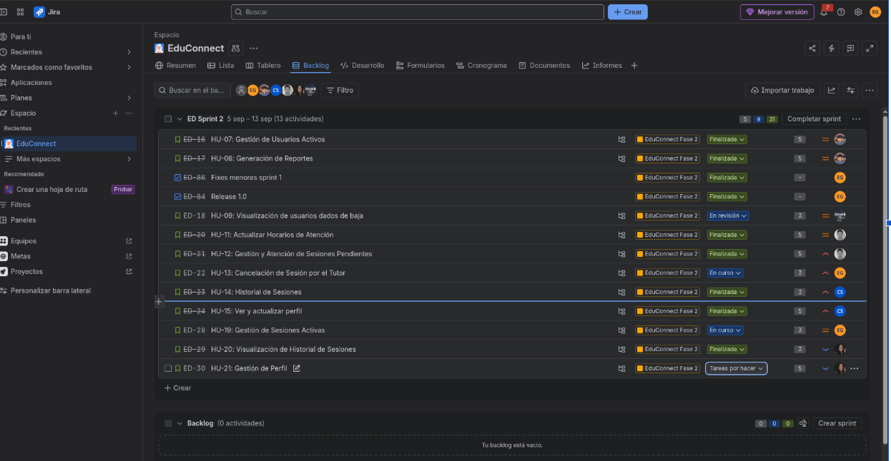
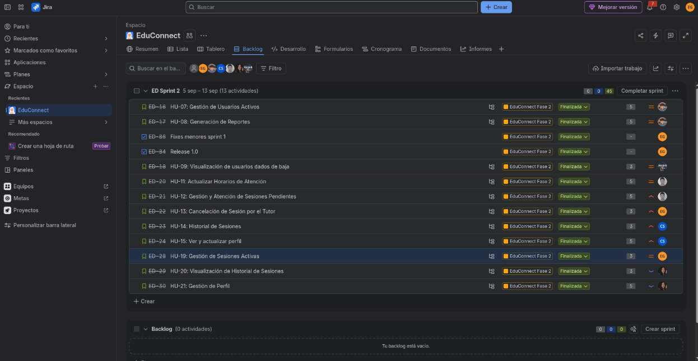

# Sprint 2 — Planificación, Dailies y Cierre del Proyecto

### Documentos relacionados

- [README del proyecto](../../README.md)
- [Tablero Kanban y evidencias](../../docs/tablero-kanban/tablero.md)
- [Product Backlog](../../docs/product-backlog/historias-de-usuario.md)
- [Sprint Retrospective 2](sprint-retrospective.md)
- [Calificación del equipo](calificacion-equipo.md)

**Universidad de San Carlos de Guatemala (USAC)**  
**Facultad de Ingeniería — Escuela de Ciencias y Sistemas**  
**Análisis y Diseño de Sistemas 1 (AYD1) — Segundo Semestre 2026**  
**Grupo 7**

---

### Ficha Técnica del Sprint 2
* **Nombre del Sprint:** Sprint 2 — Gestión Operativa, Cancelaciones, Reportes, Historiales y Perfiles
* **Período de Ejecución:** 6 de septiembre al 13 de septiembre de 2026
* **Duración:** 8 días hábiles intensivos
* **Herramienta de Gestión:** Jira Software Cloud
* **URL del Tablero:** [EduConnect G7 Jira Workspace](https://edu-connect-g7.atlassian.net/?continue=https%3A%2F%2Fedu-connect-g7.atlassian.net%2Fwelcome%2Fsoftware%3FprojectId%3D10000&atlOrigin=eyJpIjoiZDI4NjFkNjZlMDg2NDU4NTkwODAyZTU3MDE)
* **Roles en el Sprint:**
  - **Carlos Eduardo Lau López** (202202812) — **Scrum Master** / Desarrollador
  - **Eduardo Sebastián Gutiérrez Felipe** (202300694) — **Product Owner** / Desarrollador
  - **Christian David Chinchilla Santos** (202308227) — Desarrollador
  - **Josue Daniel Revolorio Martinez** (202102984) — Desarrollador
  - **Sebastian Antonio Romero Tzitzimit** (202201690) — Desarrollador
  - **Keitlyn Valentina Tunchez Castañeda** (202201139) — Desarrolladora

---

## 1. Objetivos del Sprint 2

El **Sprint 2** consolidó la plataforma EduConnect entregando la lógica operativa completa, el ciclo de vida posterior al agendamiento, la supervisión gerencial y la gestión de identidad:

1. **Gestión y Baja de Usuarios Activos:** Control administrativo para auditar estudiantes y tutores activos, y dar de baja cuentas con motivo justificado y envío automático de notificación por correo.
2. **Visualización y Auditoría de Bajas (HU-09):** Módulo dedicado para consultar usuarios dados de baja con fecha y justificación.
3. **Módulo de Reportes Analíticos (HU-08):** Generación de estadísticas en tiempo real (ranking de tutores con más atenciones, materias con mayor demanda y tarjetas de resumen).
4. **Ciclo de Atención Pedagógica del Tutor:** Dashboard del tutor con métricas en vivo, orden cronológico de citas y formulario modal obligatorio para asentar el resumen académico de la tutoría.
5. **Mecanismo de Cancelaciones Asíncronas con Correo:** Cancelación por parte del tutor con liberación inmediata de agenda y envío de correo de disculpas al alumno; y cancelación voluntaria por parte del estudiante.
6. **Historiales Completos y Perfiles:** Historial de sesiones atendidas y canceladas para ambos roles, y edición de perfil con validación de contraseña previa y carga de foto en AWS S3.
7. **Estabilización, Pruebas y Release 1.0:** Pruebas integrales de regresión, resolución de conflictos de integración en Git y despliegue final en la rama `main`.

---

## 2. Historias de Usuario Asignadas en el Sprint 2

| Código | Título de la Historia de Usuario | Responsable Principal | Story Points | Estado Final |
| :---: | :--- | :--- | :---: | :---: |
| **HU-07** | Gestión de Usuarios Activos y Baja de Cuentas con Correo | Carlos Lau | 5 SP | **DEPLOY (Done)** |
| **HU-08** | Generación de Reportes del Sistema (Gráficos y Tablas) | Carlos Lau | 8 SP | **DEPLOY (Done)** |
| **HU-09** | Visualización de Usuarios Dados de Baja | Sebastian Romero | 3 SP | **DEPLOY (Done)** |
| **HU-11** | Actualizar Horarios de Atención con Validación | Josue Revolorio | 5 SP | **DEPLOY (Done)** |
| **HU-12** | Dashboard y Atención de Sesiones con Resumen Pedagógico | Josue Revolorio | 5 SP | **DEPLOY (Done)** |
| **HU-13** | Cancelación de Sesión por Tutor con Correo de Disculpa | Eduardo Gutiérrez | 5 SP | **DEPLOY (Done)** |
| **HU-14** | Historial de Sesiones del Tutor con Filtros | Christian Chinchilla | 3 SP | **DEPLOY (Done)** |
| **HU-15** | Perfil del Tutor (Edición, Foto S3 y Cambio de Clave) | Christian Chinchilla | 5 SP | **DEPLOY (Done)** |
| **HU-19** | Gestión y Cancelación de Sesiones Activas por Estudiante | Eduardo Gutiérrez | 5 SP | **DEPLOY (Done)** |
| **HU-20** | Visualización de Historial de Sesiones del Estudiante | Keitlyn Tunchez | 3 SP | **DEPLOY (Done)** |
| **HU-21** | Perfil del Estudiante (Edición y Cambio de Contraseña) | Keitlyn Tunchez | 3 SP | **DEPLOY (Done)** |
| **TOTAL** | **11 Historias de Usuario completadas** | | **47 SP** | **100% Cumplido** |

---

## 3. Evidencias del Tablero Kanban durante el Sprint 2

A continuación se presentan los tres momentos obligatorios del tablero Kanban de Jira que demuestran la ejecución y finalización del segundo ciclo de desarrollo:

### 3.1 Estado Inicial del Tablero Kanban (Inicio del Sprint 2)
* **Fecha:** 6 de septiembre de 2026
* **Descripción:** Tras la sesión de Sprint Planning 2, se cargaron las 11 historias restantes del Product Backlog (47 SP) en la columna `TO-DO`.

---

### 3.2 Estado Intermedio del Tablero Kanban (Desarrollo Activo)
* **Fecha:** 9 de septiembre de 2026
* **Descripción:** El equipo trabajando en las integraciones cruzadas: reportes administrativos en `TEST/QA`, cancelaciones con envío de correos SMTP y pantallas de perfil en `IN PROGRESS`.

---

### 3.3 Estado Final del Tablero Kanban (Cierre del Proyecto)
* **Fecha:** 13 de septiembre de 2026
* **Descripción:** Tablero de Jira al 100% completado con la totalidad de historias en la columna `DEPLOY`, reflejando el éxito de la plataforma EduConnect.

---

## 4. Grabaciones de Ceremonias del Sprint 2

| Evento Scrum | Fecha | Plataforma | Enlace de la Grabación |
| :--- | :---: | :---: | :--- |
| **Sprint Planning 2** | 6 de septiembre de 2026 | Google Drive | [Sprint 2](https://drive.google.com/file/d/1beKELHINHqWvxiWkoaeZViC2a6F17LKB/view?usp=drive_link) |

---

## 5. Registro Cronológico Completo de Daily Scrums (Sprint 2)

A continuación se documenta el seguimiento diario de los 6 integrantes del equipo a lo largo de las 8 reuniones del Sprint 2:

---

### Daily 1: 6 de septiembre de 2026

* **Josue Revolorio:**
  - *¿Qué hice ayer?:* Participé en la reunión de Sprint Planning, revisé los criterios de aceptación para la HU-11 y HU-12, y realicé el desglose de las subtareas en Jira.
  - *¿Qué voy a hacer hoy?:* Sincronizar el repositorio local con la rama develop, crear la rama de trabajo feature y dejar listo el entorno para arrancar con el desarrollo.
  - *Bloqueos o dudas:* Ninguno.
* **Keitlyn Tunchez:**
  - *¿Qué hice ayer?:* Ya tenía asignadas las HU-20 y HU-21 del nuevo sprint y revisé los requerimientos correspondientes a ambas historias.
  - *¿Qué voy a hacer hoy?:* Comenzaré a organizar el trabajo de la HU-20, enfocándome primero en la consulta del historial de sesiones del estudiante y los datos que debe mostrar.
  - *Bloqueos o dudas:* Ninguna por el momento.
* **Eduardo Lau:**
  - *¿Qué hice ayer?:* Participé en la reunión de Sprint Planning, revisé los criterios de aceptación para la HU-07 y HU-08, y configuré las ramas base del proyecto.
  - *¿Qué voy a hacer hoy?:* Iniciar la implementación de la HU-07, desarrollando los endpoints en el backend y la interfaz para la gestión y baja de usuarios activos.
  - *Bloqueos o dudas:* Ninguno.
* **Christian Chinchilla:**
  - *¿Qué hice ayer?:* Revisé las historias de usuario asignadas para el Sprint 2 y organicé las subtareas correspondientes al historial de sesiones y gestión del perfil del tutor.
  - *¿Qué voy a hacer hoy?:* Iniciar el desarrollo de la HU-14, comenzando con el backend para consultar y filtrar el historial de sesiones del tutor.
  - *Bloqueos o dudas:* Ninguna.
* **Sebastian Romero:**
  - *¿Qué hice ayer?:* Participé en el segundo Sprint, en este pedí la HU-09 por lo que veré las tareas asignadas y sus partes.
  - *¿Qué voy a hacer hoy?:* Revisaré qué tareas me toca hacer e investigaré cómo implementar las subtareas asignadas.
  - *Bloqueos o dudas:* Ninguna.
* **Eduardo Gutierrez:**
  - *¿Qué hice ayer?:* Participé en la Sprint Planning, en donde me comprometí a completar las historias de usuario HU-13 y HU-19.
  - *¿Qué voy a hacer hoy?:* Analizar las historias a desarrollar y realizar el desglose en subtareas para backend y frontend. Revisar y corregir observaciones de la entrega del sprint 1.
  - *Bloqueos o dudas:* No hay dudas, todo está claro para avanzar.

---

### Daily 2: 7 de septiembre de 2026

* **Josue Revolorio:**
  - *¿Qué hice ayer?:* Actualicé el entorno local desde develop, creé la rama feature y organicé las subtareas en la columna `TO-DO` de Jira.
  - *¿Qué voy a hacer hoy?:* Iniciar con la primera tarea de la HU-11 creando la consulta en la base de datos y avanzando con el endpoint en el backend para la actualización de horarios.
  - *Bloqueos o dudas:* Ninguno, entorno de Docker levantado y listo.
* **Keitlyn Tunchez:**
  - *¿Qué hice ayer?:* Revisé la HU-20 y definí la información que debe manejar el historial del estudiante, tanto en backend como en frontend.
  - *¿Qué voy a hacer hoy?:* Avanzaré con la parte de backend de la HU-20, trabajando la consulta de las sesiones atendidas y canceladas del estudiante.
  - *Bloqueos o dudas:* Todo bien por ahora.
* **Eduardo Lau:**
  - *¿Qué hice ayer?:* Completé la funcionalidad de la HU-07 (gestión de usuarios activos) tanto en backend como en frontend.
  - *¿Qué voy a hacer hoy?:* Implementar la HU-08 correspondiente a reportes y estadísticas de administración, desarrollando los endpoints de conteo en .NET y la vista de métricas y gráficos en Vue.
  - *Bloqueos o dudas:* Ninguno.
* **Christian Chinchilla:**
  - *¿Qué hice ayer?:* Preparé la implementación de la HU-14 y revisé la estructura del backend, modelos y relaciones necesarias para el historial de sesiones.
  - *¿Qué voy a hacer hoy?:* Implementar y validar el endpoint del historial de sesiones del tutor, incluyendo filtros por fecha y estudiante.
  - *Bloqueos o dudas:* Ninguna.
* **Sebastian Romero:**
  - *¿Qué hice ayer?:* Revisé las subtareas e hice un plan de cómo empezar a contribuir.
  - *¿Qué voy a hacer hoy?:* Empezaré con la parte del backend donde haré el endpoint para consultar usuarios dados de baja.
  - *Bloqueos o dudas:* Ninguna.
* **Eduardo Gutierrez:**
  - *¿Qué hice ayer?:* Analicé las historias asignadas y desglosé subtareas. Revisé módulos del sprint 1 y realicé ajustes necesarios.
  - *¿Qué voy a hacer hoy?:* Generar el release de lo desarrollado en el sprint 1.
  - *Bloqueos o dudas:* Ninguna por el momento.

---

### Daily 3: 8 de septiembre de 2026

* **Josue Revolorio:**
  - *¿Qué hice ayer?:* Avancé con la integración del frontend y backend para la HU-11 y HU-12.
  - *¿Qué voy a hacer hoy?:* Finalizar por completo el desarrollo de ambas historias, realizar pruebas de integración, mover todas las tareas a `DEPLOY` en Jira y crear el Pull Request hacia la rama develop.
  - *Bloqueos o dudas:* Ninguno, todo quedó probado y finalizado.
* **Keitlyn Tunchez:**
  - *¿Qué hice ayer?:* Avancé con la estructura necesaria para consultar el historial de sesiones del estudiante y revisé el manejo de estados de sesión.
  - *¿Qué voy a hacer hoy?:* Continuaré con la HU-20, realizando pruebas de la consulta y preparando la integración con la vista del historial.
  - *Bloqueos o dudas:* Ninguna.
* **Eduardo Lau:**
  - *¿Qué hice ayer?:* Finalicé el desarrollo de la HU-08 (backend y frontend de reportes), realicé pruebas locales en Docker y generé los Pull Requests correspondientes.
  - *¿Qué voy a hacer hoy?:* Resolver conflictos de merge en Git surgidos en el Pull Request de frontend de la HU-08 al integrarse con los cambios de la HU-07 en la rama develop, asegurando que las compilaciones pasen limpias.
  - *Bloqueos o dudas:* Ninguno.
* **Christian Chinchilla:**
  - *¿Qué hice ayer?:* Finalicé la implementación del historial de sesiones del tutor y realicé pruebas de integración.
  - *¿Qué voy a hacer hoy?:* Trabajar en la HU-15 (perfil del tutor). Implementar endpoints para consultar/actualizar datos y agregar cambio de contraseña con validaciones.
  - *Bloqueos o dudas:* Ninguna.
* **Sebastian Romero:**
  - *¿Qué hice ayer?:* Empecé el backend de la consulta de usuarios dados de baja.
  - *¿Qué voy a hacer hoy?:* Ver qué datos necesito extraer para dicho endpoint y hacer la consulta efectiva donde se visualice todo.
  - *Bloqueos o dudas:* Aclaración sobre qué campos mostrar (fecha de baja, motivo, correo y nombre).
* **Eduardo Gutierrez:**
  - *¿Qué hice ayer?:* Generé el release 1.0 con los desarrollos del primer sprint.
  - *¿Qué voy a hacer hoy?:* Generar el endpoint PUT para cancelar una sesión desde el usuario tutor (`[ED-81]`).
  - *Bloqueos o dudas:* No hay bloqueos ni dudas.

---

### Daily 4: 9 de septiembre de 2026

* **Josue Revolorio:**
  - *¿Qué hice ayer?:* Creé los Pull Requests hacia la rama develop para las historias HU-11 y HU-12 y actualicé las tareas en Jira.
  - *¿Qué voy a hacer hoy?:* Ejecutar la batería completa de pruebas de integración y usabilidad en el entorno Docker Compose para verificar que la actualización de horarios y atención de sesiones interactúen sin errores.
  - *Bloqueos o dudas:* Ninguno, pruebas correctas hasta el momento.
* **Keitlyn Tunchez:**
  - *¿Qué hice ayer?:* Avancé con la HU-20, trabajando la consulta del historial de sesiones y revisando la información a mostrar.
  - *¿Qué voy a hacer hoy?:* Continuar con la integración y pruebas de la HU-20. Comenzar a trabajar la HU-21, revisando consulta y actualización de datos del perfil del estudiante.
  - *Bloqueos o dudas:* Ajustes de configuración resueltos satisfactoriamente.
* **Eduardo Lau:**
  - *¿Qué hice ayer?:* Resolví conflictos de merge en rutas, servicios y componentes compartidos de administración, verificando que la compilación de TypeScript y el build de producción se completaran sin errores.
  - *¿Qué voy a hacer hoy?:* Apoyar en la revisión de código (*code review*) de los Pull Requests de los compañeros y validar la integración general.
  - *Bloqueos o dudas:* Ninguno.
* **Christian Chinchilla:**
  - *¿Qué hice ayer?:* Implementé el backend de la HU-15 para consultar y actualizar el perfil del tutor, validaciones y cambio de contraseña. Integré actualización de foto con S3.
  - *¿Qué voy a hacer hoy?:* Finalizar el frontend de la HU-15. Integrar la vista de perfil con los endpoints, probar actualización de foto y clave, y realizar el commit.
  - *Bloqueos o dudas:* Se presentó un inconveniente con la configuración de S3 para guardar la fotografía, pero fue solucionado agregando las variables de entorno necesarias en el `.env`.
* **Sebastian Romero:**
  - *¿Qué hice ayer?:* Verifiqué datos para el endpoint e hice la consulta efectiva en la base de datos.
  - *¿Qué voy a hacer hoy?:* Empezaré a trabajar con la vista para mostrar los resultados del endpoint.
  - *Bloqueos o dudas:* Ninguna.
* **Eduardo Gutierrez:**
  - *¿Qué hice ayer?:* Generé el endpoint PUT para cancelar sesión desde el tutor (`[ED-81]`).
  - *¿Qué voy a hacer hoy?:* Crear la vista en el frontend para poder cancelar sesiones del tutor consumiendo el endpoint desarrollado (`[ED-80]`).
  - *Bloqueos o dudas:* Ninguna duda ni bloqueo.

---

### Daily 5: 10 de septiembre de 2026

* **Josue Revolorio:**
  - *¿Qué hice ayer?:* Concluí pruebas finales de integración comprobando que todo funciona correctamente.
  - *¿Qué voy a hacer hoy?:* Monitorear y verificar la estabilidad de las funcionalidades.
  - *Bloqueos o dudas:* Ninguno.
* **Keitlyn Tunchez:**
  - *¿Qué hice ayer?:* Avancé con HU-20 y HU-21, completando la implementación del historial de sesiones y perfil del estudiante en backend y frontend.
  - *¿Qué voy a hacer hoy?:* Pruebas de ambas historias en Swagger, integración con frontend y cambio de contraseña.
  - *Bloqueos o dudas:* Por el momento no tengo bloqueos.
* **Eduardo Lau:**
  - *¿Qué hice ayer?:* Apoyé en la revisión de código de los Pull Requests y validé la integración en el entorno general.
  - *¿Qué voy a hacer hoy?:* Continuar con pruebas de integración conjunta, verificación de flujos del sistema y soporte al equipo.
  - *Bloqueos o dudas:* Ninguno.
* **Christian Chinchilla:**
  - *¿Qué hice ayer?:* Finalicé el frontend de la HU-15.
  - *¿Qué voy a hacer hoy?:* Apoyar a los compañeros en tareas que presenten dificultad.
  - *Bloqueos o dudas:* Ninguno.
* **Sebastian Romero:**
  - *¿Qué hice ayer?:* Empecé a trabajar con la vista para mostrar los usuarios dados de baja.
  - *¿Qué voy a hacer hoy?:* Terminar la vista y actualizar el tablero Kanban.
  - *Bloqueos o dudas:* Ninguna.
* **Eduardo Gutierrez:**
  - *¿Qué hice ayer?:* Creé la vista en el frontend para cancelar sesiones de tutor (`[ED-80]`).
  - *¿Qué voy a hacer hoy?:* Crear el endpoint GET para obtener las sesiones activas del estudiante (`[ED-83]`).
  - *Bloqueos o dudas:* No hay ningún bloqueo o duda.

---

### Daily 6: 11 de septiembre de 2026

* **Josue Revolorio:**
  - *¿Qué hice ayer?:* Verifiqué el correcto funcionamiento de mis tareas integradas en la rama develop.
  - *¿Qué voy a hacer hoy?:* Revisar detalles finales del sistema, coordinando con el equipo ahora que casi está completo.
  - *Bloqueos o dudas:* Ninguno.
* **Keitlyn Tunchez:**
  - *¿Qué hice ayer?:* Finalicé la implementación y pruebas de HU-20 y HU-21. Preparé cambios para integrarlos con develop.
  - *¿Qué voy a hacer hoy?:* Pruebas de integración y regresión para verificar que historial, perfil y correcciones sigan funcionando tras incorporar cambios de develop.
  - *Bloqueos o dudas:* Conflictos menores de merge resueltos conservando ambas funcionalidades.
* **Eduardo Lau:**
  - *¿Qué hice ayer?:* Realicé pruebas de integración y validé la estabilidad de los módulos en develop.
  - *¿Qué voy a hacer hoy?:* Continuar con pruebas de integración conjunta y soporte al equipo.
  - *Bloqueos o dudas:* Ninguno.
* **Christian Chinchilla:**
  - *¿Qué hice ayer?:* Apoyé a compañeros con revisiones de código.
  - *¿Qué voy a hacer hoy?:* Probar la aplicación y localizar posibles bugs.
  - *Bloqueos o dudas:* Ninguno.
* **Sebastian Romero:**
  - *¿Qué hice ayer?:* Finalicé con mi parte y concluí la vista de usuarios dados de baja.
  - *¿Qué voy a hacer hoy?:* Apoyar a los compañeros si lo necesitan.
  - *Bloqueos o dudas:* Ninguno.
* **Eduardo Gutierrez:**
  - *¿Qué hice ayer?:* Creé el endpoint GET para obtener las sesiones activas del estudiante (`[ED-83]`).
  - *¿Qué voy a hacer hoy?:* Crear la vista para la gestión de sesiones activas del estudiante (`[ED-82]`).
  - *Bloqueos o dudas:* No hay bloqueos ni dudas.

---

### Daily 7: 12 de septiembre de 2026

* **Josue Revolorio:**
  - *¿Qué hice ayer?:* Revisé y verifiqué mi parte del sistema tras la coordinación con el equipo.
  - *¿Qué voy a hacer hoy?:* Realizar el Manual de Usuario.
  - *Bloqueos o dudas:* Ninguno.
* **Keitlyn Tunchez:**
  - *¿Qué hice ayer?:* Probé nuevamente las funcionalidades tras actualizar con los últimos cambios de develop.
  - *¿Qué voy a hacer hoy?:* Seguiré validando los diferentes flujos del módulo de estudiante para detectar posibles errores.
  - *Bloqueos o dudas:* Ninguna.
* **Eduardo Lau:**
  - *¿Qué hice ayer?:* Pruebas de integración y validación de estabilidad.
  - *¿Qué voy a hacer hoy?:* Pruebas de integración conjunta y soporte de cara al cierre del sprint.
  - *Bloqueos o dudas:* Ninguno.
* **Christian Chinchilla:**
  - *¿Qué hice ayer?:* Empecé con pruebas y revisión integral del sistema.
  - *¿Qué voy a hacer hoy?:* Seguir buscando errores y empezar documentación técnica.
  - *Bloqueos o dudas:* Ninguna.
* **Sebastian Romero:**
  - *¿Qué hice ayer?:* Apoyo al equipo.
  - *¿Qué voy a hacer hoy?:* Empezar la parte de documentación.
  - *Bloqueos o dudas:* Ninguno.
* **Eduardo Gutierrez:**
  - *¿Qué hice ayer?:* Creé la vista para gestión de sesiones activas del estudiante (`[ED-82]`).
  - *¿Qué voy a hacer hoy?:* Tests manuales de todos los desarrollos realizados por el equipo.
  - *Bloqueos o dudas:* No hay dudas ni bloqueos.

---

### Daily 8: 13 de septiembre de 2026 (Cierre de Sprint 2 y Proyecto)

* **Josue Revolorio:**
  - *¿Qué hice ayer?:* Finalicé la elaboración del manual de usuario.
  - *¿Qué voy a hacer hoy?:* Preparar la entrega del proyecto.
  - *Bloqueos o dudas:* Ninguno.
* **Keitlyn Tunchez:**
  - *¿Qué hice ayer?:* Continué realizando pruebas funcionales sobre las historias implementadas.
  - *¿Qué voy a hacer hoy?:* Últimas validaciones del módulo de estudiante y revisión de observaciones finales.
  - *Bloqueos o dudas:* Historias completamente implementadas, trabajo enfocado en validación final.
* **Eduardo Lau:**
  - *¿Qué hice ayer?:* Verifiqué el correcto funcionamiento de los módulos desarrollados y la estabilidad general en develop.
  - *¿Qué voy a hacer hoy?:* Participar en la reunión de cierre de Sprint y en la Sprint Review.
  - *Bloqueos o dudas:* Ninguno.
* **Christian Chinchilla:**
  - *¿Qué hice ayer?:* Empezar con la documentación.
  - *¿Qué voy a hacer hoy?:* Terminar con la documentación técnica.
  - *Bloqueos o dudas:* Ninguna.
* **Sebastian Romero:**
  - *¿Qué hice ayer?:* Apoyar con la parte de documentación.
  - *¿Qué voy a hacer hoy?:* Finalizar mi parte de documentación.
  - *Bloqueos o dudas:* Ninguna.
* **Eduardo Gutierrez:**
  - *¿Qué hice ayer?:* Pruebas manuales del sistema en funcionamiento.
  - *¿Qué voy a hacer hoy?:* Gestión del merge final y releases a la rama main.
  - *Bloqueos o dudas:* Ningún bloqueo.